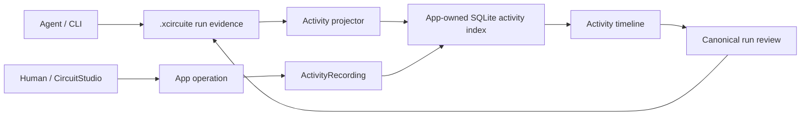
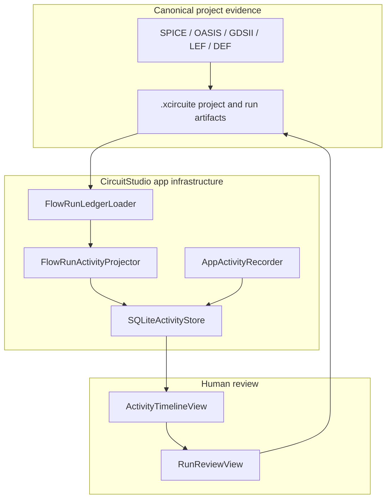
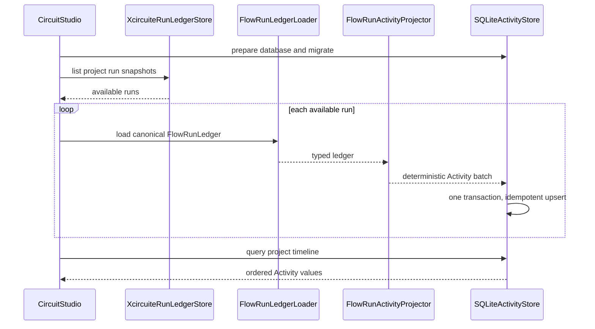

# Application Activity Timeline Design

Status: Proposed
Date: 2026-07-11
Scope: CircuitStudio application activity indexing, persistence, reconciliation, and review UI.

## Goal

Provide a durable timeline that answers:

- who or what performed an operation,
- which command or flow stage ran,
- whether it succeeded, failed, stopped, or was blocked,
- which design and evidence artifacts were consumed or produced,
- how a design moved from one reviewable state to another.

The Activity database is an application-owned index. It is not semiconductor design state or run evidence.



## Decisions

| Concern | Decision |
|---|---|
| Ownership | `circuit-studio` owns the Activity model, database, synchronization, and UI. Semiconductor libraries do not import Activity types or database-framework. |
| Authority | Standard design files and `.xcircuite` run artifacts remain authoritative. Activity rows are disposable projections. |
| Storage | One SQLite database in the app sandbox's Application Support directory. No Activity database is written into a design project. |
| Database API | Use `database-framework` `26.0629.0` with the `SQLite` SwiftPM trait and the `Database` product. |
| Granularity | Store immutable timeline events grouped by `operationID` and optionally linked to `runID` and `stageID`. |
| Artifacts | Store the canonical `CircuiteFoundation.ArtifactReference` unchanged, paired only with Activity direction metadata. Keep artifact payloads in their existing files. |
| Failure coupling | Activity persistence failure does not roll back a completed design operation, but it must surface as a visible degraded state. |
| Rebuild | Reconciliation is deterministic and idempotent. Deleting the SQLite database must not delete design history or evidence. |

## Existing Implementation Findings

The design is based on the current implementation rather than a new parallel run model.

| Existing implementation | Current responsibility | Design consequence |
|---|---|---|
| `XcircuiteProjectManifest.identity.projectID` | Stable project identity in `.xcircuite/project.json`. | Use `projectID` as the Activity partition key. Do not key durable Activity only by path. |
| `FlowRunManifest` | Run actor, intent, lifecycle, revision, and artifact references. | Project run creation and terminal state into timeline events. |
| `FlowRunActionRecord` and `actions.jsonl` | Actor-attributed actions with status, input/output references, diagnostics, and metadata. | This is the primary source for Agent, CLI, human, and system action events. Do not replace it with database writes. |
| `FlowRunProgressEvent` and `progress.jsonl` | Ordered run and stage progress with a stable sequence. | Project each progress record with an ID derived from run ID and sequence. |
| `FlowStageResult` | Stage status, diagnostics, gates, artifacts, and attempt records. | Add stage-result events only for information not already represented by an action or progress event. |
| `DesignDiff` | Base/proposed snapshots and typed design changes by domain and operation. | Project one design-change event with counts and references; keep the detailed before/after values in the canonical diff artifact. |
| `FlowRunLedgerLoader` | Loads manifest, plan, stage results, toolchain, design diff, progress, cancellation, actions, and approvals. | Use this loader as the reconciliation input instead of parsing run files again in the Activity module. |
| `XcircuiteRunLedgerObserver` | Polls canonical run snapshots and exposes an `AsyncThrowingStream`; it also provides `shutdown()`. | Trigger incremental reconciliation from the existing observer instead of creating another project watcher initially. |
| `XcircuiteSimulationRunRecorder` | Persists simulation requests, input netlists, summaries, waveforms, errors, and run status. | Simulation Activity can be reconstructed from existing run evidence. Do not add a second simulation log. |
| `RunReviewService` and `RunReviewView` | Read and review canonical run evidence, including integrity checks and approvals. | Activity opens the existing run review for details; it does not decode or reinterpret evidence. |
| `AppState.runHistory` | In-session simulation projection cleared when project state resets. | Keep it for live waveform UX; do not treat it as durable Activity history. |
| `RecentDocumentsStore` | Keeps sandbox security-scoped bookmarks for reopened projects. | Continue to own project access. Do not duplicate bookmarks in Activity rows. |

### Current gap

The run ledger is strong evidence for one run, but the app has no durable cross-run timeline or query index. `RunReviewView` lists runs, while session simulation history disappears when project state resets.

Activity fills only that navigation and understanding gap.

## Responsibility Boundary



| Layer | Owns | Does not own |
|---|---|---|
| Semiconductor and flow libraries | Typed operations, run artifacts, diagnostics, design diffs, verification results. | Activity persistence or app UI state. |
| `Xcircuite workspace` / `DesignFlowKernel` | Canonical run ledger and its integrity contract. | SQLite schema or timeline presentation. |
| Activity infrastructure | Projection, indexing, querying, correlation, and database health. | Design truth, approval truth, artifact payloads, or flow verdicts. |
| Activity UI | Filtering, grouping, and navigation to canonical review. | Recomputing status or consuming unverified artifacts. |

## Package Structure

Add an internal SwiftPM target named `Activity`.

```text
Activity
  -> Database (database-framework, SQLite trait)
  -> DesignFlowKernel
  -> Xcircuite workspace

CircuitStudioApp
  -> Activity
  -> existing app and EDA targets
```

`Activity` is app infrastructure despite being a separate target. It must not be added as a dependency of `CoreSpice`, `semiconductor-layout`, `DRCEngine`, `LVSEngine`, `PEXEngine`, `Xcircuite workspace`, or `DesignFlowKernel`.

The dependency should be pinned to the released API used by the design:

```swift
.package(
    url: "https://github.com/1amageek/database-framework.git",
    exact: "26.0629.0",
    traits: ["SQLite"]
)
```

The inspected release provides `VersionedSchema`, `SchemaMigrationPlan`, lightweight migrations, custom migrations, and SQLite concurrency tests. CircuitStudio opens a versioned `DBContainer` with `SQLiteStorageEngine.Configuration.file` or `.inMemory`, and does not depend on the default `FoundationDB` trait.

## Database Location

Resolve the database from `FileManager` rather than a hard-coded home path:

```text
Application Support/
  team.stamp.Xcircuite/
    Activity/
      activity.sqlite
```

The app is sandboxed with bundle identifier `team.stamp.Xcircuite`, so `applicationSupportDirectory` resolves inside its container. The location is app-owned, excluded from the design repository, and shared across projects opened by the same app installation.

The database stores no security-scoped bookmark. Project access remains with `RecentDocumentsStore`; Activity queries become actionable only while the corresponding project is open or otherwise accessible through that existing mechanism.

## Activity Model

Expose a database-independent value type named `Activity` and keep the `@Persistable` model internal as `ActivityRecord`. This prevents database-framework annotations from becoming the application service contract.

### Activity fields

| Field | Purpose |
|---|---|
| `id` | Deterministic event identity for projected evidence; generated identity for app-only events. |
| `projectID` | Stable `.xcircuite` project identity and primary partition key. |
| `operationID` | Groups start, progress, action, and completion events belonging to one operation or run. |
| `parentOperationID` | Optional parent for nested Agent or flow work. |
| `sourceKind` | `app`, `xcircuiteRun`, `xcircuiteProgress`, `xcircuiteAction`, or `xcircuiteDesignDiff`. |
| `sourceID` | Stable identifier in the source system, such as action ID, progress sequence key, or source record ID. |
| `sourceRevision` | Run manifest revision or another source revision used for reconciliation diagnostics. |
| `runID` | Optional canonical run link. |
| `stageID` | Optional canonical stage link. |
| `actorKind` | Agent, human, CLI, or system. |
| `actorIdentifier` | Recorded actor identifier. |
| `kind` | Stable operation classification used for filtering. |
| `status` | Running, succeeded, failed, cancelled, blocked, partial, or informational. |
| `title` | Short presentation label produced by a typed projector. |
| `summary` | Bounded factual summary; never a hidden reasoning trace. |
| `commandJSON` | Optional structured executable and sanitized argument vector. |
| `artifactsJSON` | Encoded `Activity.Artifact` values containing the canonical `CircuiteFoundation.ArtifactReference` and separate input/output/related direction metadata. Digest and byte count remain mandatory. |
| `diagnosticsJSON` | Bounded structured diagnostic summaries and codes. |
| `occurredAt` | Source event time. |
| `indexedAt` | Time the projection was written to SQLite. |

The first schema declares single-field scalar indexes for:

| Index | Query served |
|---|---|
| `projectID`, `occurredAt` | Current project timeline in reverse chronological order. |
| `runID`, `stageID` | All Activity related to one canonical run or stage. |
| `operationID`, `kind` | Expanded operation and event-kind filtering. |
| `actorKind` | Agent/human/CLI filtering. |
| `status` | Failed, blocked, or cancelled work filtering. |

### Data excluded from SQLite

The following data must remain outside Activity storage:

- artifact payload bytes,
- complete stdout or stderr,
- process environment variables,
- authentication material,
- model prompts, hidden reasoning, or scratchpad text,
- copied run manifests, stage results, or design diffs.

Command arguments are stored only as a structured, sanitized vector. The recorder must redact values identified as credentials or secrets and record the redaction count. It must not persist a raw shell command string or process environment.

## Projection Contract

Projected IDs must be deterministic so opening the same project repeatedly does not duplicate history.

| Source | Stable Activity identity | Projection |
|---|---|---|
| Run creation | `projectID + runID + run-created` | Actor, intent, creation time. |
| Run start | `projectID + runID + run-started` | Start time and running status. |
| Run terminal state | `projectID + runID + run-finished` | Terminal status, finish time, manifest artifact references. |
| Progress event | `projectID + runID + progress sequence` | Stage/run status and bounded message. |
| Action record | `projectID + runID + actionID` | Actor, action kind, status, inputs, outputs, diagnostics, sanitized command metadata. |
| Stage attempt | `projectID + runID + stageID + attempt index` | Attempt timing, result, retry decision, diagnostic codes. |
| Design diff | `projectID + runID + design-diff` | Review state, change counts by domain/operation, base/proposed snapshot references, and canonical diff path. |
| Approval | Corresponding action ID | Use the action event written by `recordApprovalAction`; do not emit a duplicate approval event. |

If an Activity fact can be obtained from both a specialized action record and a generic run snapshot, the specialized action wins. The projector may still emit run start and finish boundaries, but it must not duplicate approval, command-selection, or waiver decisions already present in `actions.jsonl`.

## Reconciliation



Reconciliation rules:

1. Read the project manifest without creating or modifying a package.
2. If no valid project manifest exists, show Activity as unavailable for that folder until CircuitStudio creates a project identity through its existing lifecycle.
3. List available run snapshots through `XcircuiteRunLedgerStore`.
4. Load each run through `FlowRunLedgerLoader`.
5. Project records in memory and commit the batch in one database save.
6. Upsert by deterministic Activity ID.
7. Do not delete prior Activity because a live or partially written run temporarily exposes fewer records.
8. Report source integrity and decode failures as Activity indexing failures; do not reinterpret corrupt evidence.

The database may contain app-only events that cannot be rebuilt, but those events are never used as proof of design correctness. Every claim shown as verified must link to canonical evidence.

## Application Recording Contract

Use a protocol-first boundary:

```swift
public protocol ActivityRecording: Sendable {
    func record(_ activity: Activity) async throws
    func record(_ activities: [Activity]) async throws
}

public protocol ActivityQuerying: Sendable {
    func activities(for query: ActivityQuery) async throws -> [Activity]
}
```

`SQLiteActivityStore` is an actor because database initialization, migrations, reads, and writes involve asynchronous I/O and ordered state transitions. Its initializer accepts a database location, but opens the `DBContainer` lazily so the synchronous `ServiceContainer` can own it without blocking app construction.

App-owned operations can record directly at their orchestration boundary. The design does not instrument lower-level semiconductor methods and does not attempt process-wide command surveillance.

A design-changing or verification-bearing operation must still produce canonical `.xcircuite` evidence. Direct Activity recording is limited to app-level context that has no design-truth role; it cannot be the only record of a design edit, verification result, approval, or artifact claim.

Coverage is therefore explicit:

| Execution path | Capture mechanism |
|---|---|
| Agent or CLI flow that writes `.xcircuite` evidence | Reconciled from run manifest, progress, actions, stage results, and artifacts. |
| Human operation orchestrated by CircuitStudio | Direct app record, plus canonical run projection when a run exists. |
| Arbitrary shell command outside an LSI run | Not observed automatically; represented only when the Agent records a run action. |

## Storage Budget

Activity storage remains metadata-only. Large design files, generated masks, waveforms, reports, process output, and detailed design diffs stay in their existing artifact locations.

| Stored value | V1 bound | Overflow behavior |
|---|---:|---|
| `title` | 512 UTF-8 bytes | Reject invalid producer output; titles are generated by typed projectors. |
| `summary` | 4 KiB | Store a deterministic truncation marker and retain the canonical source reference. |
| Sanitized command metadata | 16 KiB | Keep executable and leading sanitized arguments, then store omitted argument count. |
| Artifact references | 64 primary references per event | Store total count and direct users to the canonical run manifest for the complete set. |
| Diagnostics | 32 diagnostics per event, 1 KiB per message | Store severity/code counts and omitted diagnostic count. |

The store exposes database byte size and row count as health metrics. V1 performs no automatic age-based deletion because unexplained history loss is worse than gradual metadata growth. A later user-initiated compaction may rebuild projected rows from canonical evidence, but must never delete source artifacts or silently remove app-only events.

## Database Lifecycle and Migration

Define `ActivitySchemaV1` as a `VersionedSchema` and declare an `ActivityMigrationPlan` from the first release, even though the initial database has no prior production schema.

| Change | Migration policy |
|---|---|
| Add optional or defaulted field | Lightweight migration. |
| Add scalar index | Versioned migration and explicit index build verification. |
| Rename, reorder, or change field meaning | Custom migration into a new record type version. |
| Projection logic changes only | Bump projector version, then re-project affected source records without changing database schema. |

The store calls `migrateIfNeeded()` before serving queries. Tests use `SQLiteStorageEngine.Configuration.inMemory`; application code uses `SQLiteStorageEngine.Configuration.file` with `security: .disabled` because authorization is enforced by the local app sandbox and Activity has no multi-tenant security policy.

## Failure Behavior

Activity is loosely coupled to design execution, but failures must remain visible.

| Failure | Behavior |
|---|---|
| Database cannot open or migrate | Mark Activity unavailable and show a typed error in the Review workspace. Other design operations remain available. |
| Activity write fails after a design operation | Preserve the design operation result, mark Activity degraded, and schedule reconciliation from canonical evidence. |
| Run evidence fails integrity validation | Do not index a fabricated summary. Show the run and integrity error as an indexing issue. |
| Database is corrupt | Preserve the original file, rebuild into a new database from canonical sources, and replace only after successful reconciliation. |
| Project is moved | Resolve access through the existing security-scoped bookmark, then match Activity by `projectID`. |

No error path may use `try?`, silently discard a failed write, or report a design operation as failed solely because the optional Activity index is unavailable.

## UI Integration

The detailed presentation contract is defined in [`activity-timeline-ux-design.md`](activity-timeline-ux-design.md). The technical boundary below remains authoritative for data ownership and navigation.

The Review workspace exposes top-level `Activity / Runs` modes.

```text
Review
  Timeline
    filters: actor | status | kind | time
    operation groups
      event summary
      command summary
      input/output artifact links
  Runs
    existing RunReviewView without semantic changes
```

Selecting an event with a `runID` opens the existing `RunReviewView` selection. Selecting an artifact delegates to the existing verified artifact loading path. The timeline never reads artifact bytes directly.

`RunReviewView` currently owns `selectedRunID` internally. Integration therefore adds an `initialRunID` or equivalent binding to its initializer so Timeline navigation can select an exact canonical run without duplicating review state or loading logic.

The first release should prioritize chronological scanning, failed/blocked filtering, and navigation to canonical evidence. Full-text search and analytics are not required for the initial schema.

## Implementation Milestones

| Milestone | Deliverable | Verification |
|---:|---|---|
| 1 | Add database-framework with SQLite trait, `Activity`, application-support path resolver, V1 schema, protocols, and actor store. | In-memory CRUD, ordering, filtering, file-backed reopen, and migration tests. |
| 2 | Implement `FlowRunActivityProjector` and deterministic reconciliation through `FlowRunLedgerLoader`. | Idempotent repeated import, incremental run update, no duplicate approvals, artifact reference, and corrupt-ledger rejection tests. |
| 3 | Add Activity service lifecycle to `ServiceContainer` and project-open reconciliation. | Project switching, missing manifest, database unavailable, and cancellation tests. |
| 4 | Add Timeline mode to Review and navigation into the existing run/artifact review. | View-model tests and focused UI tests for empty, loading, degraded, filtered, and populated states. |
| 5 | Add direct app recording at orchestration boundaries not already represented by run evidence. | Successful, failed, cancelled, redacted-command, and recorder-failure tests. |

## Test Matrix

| Area | Required cases |
|---|---|
| Model | Stable ID, bounded summary, command redaction, artifact reference encoding, actor/status mapping. |
| SQLite store | Insert, idempotent upsert, transaction rollback, reverse chronological query, project isolation, run filter, actor/status filter. |
| Storage bounds | UTF-8 byte limits, deterministic truncation, artifact/diagnostic overflow counts, database size metrics, no payload duplication. |
| Migration | Empty database bootstrap, V1 reopen, lightweight migration fixture, failed migration surfaced. |
| Reconciliation | Run start/finish, progress sequence, action inputs/outputs, stage attempts, approvals without duplication, partial running ledger. |
| Integrity | Manifest mismatch, malformed JSONL, missing stage result, artifact digest mismatch. |
| Lifecycle | App launch, project open, project switch, observer shutdown, task cancellation, database degradation. |

Swift tests must use Swift Testing, shared database resources must use one common exclusion mechanism, and every test command must have an external timeout.

## Rejected Alternatives

| Alternative | Reason |
|---|---|
| Put `activity.sqlite` under `.xcircuite` | Makes an app index look like project evidence, creates noisy binary project changes, and couples project portability to one app's cache. |
| Replace `actions.jsonl` with SQLite | Removes portable run evidence from the project and prevents headless Agent/CLI flows from remaining auditable without the app. |
| Store artifact blobs in SQLite | Duplicates immutable evidence, increases migration and corruption impact, and bypasses existing digest verification. |
| Add Activity calls to every EDA library | Violates responsibility boundaries and makes standalone libraries depend on an application concern. |
| Infer Agent intent from logs or timestamps | Produces unreliable causality. Activity stores observable actions and exact references, not guessed reasoning. |

## Definition of Done

The Activity feature is complete when:

1. CircuitStudio can rebuild a project timeline from `.xcircuite` evidence.
2. Repeated reconciliation produces no duplicate events.
3. Each displayed claim links to canonical run evidence.
4. Database loss or corruption cannot delete or change design state, run evidence, or approvals.
5. Activity failures are visible but do not falsify the result of the underlying design operation.
6. Agent, human, CLI, and system actions can be filtered and correlated by run, stage, and artifacts.
7. No semiconductor library imports the Activity module or database-framework.
