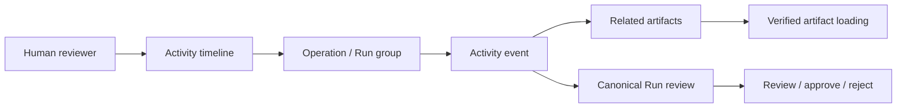
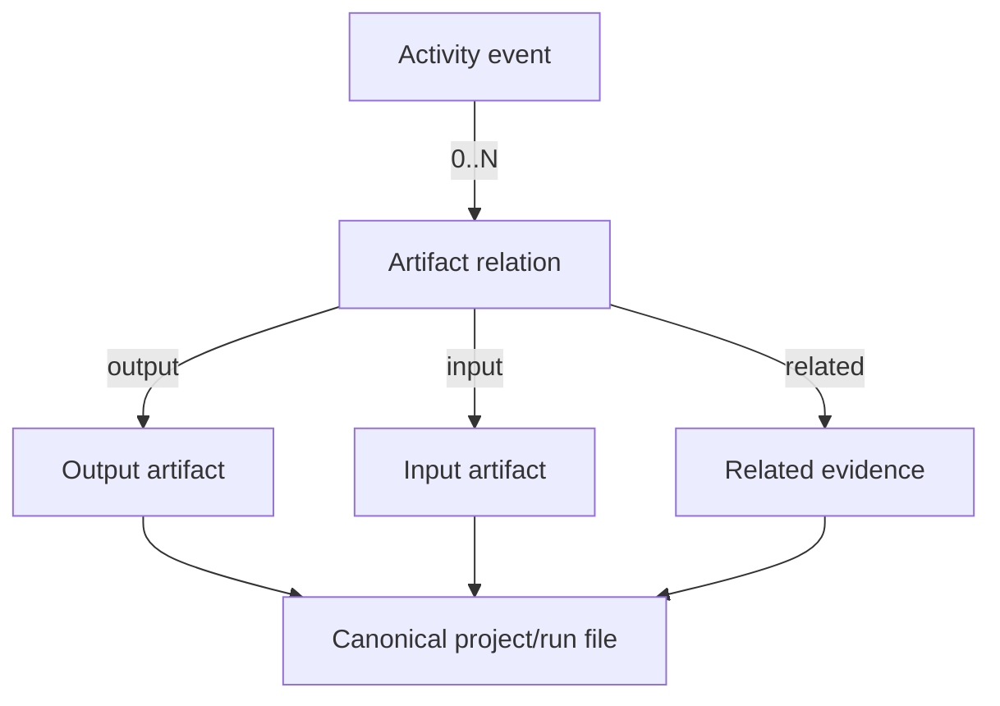

# Activity Timeline UX Design

Status: Implemented
Date: 2026-07-12
Scope: CircuitStudio Activity navigation, timeline presentation, artifact inspection, and Run review transitions.

## UX Goal

Activity is the orientation layer for design history. It answers four questions quickly:

1. What happened?
2. Who or what caused it?
3. What was the outcome?
4. Which canonical Run or artifact should be reviewed next?

Activity is not a replacement for `RunReviewView`. The timeline summarizes observable events and routes the reviewer to canonical `.xcircuite` evidence for detailed judgment.



## Design Decisions

| Concern | Decision |
|---|---|
| Primary mental model | Activity is a chronological map of design work, not a database table browser. |
| Default unit of display | Group by `operationID`, with Run groups used whenever `runID` is available. |
| Activity to artifact cardinality | One Activity may show zero or many related artifacts. Do not enforce 1:1. |
| Artifact ownership | The canonical artifact remains in the project or run evidence. Activity stores references and metadata only. |
| Detail authority | Activity shows bounded summaries; Run review and verified artifact loading provide authoritative detail. |
| Event density | Progress and retry events are available but collapsed by default when they do not change the review outcome. |
| Navigation | Every event with a `runID` can open the exact Run. Artifact actions delegate to the existing verified loading path. |
| Failure visibility | Indexing, source-integrity, and artifact-availability failures are visible as degraded states; they are never represented as design failures. |
| Persistence | The UX must remain useful if Activity is unavailable by exposing a path to the existing Runs view. |

## Information Architecture

The Review workspace has two complementary modes:

```text
Review
├── Activity
│   ├── filters and scope
│   ├── grouped timeline
│   └── selected Activity / artifact detail
└── Runs
    ├── canonical Run list
    └── full Run review and decisions
```

`Activity` is optimized for discovery and comparison across operations. `Runs` is optimized for inspection and human decisions within one execution. The two modes must preserve the selected project and must not maintain separate interpretations of Run status.

## Activity Screen

### Desktop layout

Use a two-column `NavigationSplitView` inside the Activity mode when the window is horizontally regular:

```text
┌──────────────────────────────────────────────────────────────────────┐
│ Activity                         [scope] [status] [actor] [refresh]   │
├───────────────────────┬──────────────────────────────────────────────┤
│ Timeline groups       │ Selected group / event                         │
│                       │                                                │
│ Today                 │ Run summary                                   │
│ 09:41  Layout edit    │ Artifact references                            │
│ 09:12  DRC failed     │ Diagnostics                                    │
│                       │ Open Run / Open artifact                      │
│ Yesterday             │                                                │
│ 18:04  Agent plan     │                                                │
└───────────────────────┴──────────────────────────────────────────────┘
```

On compact widths, the timeline and detail become a navigation stack. Selecting an Activity pushes its detail; opening a Run pushes the existing Run review. The timeline must remain recoverable with the back navigation.

### Timeline hierarchy

The list must not display every progress event as an equally prominent top-level row. The hierarchy is:

```text
Date section
└── Operation / Run group
    ├── Group summary
    ├── Outcome-changing events
    ├── Artifact references
    └── Collapsed progress / retry events
```

Group by `operationID`. When the group has a `runID`, show the Run ID and Run intent in the group header. For app-only Activity without a Run, show the operation title and actor instead of inventing a Run link.

Groups are ordered by the most recent `occurredAt`. Events inside an expanded group are ordered from earliest to latest so that causality reads naturally.

### Group header

The group header is the primary scanning surface. It contains:

- status icon and text status; color is never the only status signal,
- operation or Run title,
- actor kind and identifier,
- time range or most recent timestamp,
- concise outcome summary,
- artifact and diagnostic counts,
- an `Open Run` action when `runID` exists.

The header must not expose raw IDs as the primary label. The Run ID remains available as secondary, selectable metadata.

### Activity row

An Activity row uses a stable height and a predictable hierarchy:

```text
status icon  title                                      time
             bounded summary
             actor · stage · kind · artifact count · diagnostic count
```

The row has a disclosure affordance when it contains artifacts, diagnostics, or command metadata. A row without artifacts remains a valid event and is not shown as an error.

Artifact references appear as subrows rather than only as a count:

```text
└── output  proposed-layout.oas   OASIS · 2.4 MB · sha256 …91af
    related design-diff.json      JSON  · 18 KB  · Open
```

The direction (`input`, `output`, `related`) and artifact kind are visible. The full path, digest, byte count, and source reference are available in the detail view.

## Detail View

Selecting an Activity opens a detail surface with four sections in this order:

1. **Outcome**: status, title, summary, occurred time, actor, and Run/stage links.
2. **Artifacts**: input, output, and related references with verified loading actions.
3. **Diagnostics**: severity, code, message, and omitted-count notice when bounded.
4. **Provenance**: source kind, source ID, source revision, operation ID, and indexed time.

The provenance section is secondary and collapsible. It supports trust and debugging without competing with the design outcome.

The detail surface provides these actions:

| Action | Behavior |
|---|---|
| Open Run | Switch to Runs and select the exact `runID`. |
| Open artifact | Use the existing verified artifact loader; Activity never reads artifact bytes directly. |
| Reveal path | Show the canonical project-relative path after access is validated. |
| Copy reference | Copy the bounded canonical reference, not an unsanitized command or secret. |
| Show diagnostics | Expand the diagnostic list and omitted-count information. |

Approval, rejection, waiver, and repair actions remain in Run review. Activity is a navigation and context surface, not a second decision surface.

## Filters and Scope

Filters should optimize for finding work that needs attention rather than exposing every stored field.

### Initial filters

```text
Scope:       All activity | Current Run | Current stage
Outcome:     All | Running | Failed | Blocked | Partial | Succeeded
Actor:       All | Agent | Human | CLI | System
Kind:        All | Design change | Verification | Artifact | Progress
```

The failed and blocked states must be one-step filters. They are the highest-value review queues.

The filter state is visible in the toolbar and can be cleared with one action. Empty filter results explain the active filter and provide a clear action; they must not look like an empty project.

### Query contract

The existing `ActivityQuery` already supports project, Run, stage, kind, status, actor, and limit filters. Grouping and presentation filtering should be performed in the Activity view model until a query requires a new persisted index. Full-text search is a later capability and is not required for the first UX implementation.

## Artifact Presentation

Artifact is an object related to an Activity, not the Activity's identity.



The UI must distinguish:

- **output**: produced or updated by the operation,
- **input**: consumed by the operation,
- **related**: evidence that helps explain the operation.

An artifact row shows a human-readable name first, then kind and format. Hash and byte count are secondary trust metadata. If the source artifact is missing or inaccessible, keep the reference visible and show the availability failure beside it.

The Activity database does not contain artifact payloads. Artifact preview, integrity validation, and approval context are delegated to the canonical project/run services.

## Navigation Contract

```text
Activity group
   │
   ├── Activity detail
   │      ├── Open Run ──────> Runs / exact run selected
   │      └── Open artifact ─> verified artifact detail
   │
   └── no runID
          └── remain in Activity detail with provenance information
```

Opening a Run must preserve the selected Run rather than defaulting to the newest Run. Returning from Run review must preserve the Activity scope, filters, and selected group when the platform navigation model allows it.

## State Design

| State | Presentation | Available action |
|---|---|---|
| Loading | Timeline skeleton or progress overlay without replacing existing rows. | Wait or cancel via navigation. |
| No activity | Explain that no observable operations are indexed for this project. | Refresh, open Runs. |
| No filter results | Show the active filters and result count zero. | Clear filters. |
| Activity unavailable | Show the typed database/index error as degraded state. | Open Runs, retry reconciliation. |
| Reconciliation degraded | Show available rows plus a visible stale/degraded indicator. | Retry, inspect Runs directly. |
| Run evidence invalid | Keep the Activity reference but mark canonical evidence unavailable. | Open integrity details, do not fabricate a result. |
| Artifact unavailable | Keep metadata and path visible with unavailable status. | Retry access or open the Run. |
| Running operation | Show current status and latest progress without claiming completion. | Open Run, refresh. |

Activity indexing failure must never turn a successful or failed design operation into a different design status. The UI must distinguish `source status` from `index health`.

## Visual and Interaction Rules

- Use status icons and text labels together; never rely on color alone.
- Keep timeline rows dense enough for scanning, with stable dimensions so expanding content does not reorder neighboring controls unexpectedly.
- Use familiar icons for refresh, disclosure, open, and copy actions, with tooltips for unfamiliar symbols.
- Do not show raw JSON, unsanitized commands, hidden reasoning, or unbounded diagnostic text in the timeline.
- Keep the timeline as an unframed page surface; use framed detail surfaces only for genuinely inspectable artifacts or dialogs.
- Make artifact direction explicit with icon plus text (`input`, `output`, `related`).
- Support keyboard focus, row selection, disclosure, and Run navigation without requiring pointer-only interaction.
- Preserve the selected project and never mix Activity rows from different project identities.

## Acceptance Criteria

The UX design is implemented correctly when a reviewer can answer the following without opening a raw log:

1. What changed most recently?
2. Was the operation successful, failed, blocked, or still running?
3. Who or what performed it?
4. Which artifacts were inputs, outputs, or related evidence?
5. Which exact Run contains the canonical decision context?
6. Why is an artifact or Activity unavailable, if access or indexing failed?

Additional behavioral criteria:

- A Run with many progress events appears as one scannable group, not an unreadable flat log.
- An Activity with several artifacts keeps those artifacts visible without duplicating Activity rows solely for presentation.
- An Activity without artifacts remains understandable and actionable through its Run, stage, or provenance link.
- Opening a Run selects the originating `runID` exactly.
- Artifact actions never bypass canonical verification and never make the Activity database authoritative.
- Reconciliation and refresh do not create duplicate visible events.

## Implementation Sequence

| Phase | Change | Validation |
|---:|---|---|
| 1 | Add an Activity presentation model that groups rows by operation/Run and collapses progress/retry events. | Repeated Run events render as one stable group with deterministic ordering. |
| 2 | Add selected Activity detail with explicit artifact subrows and direction labels. | Zero, one, and many artifact cases render correctly. |
| 3 | Add outcome, actor, kind, stage, and failed/blocked filters. | Filter state is visible, clearable, and isolated to the current project. |
| 4 | Add exact Run and verified artifact navigation. | Selected Run and artifact provenance are preserved through navigation. |
| 5 | Add degraded, unavailable, and integrity states. | Index failure never falsifies canonical Run status. |

The first implementation should focus on grouping, artifact visibility, and exact navigation. Full-text search, artifact lineage graphs, and analytics are separate capabilities and should not be mixed into the initial timeline surface.
