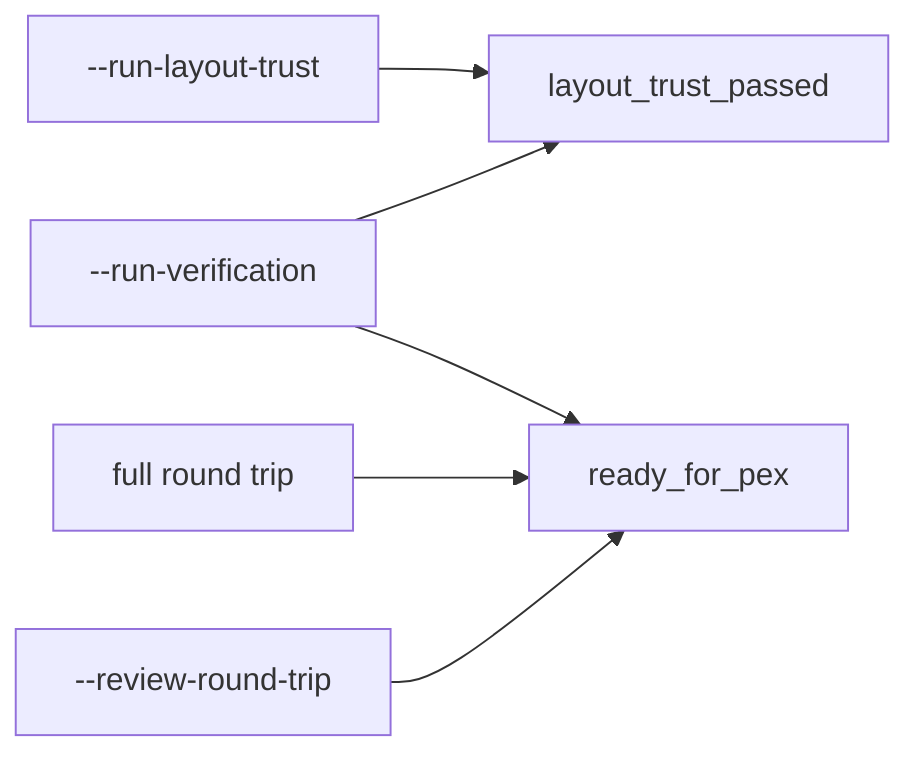
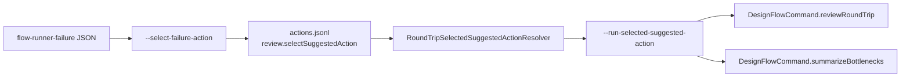

# Circuit Studio CLI Contract

`circuit-studio-flow-runner` emits line-oriented `key=value` output for Agent and
CI callers. Keys are part of the command contract. A command should not reuse a
key for a different semantic gate.

## Gate Key Semantics

| Key | Meaning | Emitted by |
|---|---|---|
| `layout_trust_passed` | The layout ownership and net-aware topology trust evaluation passed. | `--run-layout-trust`, `--run-verification` |
| `ready_for_pex` | The pre-PEX verification gate passed and the run may proceed to PEX. This is a stronger gate than layout trust alone. | full round trip, `--run-verification`, `--review-round-trip` |

`--run-layout-trust` does not emit `ready_for_pex`. Layout trust is one input to
pre-PEX confidence, but it is not the PEX readiness gate.

## Toolchain Trust Review

`--review-round-trip` projects the canonical `toolchain.json` summary rather
than rediscovering tools in the CLI. JSON output carries the typed toolchain
summary and its reviewed artifacts. Line-oriented output emits:

| Key | Meaning |
|---|---|
| `toolchain_stage_count` | Number of stages represented by the toolchain manifest. |
| `toolchain_selected_tools` | Comma-separated selected tool IDs. |
| `toolchain_rejected_evaluation_count` | Candidate evaluations rejected by trust qualification. |
| `toolchain_missing_selection_stages` | Required stages without a selected tool. |
| `toolchain_profile_id` / `toolchain_pdk_id` | Selected profile and PDK provenance. |
| `toolchain_catalog_id` / `toolchain_catalog_path` | Technology catalog provenance. |
| `toolchain_profile_artifact_path` | Profile artifact recorded by the flow. |
| `toolchain_artifact` | Reviewed toolchain artifact path. Repeated per artifact. |
| `toolchain_artifact_integrity` | Integrity verdict paired with the preceding artifact. |



## Suggested Action Continuation

Failure JSON is a continuation contract, not a process execution contract. A
caller first records an explicit selection, then dispatches that selection
through the shared typed API:



`--run-selected-suggested-action --output <project-root> --run-id <run-id>
[--action-id <id>]` resolves the selected ready semantic action from
`.xcircuite/runs/<run-id>/actions.jsonl`, validates action readiness and run
identity, then projects supported operations into typed review or
bottleneck-summary `DesignFlowCommand` values. No executable or argument list is
stored in the selection record.

## `--run-layout-trust`

Current output keys:

| Key | Value |
|---|---|
| `layout_trust` | Layout trust report status. |
| `layout_trust_passed` | Boolean layout trust result. |
| `layout_trust_report` | Path to the persisted layout trust report. |
| `owned_shapes` | Count of shapes with net ownership. |
| `unowned_shapes` | Count of shapes without net ownership. |
| `shorts` | Count of net-aware physical shorts. |
| `opens` | Count of net-aware physical opens. |

## `--run-goal-layout-agent`

Closes a `.subckt` intent through the layout editor's goal-command surface
(place, bind terminals, select routing layer, finish nets, repair), gates the
outcome on the editor trust report, live LVS, and goal-log replay determinism,
and exports a label-carrying GDS plus a machine-readable evidence JSON under
`<project-root>/.xcircuite/runs/<run-id>/goal-agent/`. A non-closable intent
fails with the typed failing stage — the command never reports a half-closed
artifact.

```
circuit-studio-flow-runner --run-goal-layout-agent \
  --subckt <intent.subckt> --technology-package <package.json> \
  --output <project-root> --run-id <run-id> [--design-name <name>] [--json]
```

Current output keys:

| Key | Value |
|---|---|
| `goal_layout_agent` | `closed` or `not-closed`. |
| `design_name` | Top cell name (defaults to the `.subckt` header name). |
| `closed` | Boolean closure claim: wired, DRC/connectivity/LVS clean, replay-deterministic. |
| `evidence` | Path to `goal-agent-evidence.json` (replayable script, per-command goal log, trust axes, GDS path). |
| `gds` | Path to the exported GDS artifact. |

## `--scaffold-design-spec`

The 作る (author) entry point for design specs. Writes a minimal valid
`DesignFlowDesignSpec` JSON skeleton so a caller never has to hand-write the
schema from memory: schemaVersion, name, title, a `vsource` + `ground` + one
`nmos_l1` component wired into example nets, one `tran` analysis, a matching
`postLayoutAnalysis`, empty `postLayoutComparisonLimits`, and a tiny valid
`pexIR` (one grounded capacitor, corner `tt_25c_1v0`). The spec is constructed
as a typed Swift value, decoded back through `DesignFlowDesignSpec`, and
`build()` succeeds before the file is written — the scaffold cannot drift from
the schema. The acceptance contract: `--generate-netlist --design-spec <path>`
consumes the scaffold unchanged.

```
circuit-studio-flow-runner --scaffold-design-spec \
  --output-design-spec <path.json> [--design-name <name>] [--json]
```

Current output keys:

| Key | Value |
|---|---|
| `design_spec_scaffold` | `scaffolded` on success. |
| `design` | Design name written into the spec (default `new_design`). |
| `design_spec` | Path of the written design spec JSON. |

## `--run-verification`

Current output keys related to these gates:

| Key | Value |
|---|---|
| `verification` | Pre-PEX verification report status. |
| `ready_for_pex` | Boolean DRC/LVS/approval readiness for PEX. |
| `layout_trust_passed` | Boolean layout trust result. |
| `layout_trust_report` | Path to the persisted layout trust report. |
| `drc_passed` | Boolean DRC result. |
| `lvs_passed` | Boolean LVS result. |
| `external_signoff` | Signoff source. |
| `signoff_approved` | Whether imported signoff evidence was explicitly approved. |

## Signoff Repair Review

Planning and mutation are Xcircuite responsibilities. circuit-studio reads the
same retained planning, candidate, verification, approval, and history artifacts
for human review; it does not translate diagnostics or create candidate actions.

```mermaid
flowchart LR
  Hints["typed diagnostic artifacts"] --> Translate["Xcircuite generate-planning-problem"]
  Translate --> Problem["planning/problem.json"]
  Problem --> Registry["Xcircuite operation registry"]
  Registry --> Plan["generate-candidate-plan"]
  Plan --> Execute["execute-candidate-plan"]
  Execute --> Verify["verify-candidate-plan"]
  Verify --> Ledger["actions.jsonl"]
  Ledger --> History["--summarize-signoff-repair-cycles"]
  History --> Assess["--assess-signoff-repair-cycles"]
```



The external Agent uses Xcircuite's translator-registry-backed
`generate-planning-problem`, followed by the registered, database-bound
`generate-candidate-plan`, `execute-candidate-plan`, and
`verify-candidate-plan` surfaces. Execution requires an exact candidate binding,
one target database and base revision, a registered handler version, an injected
database host, and typed verification requirements. Circuit-studio remains the
human review and approval projection and does not synthesize a workspace-file
candidate or bypass Xcircuite's operation registry.

The review projection continues to recognize retained
`review.runSignoffRepairCandidateCycle` history records created by earlier or
external DB-bound runs. That compatibility is read-only and does not restore the
removed file-backed mutation command.

`--summarize-signoff-repair-cycles --output <project-root>` reads persisted
`.xcircuite/runs/*/planning/candidate-cycle-history/history-<cycle>.json` artifacts and
does not regenerate plans or rerun verification.

Current output keys:

| Key | Value |
|---|---|
| `signoff_repair_cycle_history` | Summary status. |
| `history_run_count` | Count of runs with persisted candidate-cycle history summaries. |
| `history_cycle_count` | Total candidate cycles across retained run summaries. |
| `history_accepted_count` | Total accepted candidate cycles across retained run summaries. |
| `history_not_accepted_count` | Total non-accepted candidate cycles across retained run summaries. |
| `history_consumed_rejected_feedback_count` | Total rejected-plan feedback records consumed across retained run summaries. |
| `history_max_global_rejected_feedback_count` | Maximum global rejected-feedback count observed across retained run summaries. |
| `history_feedback_rank_change_count` | Total rejected-feedback rank changes across retained run summaries. |
| `history_feedback_score_delta_count` | Total rejected-feedback score deltas across retained run summaries. |
| `history_selected_actions` | Unique selected action IDs across retained run summaries. |
| `history_selected_action_domains` | Unique selected action-domain IDs across retained run summaries. |
| `history_selected_objective_domains` | Unique selected objective-domain IDs across retained run summaries, such as DRC/LVS/PEX/simulation. |
| `history_feedback_penalized_actions` | Unique feedback-penalized action IDs across retained run summaries. |
| `history_feedback_rank_changed_actions` | Unique action IDs whose rank changed because of rejected feedback. |
| `history_feedback_score_delta_actions` | Unique action IDs whose score changed because of rejected feedback. |
| `history_objective_domain` | One line per selected objective-domain with cycle count, accepted count, acceptance rate, feedback impact counts, selected actions, and action domains. |
| `history_run` | One line per retained run with run ID, cycle count, accepted count, rank-change count, and summary path. |
| `recommendation` | Retained-history follow-up recommendation. |

`--assess-signoff-repair-cycles --output <project-root>` reads the same
retained summaries and evaluates them against explicit promotion thresholds.
This is the Agent-facing gate above the retained history index: it writes
`.xcircuite/retained/history-assessment.json`, registers
that report in the `.xcircuite` manifest with hash and byte-count evidence, and
returns the observed corpus evidence, the requested thresholds, every gate
result, and the failed gate IDs without rerunning candidate generation or
verification. This assessment measures whether retained history satisfies
promotion thresholds. It is not a tool qualification record and does not
replace `ToolQualification` trust policy.

History assessment profile:

```json
{
  "schemaVersion": 1,
  "profileID": "signoff-repair-history-target",
  "title": "Signoff repair history target",
  "description": "Retained-history promotion thresholds.",
  "request": {
    "minimumRunCount": 1,
    "minimumCycleCount": 1,
    "minimumAcceptedCount": 0,
    "minimumFeedbackRankChangeCount": 0,
    "minimumFeedbackScoreDeltaCount": 0,
    "minimumAcceptedCountPerSelectedObjectiveDomain": 0,
    "requiredSelectedActionDomainIDs": [],
    "requiredSelectedObjectiveDomainIDs": []
  }
}
```

Use `--history-assessment-profile <path>` to load the profile. Explicit
`--min-history-*` options and `--require-history-selected-action-domain`
or `--require-history-selected-objective-domain` override the corresponding
profile values, and the effective request is persisted in the assessment
report. The profile is a versioned data artifact, not a Swift process/PDK file;
process and domain policy must remain external to the compiled product. The
versioned baseline fixture is
`docs/contract-fixtures/signoff-repair-history-assessment-profile-v1.json`;
the canonical report fixture is
`docs/contract-fixtures/signoff-repair-history-assessment-report-v1.json`.
The persisted report uses schema version 1, requires every decision field, and
is rejected when its status, gates, missing-domain lists, or recommendations do
not match the retained summary and effective request.

Threshold options:

| Option | Default | Meaning |
|---|---:|---|
| `--history-assessment-profile` | none | JSON profile that defines retained-history thresholds. |
| `--min-history-runs` | 1 | Minimum retained run summaries. |
| `--min-history-cycles` | 1 | Minimum retained candidate cycles. |
| `--min-history-accepted` | 0 | Minimum accepted candidate cycles. |
| `--min-history-feedback-rank-changes` | 0 | Minimum rejected-feedback rank changes. |
| `--min-history-feedback-score-deltas` | 0 | Minimum rejected-feedback score deltas. |
| `--min-history-accepted-per-selected-objective-domain` | 0 | Minimum accepted candidate cycles for each required selected objective-domain, or each observed selected objective-domain when no required list is provided. |
| `--require-history-selected-action-domain` | none | Required selected action-domain ID; can be repeated. |
| `--require-history-selected-objective-domain` | none | Required selected objective-domain ID; can be repeated. |

Current output keys:

| Key | Value |
|---|---|
| `signoff_repair_cycle_history_assessment` | `passed` or `failed`. |
| `assessment_passed` | Boolean pass result. |
| `assessment_report` | Persisted assessment report JSON path. |
| `assessment_report_sha256` | Persisted report SHA-256 digest. |
| `assessment_report_bytes` | Persisted report byte count. |
| `assessment_profile_id` | Profile ID when a profile was used. |
| `assessment_profile_title` | Profile title when a profile was used. |
| `assessment_profile_path` | Profile JSON path when a profile was used. |
| `assessment_failed_gates` | Comma-separated failed gate IDs. |
| `assessment_min_history_runs` | Requested retained-run threshold. |
| `assessment_min_history_cycles` | Requested retained-cycle threshold. |
| `assessment_min_history_accepted` | Requested accepted-cycle threshold. |
| `assessment_min_history_feedback_rank_changes` | Requested feedback rank-change threshold. |
| `assessment_min_history_feedback_score_deltas` | Requested feedback score-delta threshold. |
| `assessment_min_history_accepted_per_selected_objective_domain` | Requested accepted-cycle threshold per selected objective-domain. |
| `assessment_required_selected_action_domains` | Requested selected action-domain IDs. |
| `assessment_required_selected_objective_domains` | Requested selected objective-domain IDs. |
| `assessment_missing_selected_action_domains` | Required selected action-domain IDs absent from retained history. |
| `assessment_missing_selected_objective_domains` | Required selected objective-domain IDs absent from retained history. |
| `assessment_below_threshold_selected_objective_domains` | Selected objective-domain IDs that do not meet the per-domain accepted-cycle threshold. |
| `assessment_gate` | One line per gate with gate ID, pass status, observed count, and required count. |
| `history_*` | Same retained-history evidence keys exposed by `--summarize-signoff-repair-cycles`. |
| `recommendation` | Assessment follow-up recommendation. |

## Breaking Changes

The `--run-layout-trust` mode uses `layout_trust_passed` for its boolean result.
Older output that used `ready_for_pex` for this mode conflated layout trust with
the stronger pre-PEX gate and is no longer part of the current contract.
