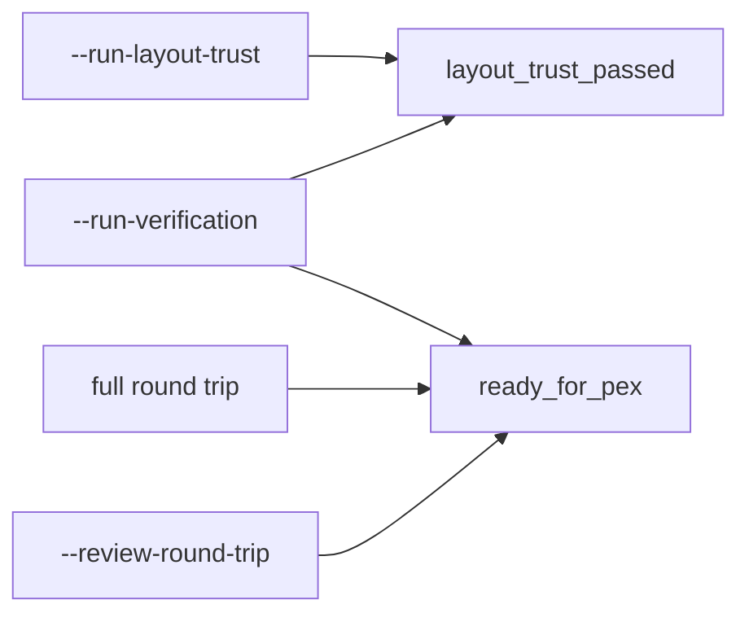
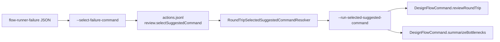
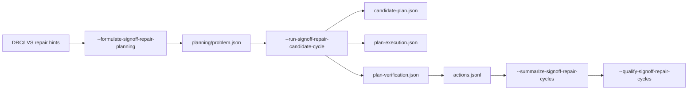

# Circuit Studio CLI Contract

`circuit-studio-flow-runner` emits line-oriented `key=value` output for Agent and
CI callers. Keys are part of the command contract. A command should not reuse a
key for a different semantic gate.

## Gate Key Semantics

| Key | Meaning | Emitted by |
|---|---|---|
| `layout_trust_passed` | The layout ownership and net-aware topology trust evaluation passed. | `--run-layout-trust`, `--run-verification` |
| `ready_for_pex` | The pre-PEX verification gate passed and the run may proceed to PEX. This is a stronger gate than layout trust alone. | full round trip, `--run-verification`, `--review-round-trip` |

`--run-layout-trust` does not emit `ready_for_pex`. Layout trust is one input to
pre-PEX confidence, but it is not the PEX readiness gate.



## Suggested Command Continuation

Failure JSON is a continuation contract, not a process execution contract. A
caller first records an explicit selection, then dispatches that selection
through the shared typed command API:



`--run-selected-suggested-command --output <project-root> --run-id <run-id>
[--command-id <id>]` resolves the selected ready command from
`.xcircuite/flow-runs/<run-id>/actions.jsonl`, validates the runner prefix,
run ID, project root, and manifest path, then dispatches only allowlisted review
or bottleneck-summary `DesignFlowCommand` values. It does not spawn the selected
command as a shell process.

## `--run-layout-trust`

Current output keys:

| Key | Value |
|---|---|
| `layout_trust` | Layout trust report status. |
| `layout_trust_passed` | Boolean layout trust result. |
| `layout_trust_report` | Path to the persisted layout trust report. |
| `owned_shapes` | Count of shapes with net ownership. |
| `unowned_shapes` | Count of shapes without net ownership. |
| `shorts` | Count of net-aware physical shorts. |
| `opens` | Count of net-aware physical opens. |

## `--run-verification`

Current output keys related to these gates:

| Key | Value |
|---|---|
| `verification` | Pre-PEX verification report status. |
| `ready_for_pex` | Boolean DRC/LVS/approval readiness for PEX. |
| `layout_trust_passed` | Boolean layout trust result. |
| `layout_trust_report` | Path to the persisted layout trust report. |
| `drc_passed` | Boolean DRC result. |
| `lvs_passed` | Boolean LVS result. |
| `external_signoff` | Signoff source. |
| `signoff_approved` | Whether imported signoff evidence was explicitly approved. |

## Signoff Repair Planning

The signoff repair path is a typed planning contract. The CLI does not ask an
Agent to run arbitrary shell commands; it dispatches through `DesignFlowCommand`
and writes the same run ledger used by the cockpit.



`--formulate-signoff-repair-planning --output <project-root> --run-id <run-id>
--approval-reviewer <reviewer>` compiles repair hint reports into
`planning/action-domain-snapshot.json`, `planning/repair-formulation.json`, and
`planning/problem.json`.

Current output keys:

| Key | Value |
|---|---|
| `signoff_repair_planning` | Planning formulation status. |
| `action_domain` | Persisted action-domain snapshot path. |
| `repair_formulation` | Persisted repair formulation path. |
| `planning_problem` | Persisted planning problem path. |
| `source_report_count` | Count of source repair-hint reports used. |

`--run-signoff-repair-candidate-cycle --output <project-root> --run-id <run-id>
--approval-reviewer <reviewer>` formulates the planning problem, generates one
candidate plan, executes it through Xcircuite, verifies it, and appends a
summary action record. `--candidate-strategy <strategy>` and
`--candidate-verification-mode <mode>` select the generation and verification
policies.

Current output keys:

| Key | Value |
|---|---|
| `signoff_repair_candidate_cycle` | Candidate verification status. |
| `cycle_action_id` | Summary run action ID written by circuit-studio. |
| `planning_action_id` | Planning-formulation run action ID. |
| `cycle_index` | One-based candidate-cycle index within the run ledger. |
| `feedback_rejected_plans` | Rejected-plan feedback path consumed during candidate generation, when present. |
| `rejected_feedback_count` | Count of rejected-plan records consumed by candidate generation. |
| `global_rejected_feedback_count` | Count of global rejected feedback items consumed by candidate generation. |
| `selected_actions` | Comma-separated planner action IDs selected in the symbolic trace. |
| `selected_action_domains` | Comma-separated action-domain IDs for selected symbolic planner actions. |
| `feedback_penalized_actions` | Comma-separated candidate action IDs that received negative feedback score components. |
| `feedback_penalty_terms` | Comma-separated `<actionID>:<termID>` feedback penalty terms applied during ranking. |
| `feedback_rank_changes` | Comma-separated `<actionID>:<rankBeforeRejectedFeedback>-><rank>` changes that prove rejected feedback changed ranking. |
| `feedback_score_deltas` | Comma-separated `<actionID>:<rejectedFeedbackScoreDelta>` values for actions directly scored by rejected feedback. |
| `cycle_history_count` | Count of candidate cycles projected from the shared run ledger after this command. |
| `cycle_history_accepted_count` | Count of accepted candidate cycles in the projected history. |
| `cycle_history_not_accepted_count` | Count of non-accepted candidate cycles in the projected history. |
| `cycle_history_latest_index` | Latest candidate-cycle index in the projected history. |
| `cycle_history_latest_accepted` | Whether the latest candidate cycle was accepted. |
| `cycle_history_consumed_rejected_feedback_count` | Total rejected-plan feedback records consumed across projected candidate cycles. |
| `cycle_history_max_global_rejected_feedback_count` | Maximum global rejected-feedback count observed across projected candidate cycles. |
| `cycle_history_selected_actions` | Unique selected action IDs across projected candidate cycles. |
| `cycle_history_selected_action_domains` | Unique selected action-domain IDs across projected candidate cycles. |
| `cycle_history_selected_objective_domains` | Unique selected objective-domain IDs across projected candidate cycles, such as DRC/LVS/PEX/simulation. |
| `cycle_history_feedback_penalized_actions` | Unique feedback-penalized action IDs across projected candidate cycles. |
| `cycle_history_feedback_rank_change_count` | Count of rejected-feedback rank changes across projected candidate cycles. |
| `cycle_history_feedback_rank_changed_actions` | Unique action IDs whose rank changed because of rejected feedback. |
| `cycle_history_feedback_score_delta_count` | Count of rejected-feedback score deltas across projected candidate cycles. |
| `cycle_history_feedback_score_delta_actions` | Unique action IDs whose score changed because of rejected feedback. |
| `cycle_history_objective_domain` | One line per selected objective-domain with cycle count, accepted count, acceptance rate, feedback impact counts, selected actions, and action domains. |
| `candidate_plan` | Persisted candidate plan path. |
| `plan_execution` | Persisted execution artifact path. |
| `design_diff` | Persisted design diff path when produced. |
| `plan_verification` | Persisted verification artifact path. |
| `rejected_plans` | Persisted rejected-plan feedback path when produced. |
| `cycle_history_summary` | Persisted candidate-cycle history summary JSON path. |
| `accepted` | Whether verification accepted the candidate. |

`--summarize-signoff-repair-cycles --output <project-root>` reads persisted
`.xcircuite/runs/*/planning/candidate-cycle-history-summary.json` artifacts and
does not regenerate plans or rerun verification.

Current output keys:

| Key | Value |
|---|---|
| `signoff_repair_cycle_history` | Summary status. |
| `history_run_count` | Count of runs with persisted candidate-cycle history summaries. |
| `history_cycle_count` | Total candidate cycles across retained run summaries. |
| `history_accepted_count` | Total accepted candidate cycles across retained run summaries. |
| `history_not_accepted_count` | Total non-accepted candidate cycles across retained run summaries. |
| `history_consumed_rejected_feedback_count` | Total rejected-plan feedback records consumed across retained run summaries. |
| `history_max_global_rejected_feedback_count` | Maximum global rejected-feedback count observed across retained run summaries. |
| `history_feedback_rank_change_count` | Total rejected-feedback rank changes across retained run summaries. |
| `history_feedback_score_delta_count` | Total rejected-feedback score deltas across retained run summaries. |
| `history_selected_actions` | Unique selected action IDs across retained run summaries. |
| `history_selected_action_domains` | Unique selected action-domain IDs across retained run summaries. |
| `history_selected_objective_domains` | Unique selected objective-domain IDs across retained run summaries, such as DRC/LVS/PEX/simulation. |
| `history_feedback_penalized_actions` | Unique feedback-penalized action IDs across retained run summaries. |
| `history_feedback_rank_changed_actions` | Unique action IDs whose rank changed because of rejected feedback. |
| `history_feedback_score_delta_actions` | Unique action IDs whose score changed because of rejected feedback. |
| `history_objective_domain` | One line per selected objective-domain with cycle count, accepted count, acceptance rate, feedback impact counts, selected actions, and action domains. |
| `history_run` | One line per retained run with run ID, cycle count, accepted count, rank-change count, and summary path. |
| `recommendation` | Retained-history follow-up recommendation. |

`--qualify-signoff-repair-cycles --output <project-root>` reads the same
retained summaries and evaluates them against explicit promotion thresholds.
This is the Agent-facing gate above the retained history index: it writes
`.xcircuite/retained/signoff-repair-cycle-history-qualification.json`, registers
that report in the `.xcircuite` manifest with hash and byte-count evidence, and
returns the observed corpus evidence, the requested thresholds, every gate
result, and the failed gate IDs without rerunning candidate generation or
verification.

Qualification profile:

```json
{
  "schemaVersion": 1,
  "profileID": "signoff-repair-history-target",
  "title": "Signoff repair history target",
  "description": "Retained-history promotion thresholds.",
  "request": {
    "minimumRunCount": 1,
    "minimumCycleCount": 1,
    "minimumAcceptedCount": 0,
    "minimumFeedbackRankChangeCount": 0,
    "minimumFeedbackScoreDeltaCount": 0,
    "minimumAcceptedCountPerSelectedObjectiveDomain": 0,
    "requiredSelectedActionDomainIDs": [],
    "requiredSelectedObjectiveDomainIDs": []
  }
}
```

Use `--history-qualification-profile <path>` to load the profile. Explicit
`--min-history-*` options and `--require-history-selected-action-domain`
or `--require-history-selected-objective-domain` override the corresponding
profile values, and the effective request is persisted in the qualification
report. The profile is a versioned data artifact, not a Swift process/PDK file;
process and domain policy must remain external to the compiled product. The
versioned baseline fixture is
`docs/contract-fixtures/signoff-repair-history-qualification-profile-v1.json`.

Threshold options:

| Option | Default | Meaning |
|---|---:|---|
| `--history-qualification-profile` | none | JSON profile that defines retained-history thresholds. |
| `--min-history-runs` | 1 | Minimum retained run summaries. |
| `--min-history-cycles` | 1 | Minimum retained candidate cycles. |
| `--min-history-accepted` | 0 | Minimum accepted candidate cycles. |
| `--min-history-feedback-rank-changes` | 0 | Minimum rejected-feedback rank changes. |
| `--min-history-feedback-score-deltas` | 0 | Minimum rejected-feedback score deltas. |
| `--min-history-accepted-per-selected-objective-domain` | 0 | Minimum accepted candidate cycles for each required selected objective-domain, or each observed selected objective-domain when no required list is provided. |
| `--require-history-selected-action-domain` | none | Required selected action-domain ID; can be repeated. |
| `--require-history-selected-objective-domain` | none | Required selected objective-domain ID; can be repeated. |

Current output keys:

| Key | Value |
|---|---|
| `signoff_repair_cycle_history_qualification` | `passed` or `failed`. |
| `qualification_passed` | Boolean pass result. |
| `qualification_report` | Persisted qualification report JSON path. |
| `qualification_report_sha256` | Persisted report SHA-256 digest. |
| `qualification_report_bytes` | Persisted report byte count. |
| `qualification_profile_id` | Profile ID when a profile was used. |
| `qualification_profile_title` | Profile title when a profile was used. |
| `qualification_profile_path` | Profile JSON path when a profile was used. |
| `qualification_failed_gates` | Comma-separated failed gate IDs. |
| `qualification_min_history_runs` | Requested retained-run threshold. |
| `qualification_min_history_cycles` | Requested retained-cycle threshold. |
| `qualification_min_history_accepted` | Requested accepted-cycle threshold. |
| `qualification_min_history_feedback_rank_changes` | Requested feedback rank-change threshold. |
| `qualification_min_history_feedback_score_deltas` | Requested feedback score-delta threshold. |
| `qualification_min_history_accepted_per_selected_objective_domain` | Requested accepted-cycle threshold per selected objective-domain. |
| `qualification_required_selected_action_domains` | Requested selected action-domain IDs. |
| `qualification_required_selected_objective_domains` | Requested selected objective-domain IDs. |
| `qualification_missing_selected_action_domains` | Required selected action-domain IDs absent from retained history. |
| `qualification_missing_selected_objective_domains` | Required selected objective-domain IDs absent from retained history. |
| `qualification_underqualified_selected_objective_domains` | Selected objective-domain IDs that do not meet the per-domain accepted-cycle threshold. |
| `qualification_gate` | One line per gate with gate ID, pass status, observed count, and required count. |
| `history_*` | Same retained-history evidence keys exposed by `--summarize-signoff-repair-cycles`. |
| `recommendation` | Qualification follow-up recommendation. |

## Breaking Changes

The `--run-layout-trust` mode uses `layout_trust_passed` for its boolean result.
Older output that used `ready_for_pex` for this mode conflated layout trust with
the stronger pre-PEX gate and is no longer part of the current contract.
