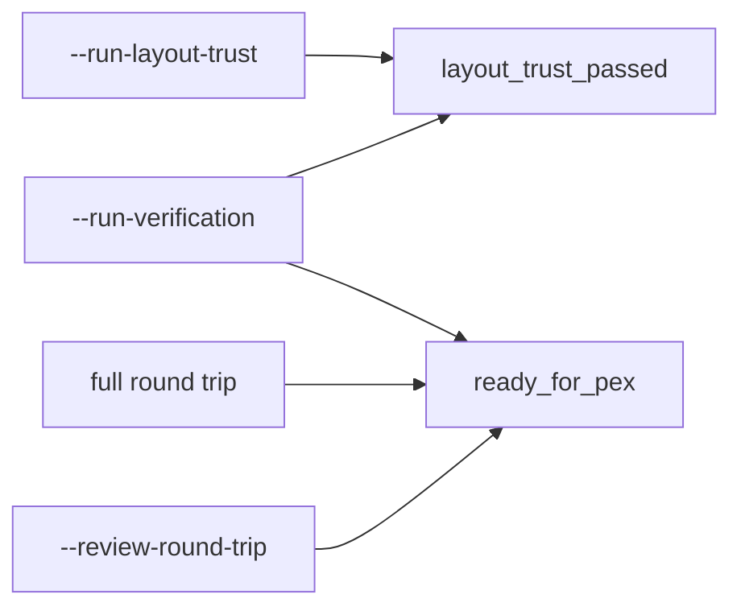

# Circuit Studio CLI Contract

`circuit-studio-flow-runner` emits line-oriented `key=value` output for Agent and
CI callers. Keys are part of the command contract. A command should not reuse a
key for a different semantic gate.

## Gate Key Semantics

| Key | Meaning | Emitted by |
|---|---|---|
| `layout_trust_passed` | The layout ownership and net-aware topology trust evaluation passed. | `--run-layout-trust`, `--run-verification` |
| `ready_for_pex` | The pre-PEX verification gate passed and the run may proceed to PEX. This is a stronger gate than layout trust alone. | full round trip, `--run-verification`, `--review-round-trip` |

`--run-layout-trust` does not emit `ready_for_pex`. Layout trust is one input to
pre-PEX confidence, but it is not the PEX readiness gate.

## `--run-layout-trust`

Current output keys:

| Key | Value |
|---|---|
| `layout_trust` | Layout trust report status. |
| `layout_trust_passed` | Boolean layout trust result. |
| `layout_trust_report` | Path to the persisted layout trust report. |
| `owned_shapes` | Count of shapes with net ownership. |
| `unowned_shapes` | Count of shapes without net ownership. |
| `shorts` | Count of net-aware physical shorts. |
| `opens` | Count of net-aware physical opens. |

## `--run-verification`

Current output keys related to these gates:

| Key | Value |
|---|---|
| `verification` | Pre-PEX verification report status. |
| `ready_for_pex` | Boolean DRC/LVS/approval readiness for PEX. |
| `layout_trust_passed` | Boolean layout trust result. |
| `layout_trust_report` | Path to the persisted layout trust report. |
| `drc_passed` | Boolean DRC result. |
| `lvs_passed` | Boolean LVS result. |
| `external_signoff` | Signoff source. |
| `signoff_approved` | Whether imported signoff evidence was explicitly approved. |

## Breaking Changes

The `--run-layout-trust` mode uses `layout_trust_passed` for its boolean result.
Older output that used `ready_for_pex` for this mode conflated layout trust with
the stronger pre-PEX gate and is no longer part of the current contract.
