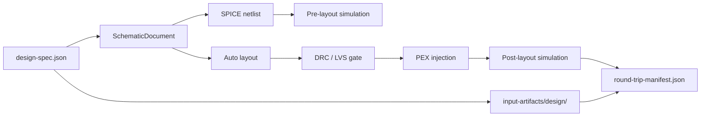

# CircuitStudio Design Spec

This document defines the structured design input consumed by `DesignFlowDesignSpec` and the `circuit-studio-flow-runner --design-spec` command.

The design spec is a small, versioned JSON contract for Agent and CLI callers. It is not intended to replace standard signoff formats. It is an operation input that builds a schematic, generates SPICE, runs simulation, creates layout, gates DRC/LVS, injects PEX, compares post-layout results, and captures the source spec into the run manifest.

## Compatibility

| Field | Required | Meaning |
|---|---:|---|
| `schemaVersion` | No | Version of this JSON contract. Missing means `1`. Only `1` is currently supported. |
| `name` | Yes | Stable design name. Used for default run directory names. |
| `title` | No | Human-readable title. Defaults to `name`. |
| `components` | Yes | Component instances to place in the schematic. |
| `nets` | Yes | Named electrical nets and their terminal ownership. |
| `analyses` | Yes | Pre-layout analysis commands. |
| `postLayoutAnalysis` | No | Post-layout analysis command. Defaults to the first `analyses` entry. |
| `pexIR` | For round trip unless `--pex-manifest` is used | Inline parasitic IR for post-layout simulation. |

## Name Rules

`name`, component names, and net names must be stable single-token identifiers.

| Rejected | Reason |
|---|---|
| Empty values | Cannot be used as stable artifact identifiers |
| Leading/trailing whitespace | Ambiguous for CLI and manifest review |
| Internal whitespace | Ambiguous for SPICE-style tokenization |
| `/` or `\` | Could affect paths |
| `.` or `..` | Path traversal ambiguity |

## Components

| Field | Required | Meaning |
|---|---:|---|
| `name` | Yes | Instance name. Must be unique. |
| `deviceKindID` | Yes | Device kind from `DeviceCatalog.standard()`. |
| `parameters` | No | Numeric parameter overrides. Missing means `{}`. |
| `modelPresetID` | No | Optional model preset ID. |
| `modelName` | No | Optional explicit model name. |

## Nets

| Field | Required | Meaning |
|---|---:|---|
| `name` | Yes | Net name. Must be unique. |
| `terminals` | Yes | Component terminals owned by this net. |

Each terminal has:

| Field | Required | Meaning |
|---|---:|---|
| `component` | Yes | Component instance name. |
| `port` | Yes | Port ID from the component's device kind. |

A terminal may appear in only one net. Duplicate terminal ownership is rejected before artifacts are produced.

## Analyses

| Kind | Required fields | Optional fields |
|---|---|---|
| `op` | None | None |
| `tran` | `stopTime` | `stepTime`, `startTime`, `maxStep` |
| `dcSweep` | `source`, `startValue`, `stopValue`, `stepValue` | None |

## Inline PEX IR

`pexIR` mirrors the subset needed by `PostLayoutSimulationService`.

| Field | Required | Meaning |
|---|---:|---|
| `version` | Yes | IR version string. |
| `cornerID` | Yes | Process corner ID. |
| `units` | No | Unit declarations. Missing values default to canonical units. |
| `elements` | Yes | R/C/coupling parasitic elements. |
| `diagnostics` | No | Optional imported diagnostics. |

Supported units:

| Quantity | Supported values | Canonical |
|---|---|---|
| resistance | `ohm`, `kohm` | `ohm` |
| capacitance | `F`, `pF`, `fF` | `F` |
| coordinate | `um` | `um` |

Supported element kinds:

| Kind | Node contract |
|---|---|
| `resistor` | `nodeA` and `nodeB` |
| `capacitor` | `nodeA`; `nodeB` may be omitted for ground-referenced capacitance |
| `coupling` | `nodeA` and `nodeB` |

## CLI Use

| Operation | Command |
|---|---|
| Netlist | `swift run circuit-studio-flow-runner --generate-netlist --design-spec <path>` |
| Simulation | `swift run circuit-studio-flow-runner --simulate --design-spec <path>` |
| Full round trip | `swift run circuit-studio-flow-runner --design-spec <path> --approve-signoff` |
| Bottleneck summary | `swift run circuit-studio-flow-runner --summarize-bottlenecks --design-spec <path>` |

When `--output` is omitted, design-spec round trips use `./round-trip-runs/<design-spec-file-name-without-extension>`.

The round-trip manifest records the original spec as:

| Manifest artifact | Meaning |
|---|---|
| `kind: design-spec` | Captured copy under `input-artifacts/design/` |
| `sourcePath` | Original source path passed to `--design-spec` |

## Current Limits

| Limit | Impact |
|---|---|
| Schema version `1` only | Future incompatible changes must increment `schemaVersion`. |
| Device kinds come from `DeviceCatalog.standard()` | Custom PDK/device catalog injection is not exposed in this CLI contract yet. |
| Geometry is auto-generated | The spec describes circuit intent, not hand-authored layout. |
| Inline PEX is optional only when `--pex-manifest` is supplied | Full round trip needs parasitics from one of those two sources. |
| No subcircuits or hierarchy | Current contract builds one flat schematic. |
