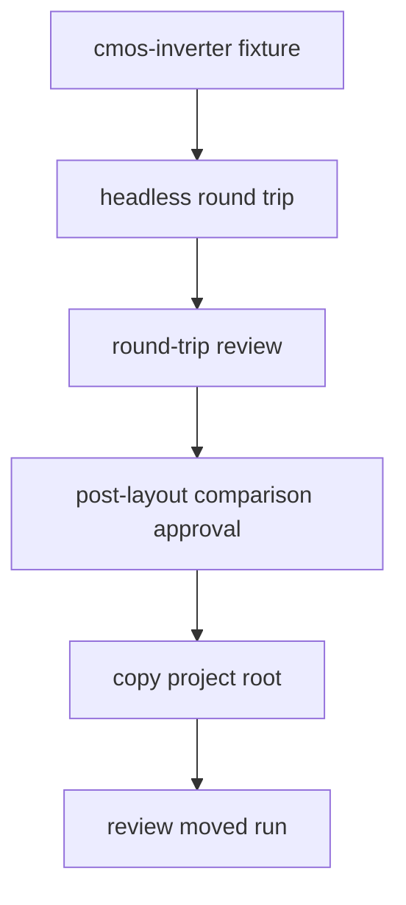
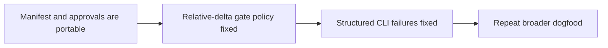
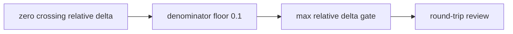
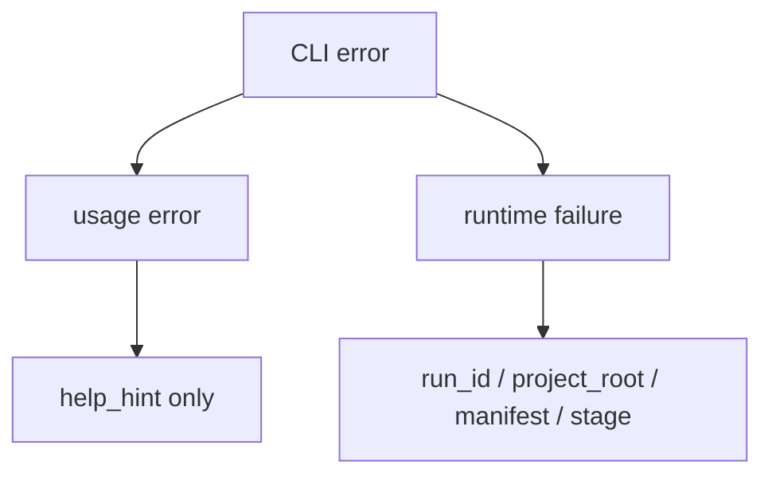
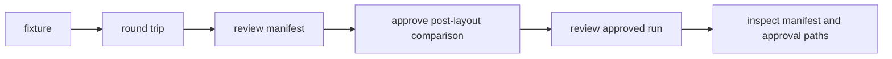
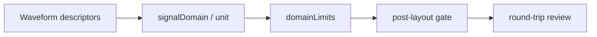
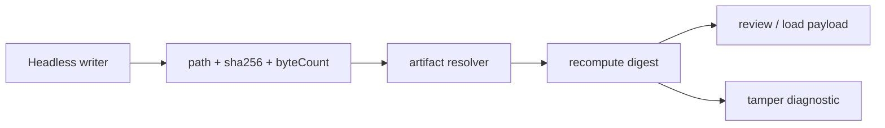

# Dogfooding Report: Round-trip Artifact Trust

Date: 2026-05-15

## Flow



## Commands

```bash
swift run circuit-studio-flow-runner \
  --fixture cmos-inverter \
  --output /tmp/lsi-dogfood-cmos-inverter \
  --run-id dogfood-cmos-20260515 \
  --approve-signoff \
  --max-abs-delta 0.5 \
  --max-rel-delta 0.5
```

```bash
swift run circuit-studio-flow-runner \
  --fixture cmos-inverter \
  --output /tmp/lsi-dogfood-cmos-inverter-pass \
  --run-id dogfood-cmos-pass-20260515 \
  --approve-signoff \
  --max-abs-delta 0.05
```

```bash
swift run circuit-studio-flow-runner \
  --approve-gate \
  --output /tmp/lsi-dogfood-cmos-inverter-pass \
  --run-id dogfood-cmos-pass-20260515 \
  --manifest /tmp/lsi-dogfood-cmos-inverter-pass/.xcircuite/flow-runs/dogfood-cmos-pass-20260515/round-trip-manifest.json \
  --approval-gate post-layout-comparison \
  --reviewer dogfood-agent \
  --approval-policy dogfood-post-layout-absolute-delta \
  --approval-note 'Dogfood approval after artifact resolver validation'
```

## Findings

| ID | Severity | Finding | Evidence | Recommended fix |
|---|---:|---|---|---|
| DF-2026-05-15-001 | P1 | Global relative-delta gates are unstable for CMOS transient comparisons near zero crossings. | `V(out)` max absolute delta was `0.0376818968899153`, but max relative delta was `1.6042159853749478`; `V(in)` and `I(1)` also exceeded `1.5` relative delta while their absolute errors were small. | Fixed in follow-up: comparison limits now support global `relativeDeltaDenominatorFloor` and variable-specific `floor=VALUE` so transient relative gates can be bounded by a meaningful signal floor. |
| DF-2026-05-15-002 | P2 | CLI prints the full usage text for runtime flow failures and argument mistakes, obscuring the actionable error. | Both post-layout gate failure and unquoted `--approval-note` produced `flow_command=failed`, one-line error, and then the full help text. | Fixed in follow-up: `--help` is the only full-help path; usage and runtime failures now print structured fields with a concise recommendation. |
| DF-2026-05-15-003 | P1 | Approval records still store absolute `targetArtifactPath`, so approval audit is not portable even when the round-trip manifest is relative-only. | After copying `/tmp/lsi-dogfood-cmos-inverter-pass` to `/tmp/lsi-dogfood-cmos-inverter-moved`, review still reported `approval_count=1`. The copied approval record target still pointed to the original absolute path. After hiding the original root, moved review still passed with `warning_count=0`. | Fixed in follow-up: manifest-backed approvals now store run-relative target paths, target artifact kind, and path base. Review validates approval target existence and hash through the artifact resolver. |

## Positive Results

| Check | Result |
|---|---|
| New round-trip manifest artifact paths | All 10 artifact paths were relative. |
| Manifest review | Passing run reviewed with `diagnostic_count=0` and `warning_count=0`. |
| Gate approval via manifest artifact | Approval succeeded with `approval_warning_count=0`. |
| Moved manifest artifacts | Moved project review still resolved manifest artifacts correctly. |

## Follow-up Validation

After fixing DF-2026-05-15-003, the dogfood flow was repeated with:

```bash
swift run circuit-studio-flow-runner \
  --fixture cmos-inverter \
  --output /tmp/lsi-dogfood-cmos-portable-v2 \
  --run-id dogfood-cmos-portable-v2-20260515 \
  --approve-signoff \
  --max-abs-delta 0.05
```

```bash
swift run circuit-studio-flow-runner \
  --approve-gate \
  --output /tmp/lsi-dogfood-cmos-portable-v2 \
  --run-id dogfood-cmos-portable-v2-20260515 \
  --manifest /tmp/lsi-dogfood-cmos-portable-v2/.xcircuite/flow-runs/dogfood-cmos-portable-v2-20260515/round-trip-manifest.json \
  --approval-gate post-layout-comparison \
  --reviewer dogfood-agent \
  --approval-policy dogfood-post-layout-absolute-delta \
  --approval-note 'Dogfood approval after portable approval target fix'
```

| Check | Result |
|---|---|
| Approval target path base | `runDirectory` |
| Approval target kind | `post-layout-comparison` |
| Approval target path | `post-layout-comparison.json` |
| Approval target absolute | `false` |
| Review after moving project root and hiding original | `round_trip_review=passed`, `diagnostic_count=0`, `warning_count=0`, `approval_count=1` |

## Next Strategy



DF-2026-05-15-003 is closed by implementation and dogfood validation. DF-2026-05-15-001 is closed by the relative-delta denominator floor implementation and CMOS inverter dogfood validation. DF-2026-05-15-002 is closed by structured CLI failure output and command-line dogfood validation.

## Follow-up Validation: Relative Delta Floor

After fixing DF-2026-05-15-001, the CMOS inverter flow was repeated with the same relative gate and an explicit denominator floor:

```bash
swift run circuit-studio-flow-runner \
  --fixture cmos-inverter \
  --output /tmp/lsi-dogfood-cmos-relative-floor-v1 \
  --run-id dogfood-cmos-relative-floor-v1-20260515 \
  --approve-signoff \
  --max-abs-delta 0.05 \
  --max-rel-delta 0.5 \
  --relative-delta-floor 0.1
```



| Check | Result |
|---|---|
| Round trip | `round_trip=passed` |
| Review | `round_trip_review=passed` |
| Review diagnostics / warnings | `0 / 0` |
| Max absolute delta | `0.0376818968899153` |
| Max relative delta with floor | `0.09641079148664831` |
| Comparison limits persisted | `maxAbsoluteDelta=0.05`, `maxRelativeDelta=0.5`, `relativeDeltaDenominatorFloor=0.1` |

DF-2026-05-15-001 is closed for the global policy path. Variable-specific `floor=VALUE` is also supported by `--variable-limit` for mixed-unit designs where a single global floor is too blunt.

## Follow-up Validation: Structured CLI Failures

After fixing DF-2026-05-15-002, usage and runtime failures were repeated.

```bash
swift run circuit-studio-flow-runner --bad-option
```

```text
flow_command=failed
error_kind=usage
error_type=RunnerError
error=Invalid argument: --bad-option
help_hint=swift run circuit-studio-flow-runner --help
```

```bash
swift run circuit-studio-flow-runner \
  --fixture cmos-inverter \
  --output /tmp/lsi-dogfood-cli-failure-v1 \
  --run-id dogfood-cli-failure-v1-20260516 \
  --approve-signoff \
  --max-abs-delta 0.05 \
  --max-rel-delta 0.5
```

```text
flow_command=failed
error_kind=runtime
error_type=StudioError
error=Simulation error: Post-layout comparison exceeded configured limits.
run_id=dogfood-cli-failure-v1-20260516
project_root=/tmp/lsi-dogfood-cli-failure-v1
manifest=/tmp/lsi-dogfood-cli-failure-v1/.xcircuite/flow-runs/dogfood-cli-failure-v1-20260516/round-trip-manifest.json
stage=post-layout-comparison
recommendation=Inspect post-layout-comparison.json and adjust the design or comparison limits.
```



| Check | Result |
|---|---|
| Full help on invalid argument | Not printed |
| Full help on runtime failure | Not printed |
| Runtime manifest path | Printed |
| Runtime failed stage | `post-layout-comparison` |
| Runtime recommendation | Printed |

## Broad Fixture Sweep

After closing DF-2026-05-15-001, DF-2026-05-15-002, and DF-2026-05-15-003, the full built-in fixture set was run through the same trust path:



All runs used:

```bash
swift run circuit-studio-flow-runner \
  --fixture <fixture> \
  --output /tmp/lsi-dogfood-broad-<fixture>-v1 \
  --run-id dogfood-broad-<fixture>-v1-20260516 \
  --approve-signoff \
  --max-abs-delta 0.05 \
  --max-rel-delta 0.5 \
  --relative-delta-floor 0.1
```

Each passing run was then approved with:

```bash
swift run circuit-studio-flow-runner \
  --approve-gate \
  --output /tmp/lsi-dogfood-broad-<fixture>-v1 \
  --run-id dogfood-broad-<fixture>-v1-20260516 \
  --manifest /tmp/lsi-dogfood-broad-<fixture>-v1/.xcircuite/flow-runs/dogfood-broad-<fixture>-v1-20260516/round-trip-manifest.json \
  --approval-gate post-layout-comparison \
  --reviewer dogfood-agent \
  --approval-policy broad-fixture-post-layout \
  --approval-note broad-fixture-sweep
```

| Fixture | Round trip | Review before approval | Review after approval | Artifact paths | Approval target |
|---|---|---|---|---|---|
| `voltage-divider` | passed | diagnostic `0`, warning `0` | diagnostic `0`, warning `0`, approval `1` | `10`, absolute `0` | `runDirectory:post-layout-comparison.json` |
| `resistor-divider` | passed | diagnostic `0`, warning `0` | diagnostic `0`, warning `0`, approval `1` | `10`, absolute `0` | `runDirectory:post-layout-comparison.json` |
| `rc-low-pass` | passed | diagnostic `0`, warning `0` | diagnostic `0`, warning `0`, approval `1` | `10`, absolute `0` | `runDirectory:post-layout-comparison.json` |
| `cmos-inverter` | passed | diagnostic `0`, warning `0` | diagnostic `0`, warning `0`, approval `1` | `10`, absolute `0` | `runDirectory:post-layout-comparison.json` |

The broad sweep did not uncover a new artifact trust defect. The remaining dogfood frontier should move from artifact portability to higher-level design quality: richer comparison policies per signal class, structured design intent, and post-layout metric evaluation that distinguishes voltage, current, and timing domains.

## Follow-up Validation: Domain-Specific Comparison Policy

The next issue was that global comparison limits still treated voltage and current as the same physical quantity. The comparison report now records each variable's `signalDomain` and `unit`, and CLI limits can target signal domains directly.



The CMOS inverter was repeated with separate voltage and current limits:

```bash
swift run circuit-studio-flow-runner \
  --fixture cmos-inverter \
  --output /tmp/lsi-dogfood-domain-policy-v1 \
  --run-id dogfood-domain-policy-v1-20260516 \
  --approve-signoff \
  --domain-limit voltage:abs=0.05,rel=0.5,floor=0.1 \
  --domain-limit current:abs=0.001,rel=0.5,floor=0.001
```

| Check | Result |
|---|---|
| Round trip | `round_trip=passed` |
| Review | `round_trip_review=passed` |
| Review diagnostics / warnings | `0 / 0` |
| Persisted domain limits | `voltage`, `current` |
| Voltage variables | `signalDomain=voltage`, `unit=V` |
| Current variables | `signalDomain=current`, `unit=A` |
| Largest voltage absolute delta | `0.0376818968899153` |
| Largest current absolute delta | `0.0002606651557556028` |

This closes the first comparison-policy gap: mixed-unit designs no longer need a single global absolute or relative threshold.

## Follow-up Validation: Artifact Digest Integrity

The remaining artifact trust gap was content identity. Relative paths prove where an artifact is located, but they do not prove that the artifact still has the same bytes that were present when the manifest was written. Round-trip artifacts now carry `sha256` and `byteCount`, and review recomputes both before loading signoff or comparison payloads.



The CMOS inverter dogfood was repeated with domain limits and digest-backed artifacts:

```bash
swift run circuit-studio-flow-runner \
  --fixture cmos-inverter \
  --output /tmp/lsi-dogfood-artifact-digest-v1 \
  --run-id dogfood-artifact-digest-v1-20260519 \
  --approve-signoff \
  --domain-limit voltage:abs=0.05,rel=0.5,floor=0.1 \
  --domain-limit current:abs=0.001,rel=0.5,floor=0.001
```

| Check | Result |
|---|---|
| Round trip | `round_trip=passed` |
| Review | `round_trip_review=passed` |
| Artifact count | `10` |
| Review diagnostics / warnings | `0 / 0` |
| Manifest artifacts missing digest | `0` |
| Manifest artifacts with invalid byte count | `0` |
| Review payload loading | gated by digest verification |
| Tamper regression | modified comparison artifact becomes `incomplete` with SHA-256 and byte-count diagnostics |

Representative manifest entries:

| Artifact | Byte count | SHA-256 |
|---|---:|---|
| `pre-layout.cir` | `301` | `0e27583150e300c710cf644e4c449c06fc5039d1c24746b4fb88da07bc44a582` |
| `post-layout.cir` | `437` | `654bd0cf614333d8e2aa904f97df706ff4dbb199d58362c2df6838b6f04b3328` |
| `post-layout-comparison.json` | `2926` | `ed9142e657507c0dd8e9916d9b9e01f6b000689e823866eed20bff93bc048d6a` |

This closes the next trust boundary: review no longer treats a resolvable artifact path as sufficient evidence. The artifact must also match the manifest digest before typed payloads are consumed.
