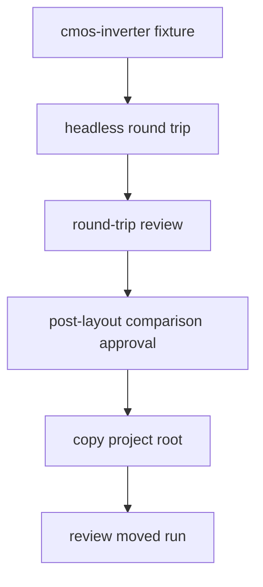
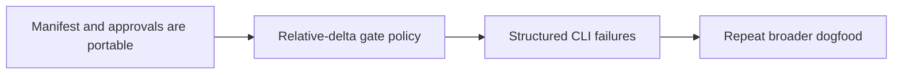

# Dogfooding Report: Round-trip Artifact Trust

Date: 2026-05-15

## Flow



## Commands

```bash
swift run circuit-studio-flow-runner \
  --fixture cmos-inverter \
  --output /tmp/lsi-dogfood-cmos-inverter \
  --run-id dogfood-cmos-20260515 \
  --approve-signoff \
  --max-abs-delta 0.5 \
  --max-rel-delta 0.5
```

```bash
swift run circuit-studio-flow-runner \
  --fixture cmos-inverter \
  --output /tmp/lsi-dogfood-cmos-inverter-pass \
  --run-id dogfood-cmos-pass-20260515 \
  --approve-signoff \
  --max-abs-delta 0.05
```

```bash
swift run circuit-studio-flow-runner \
  --approve-gate \
  --output /tmp/lsi-dogfood-cmos-inverter-pass \
  --run-id dogfood-cmos-pass-20260515 \
  --manifest /tmp/lsi-dogfood-cmos-inverter-pass/.xcircuite/flow-runs/dogfood-cmos-pass-20260515/round-trip-manifest.json \
  --approval-gate post-layout-comparison \
  --reviewer dogfood-agent \
  --approval-policy dogfood-post-layout-absolute-delta \
  --approval-note 'Dogfood approval after artifact resolver validation'
```

## Findings

| ID | Severity | Finding | Evidence | Recommended fix |
|---|---:|---|---|---|
| DF-2026-05-15-001 | P1 | Global relative-delta gates are unstable for CMOS transient comparisons near zero crossings. | `V(out)` max absolute delta was `0.0376818968899153`, but max relative delta was `1.6042159853749478`; `V(in)` and `I(1)` also exceeded `1.5` relative delta while their absolute errors were small. | Add relative-delta floor semantics or require variable-specific gates for transient signals. A useful comparison gate needs `relativeDenominatorFloor` or a policy that ignores relative delta below an absolute signal magnitude floor. |
| DF-2026-05-15-002 | P2 | CLI prints the full usage text for runtime flow failures and argument mistakes, obscuring the actionable error. | Both post-layout gate failure and unquoted `--approval-note` produced `flow_command=failed`, one-line error, and then the full help text. | Only print help for `--help` and parse/usage errors. Runtime flow failures should print structured fields: `error_kind`, `stage`, `run_id`, `manifest`, and `recommendation`. |
| DF-2026-05-15-003 | P1 | Approval records still store absolute `targetArtifactPath`, so approval audit is not portable even when the round-trip manifest is relative-only. | After copying `/tmp/lsi-dogfood-cmos-inverter-pass` to `/tmp/lsi-dogfood-cmos-inverter-moved`, review still reported `approval_count=1`. The copied approval record target still pointed to the original absolute path. After hiding the original root, moved review still passed with `warning_count=0`. | Fixed in follow-up: manifest-backed approvals now store run-relative target paths, target artifact kind, and path base. Review validates approval target existence and hash through the artifact resolver. |

## Positive Results

| Check | Result |
|---|---|
| New round-trip manifest artifact paths | All 10 artifact paths were relative. |
| Manifest review | Passing run reviewed with `diagnostic_count=0` and `warning_count=0`. |
| Gate approval via manifest artifact | Approval succeeded with `approval_warning_count=0`. |
| Moved manifest artifacts | Moved project review still resolved manifest artifacts correctly. |

## Follow-up Validation

After fixing DF-2026-05-15-003, the dogfood flow was repeated with:

```bash
swift run circuit-studio-flow-runner \
  --fixture cmos-inverter \
  --output /tmp/lsi-dogfood-cmos-portable-v2 \
  --run-id dogfood-cmos-portable-v2-20260515 \
  --approve-signoff \
  --max-abs-delta 0.05
```

```bash
swift run circuit-studio-flow-runner \
  --approve-gate \
  --output /tmp/lsi-dogfood-cmos-portable-v2 \
  --run-id dogfood-cmos-portable-v2-20260515 \
  --manifest /tmp/lsi-dogfood-cmos-portable-v2/.xcircuite/flow-runs/dogfood-cmos-portable-v2-20260515/round-trip-manifest.json \
  --approval-gate post-layout-comparison \
  --reviewer dogfood-agent \
  --approval-policy dogfood-post-layout-absolute-delta \
  --approval-note 'Dogfood approval after portable approval target fix'
```

| Check | Result |
|---|---|
| Approval target path base | `runDirectory` |
| Approval target kind | `post-layout-comparison` |
| Approval target path | `post-layout-comparison.json` |
| Approval target absolute | `false` |
| Review after moving project root and hiding original | `round_trip_review=passed`, `diagnostic_count=0`, `warning_count=0`, `approval_count=1` |

## Next Strategy



DF-2026-05-15-003 is closed by implementation and dogfood validation. The next trust issue is DF-2026-05-15-001: comparison gate policy needs a relative-delta denominator floor or variable-specific transient policy before broader circuit dogfooding.
