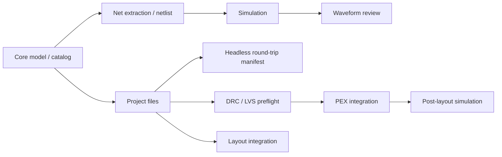

# CircuitStudio Feature Maturity

Last evaluated: 2026-05-07

この評価は、`circuit-studio` を Agent API としてではなく、人間が操作する統合 cockpit として見た個別機能の完成度を記録する。

## 評価基準

| Score | Meaning |
|---:|---|
| 0 | 未実装 |
| 1 | 型や骨格のみ |
| 2 | 基本動作あり、検証不足 |
| 3 | 代表ケースがテスト済み |
| 4 | 統合フローが動き、失敗系も検証済み |
| 5 | 実運用相当、互換性・例外・回帰が十分 |

## Verification Summary

| Target | Command | Result |
|---|---|---|
| CircuitStudio build | `perl -e 'alarm 120; exec @ARGV' swift build` | Pass |
| CircuitStudio core tests | `perl -e 'alarm 120; exec @ARGV' swift test --filter CircuitStudioCoreTests` | 133 pass, 4 skipped |
| CoreSpice IR | `perl -e 'alarm 120; exec @ARGV' swift test --filter CoreSpiceIRTests` | 29 pass |
| semiconductor-layout IO | `perl -e 'alarm 120; exec @ARGV' swift test --filter LayoutIOTests` | 65 pass |
| swift-mask-data detector | `perl -e 'alarm 120; exec @ARGV' swift test --filter FormatDetectorTests` | 28 pass |
| PEXEngine runtime | `perl -e 'alarm 120; exec @ARGV' swift test --filter PEXRuntimeTests` | 16 pass |

Skipped CircuitStudio tests are explicit known limitations:

| Test | Reason |
|---|---|
| `J3: BJT with .model card` | NR solver lacks damping for nonlinear BJT convergence |
| `J4: MOSFET with .model card` | NR solver lacks damping for nonlinear MOSFET convergence |
| `J6: SIN voltage source transient` | Transient solver timestep control collapses with SIN waveforms |
| `J9: Parameter expression evaluation` | SPICE parser does not yet support `.param` expression evaluation |

## Feature Maturity Matrix

| Feature | Score | Implemented | Confirmed by tests | Weak / unverified | Next tests |
|---|---:|---|---|---|---|
| Schematic model/editor operations | 3 | `SchematicDocument`, component placement model, wires, labels, junctions, selection, undo/redo, mirror, copy/paste, T-junction wire splitting | `SchematicViewModelTests`, `UndoStackTests`, `MirrorTests`, `SelectionTests`, `CopyPasteTests` | Interactive canvas gestures, NoConnect/power-symbol style workflows, ERC-level checks | Add gesture-level editor tests and ERC-oriented connectivity diagnostics |
| Device catalog / symbol metadata | 4 | Standard device catalog, categories, ports, parameter schemas, semiconductor model classification | `DeviceCatalogTests` | Symbol rendering fidelity and full SPICE model coverage are not exhaustively checked | Add snapshot/geometry tests for symbols and model preset coverage tests |
| Net extraction | 4 | Union-Find based net extraction, pin/wire connectivity, ground net handling, label naming/merging, endpoint-to-segment T-junctions, overlapping collinear wires | `NetExtractorTests` | Larger schematics, conflicting labels, floating nets, non-axis-aligned imported wires | Add conflicting-label diagnostics and larger multi-branch imported-schematic cases |
| Netlist generation | 4 | SPICE generation for passive, controlled source, diode, BJT, MOSFET, tran/ac directives, process headers | `NetlistGeneratorTests`, parts of `EndToEndTests` | Advanced SPICE syntax, `.param` expressions, subcircuits, include ordering edge cases | Add parser/generator round-trip tests and expression/subckt coverage |
| Process configuration / Virtual PDK | 4 | Process libraries, includes, corner overrides, global parameters, temperature, fixture-backed virtual PDK | `ProcessConfigurationTests`, `VirtualPDKTests` | Multiple PDK layouts, missing libraries, conflicting corner sections, relative path portability | Add missing-file diagnostics and multi-corner include resolution tests |
| SimulationService | 3 | In-process CoreSpice execution, explicit analysis command execution, OP/AC/tran paths, event stream surface | `SimulationServiceTests`, `EndToEndTests` | Nonlinear convergence limitations, SIN transient limitation, `.param` expression limitation, cancellation not covered here | Add convergence failure classification, cancellation, and structured diagnostic tests |
| WaveformViewer | 3 | Waveform document, traces, chart view, toolbar, trace visibility, streaming updates, zoom/pan/cursor, terminal filtering, complex magnitude display | `WaveformViewModelTests` | Chart rendering, AppKit scroll capture, export panel, large waveform decimation performance | Add chart interaction tests, export error tests, and large dataset decimation tests |
| ProjectService / standard file handling | 3 | Project creation, `.xcircuite` files, workspace/placement/simulation JSON, SPICE save paths, PEX config paths and TOML rendering | `ProjectServiceTests` | Layout export, overwrite policy, invalid JSON/load errors, absolute path normalization | Add temp-directory tests for layout export, invalid project files, and absolute path handling |
| Layout integration | 2 | `CircuitStudioApp` depends on `LayoutEditor`, `LayoutAutoGen`, `LayoutCore`, `LayoutTech`, `LayoutIO`, `LayoutVerify` | `swift build`; lower-level `LayoutIOTests` pass | Full CircuitStudio layout workflow and cross-probe behavior are still lightly covered | Add app/service integration tests around loading layout, displaying violations, and cross-probe state |
| Headless round-trip harness | 3 | `HeadlessRoundTripService` runs schematic net extraction, SPICE generation, pre-layout simulation, auto layout, external signoff command execution, persisted signoff approval, pre-PEX verification, PEX IR injection, post-layout simulation, and writes a machine-readable manifest with artifacts and gate status | `HeadlessRoundTripServiceTests` | Current CMOS inverter round trip completes only by explicitly continuing after a failed in-process DRC gate; real PEX backend and real signoff decks are still mock-backed | Add strict passing round-trip fixture, real PEX artifacts, real signoff deck smoke tests, and failure-manifest regression tests |
| Full LVS / DRC preflight | 4 | `PhysicalVerificationService`, DRC violation summaries, schematic-to-layout DesignUnit checks, stale-layout detection, actual layout instance validation, physically realized net validation, hierarchy topology error reporting, hierarchical connectivity extraction through shapes/vias/cut-shapes/pins/labels/instance pins, physical short/open detection, terminal mismatch reporting, explicit Full LVS skip diagnostics, missing/misnamed external port detection, invalid imported terminal reporting, duplicate imported terminal reporting, metadata-backed polygon terminal recognition, raw MOS `ACTIVE ∩ POLY` extraction, source/drain/gate/bulk terminal inference for current sample-process fixtures, numeric GDS layer alias normalization, shared-diffusion two-device extraction, raw resistor extraction, MOS W/L/kind/`nf` comparison, resistor value comparison, external signoff command execution, log artifact capture, report normalization, approval persistence, and explicit human approval gating before PEX | `PhysicalVerificationServiceTests`, `ExternalSignoffCommandServiceTests`, `CMOSInverterFlowTests`; lower-level `LayoutIOTests` pass | Real foundry PDK extraction rules, golden GDS/OASIS regression corpora, real signoff deck fixtures, and UI review workflows are not implemented | Add foundry-style extraction deck fixtures, golden GDS/OASIS corpus tests, real signoff deck smoke tests, and review UI approval tests |
| PEX command / artifact integration | 4 | `PEXCommandService`, `PEXProjectConfig`, PEX config paths, explicit executable invocation, extract argument building, stderr/non-zero mapping, manifest and IR artifact loading, unit normalization, dropped-element diagnostics, mock PEXEngine artifact handoff | `PEXCommandServiceTests`, `PEXArtifactServiceTests`; lower-level `PEXRuntimeTests` pass | UI review flow, real-backend/golden SPEF flow, and PATH/`PEXENGINE_BIN` discovery isolation are not covered | Add UI review integration, golden SPEF, and environment discovery tests |
| Post-layout simulation | 3 | `PostLayoutSimulationService` merges base SPICE and unit-normalized PEX parasitic IR, renders extracted R/C/Ccoupling elements, and runs CoreSpice analysis | `PostLayoutSimulationServiceTests`, `CMOSInverterFlowTests` | Model/subckt-aware parasitic insertion, corner sweeps, waveform comparison against pre-layout, and large PEX deck performance are not covered | Add pre-vs-post comparison tests and multi-corner post-layout simulation tests |

## Current Read

The strongest `circuit-studio` areas are model/catalog, netlist generation, process configuration, and representative simulation flows. The DRC/LVS/PEX/post-layout path now has a headless round-trip harness that can carry a CMOS inverter through artifact-producing stages and record the current blocker: the generated layout still fails the strict in-process DRC gate. Real signoff decks, strict passing layout fixtures, real PEX artifacts, and multi-corner post-layout review are still future work.

## Recommended Next Work

| Priority | Work |
|---:|---|
| 1 | Make the CMOS inverter headless round trip pass strict pre-PEX DRC without forced continuation |
| 2 | Add failure-manifest regression tests for each known gate blocker |
| 3 | Add real signoff deck fixtures and golden GDS/OASIS regression corpora |
| 4 | Add pre-layout vs post-layout waveform comparison tests across PEX corners |
| 5 | Add SimulationService failure/cancellation tests with structured diagnostic expectations |
| 6 | Add ProjectService follow-up tests for layout export, invalid project files, and absolute path handling |
| 7 | Track CoreSpice nonlinear convergence and `.param` expression limitations as upstream blockers |
