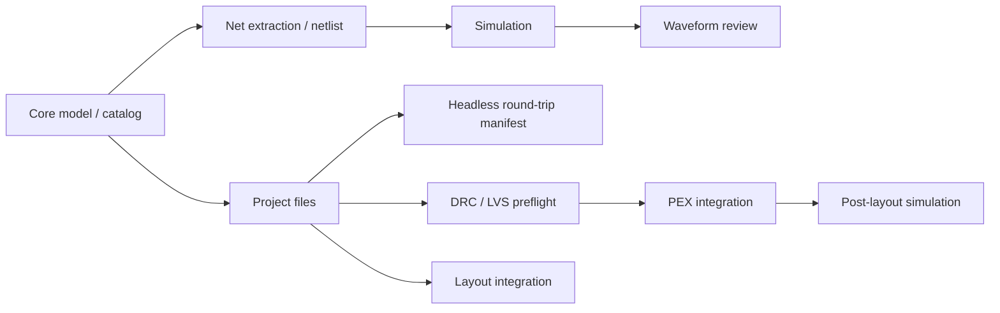

# CircuitStudio Feature Maturity

Last evaluated: 2026-07-14

この評価は、`circuit-studio` を Agent API としてではなく、人間が操作する統合 cockpit として見た個別機能の完成度を記録する。

## 評価基準

| Score | Meaning |
|---:|---|
| 0 | 未実装 |
| 1 | 型や骨格のみ |
| 2 | 基本動作あり、検証不足 |
| 3 | 代表ケースがテスト済み |
| 4 | 統合フローが動き、失敗系も検証済み |
| 5 | 実運用相当、互換性・例外・回帰が十分 |

## Current Migration Verification

| Check | Result |
|---|---|
| Canonical artifact contract | Pass: Activity stores `CircuiteFoundation.ArtifactReference` unchanged and adds only direction metadata. App-local artifact reference projections are removed. |
| Source parse | Pass for Activity, CircuitStudio services, and views. |
| Test declaration floor | Pass: 925 `@Test` declarations; the pre-migration baseline was 924. |
| CircuitStudio build | Blocked upstream in the in-progress Xcircuite storage migration; CircuitStudio compilation has not produced a local compiler error. |
| CircuitStudio tests | Pending a successful Xcircuite build. Run through timeout-bounded `xcodebuild test` after the upstream package compiles. |

## Historical Verification Summary (2026-06-28)

The following rows are retained as historical evidence. They are not the current
migration acceptance result and must be re-run with the workspace's bounded
`xcodebuild` verification matrix before release.

| Target | Command | Result |
|---|---|---|
| CircuitStudio build | `perl -e 'alarm 120; exec @ARGV' swift build` | Pass |
| CircuitStudio tests | `perl -e 'alarm shift; exec @ARGV' 600 swift test` | Pass; 760 `CircuitStudioCoreTests` plus 5 `CircuitPhysicalDesign` contract tests, with prior J3/J4/J6/J9 simulator compatibility skips now regular E2E tests |
| Standalone voltage-divider round trip | `perl -e 'alarm 120; exec @ARGV' swift run circuit-studio-flow-runner --fixture voltage-divider --approve-signoff --output /tmp/circuit-studio-cli-roundtrip-vd --run-id vd-cli` | Pass |
| Standalone CMOS inverter round trip | `perl -e 'alarm 120; exec @ARGV' swift run circuit-studio-flow-runner --fixture cmos-inverter --approve-signoff --output /tmp/circuit-studio-cli-roundtrip-cmos --run-id cmos-cli` | Pass |
| Dogfood CMOS inverter design project | `perl -e 'alarm 120; exec @ARGV' swift run circuit-studio-flow-runner --fixture cmos-inverter --approve-signoff --output /tmp/circuit-studio-dogfood-cmos --run-id dogfood-cmos-inverter --max-abs-delta 0.05 --max-rel-delta 2.0` | Pass |
| Standalone resistor-divider round trip | `perl -e 'alarm 120; exec @ARGV' swift run circuit-studio-flow-runner --fixture resistor-divider --approve-signoff --output /tmp/circuit-studio-cli-roundtrip-resistor-divider --run-id resistor-divider-cli` | Pass |
| Standalone RC low-pass round trip | `perl -e 'alarm 120; exec @ARGV' swift run circuit-studio-flow-runner --fixture rc-low-pass --approve-signoff --output /tmp/circuit-studio-rc-low-pass-pass --run-id rc-low-pass-cli` | Pass |
| Standalone resistor-divider round trip through command API | `perl -e 'alarm 120; exec @ARGV' swift run circuit-studio-flow-runner --fixture resistor-divider --approve-signoff --output /tmp/circuit-studio-cli-command-api --run-id command-api-cli` | Pass; prints `run_id=command-api-cli` |
| Standalone fixture listing through command API | `perl -e 'alarm 120; exec @ARGV' swift run circuit-studio-flow-runner --list-fixtures` | Pass |
| Standalone netlist generation through command API | `perl -e 'alarm 120; exec @ARGV' swift run circuit-studio-flow-runner --generate-netlist --fixture resistor-divider` | Pass |
| Standalone schematic simulation through command API | `perl -e 'alarm 120; exec @ARGV' swift run circuit-studio-flow-runner --simulate --fixture resistor-divider` | Pass |
| Standalone bottleneck summary through command API | `perl -e 'alarm 120; exec @ARGV' swift run circuit-studio-flow-runner --summarize-bottlenecks --output /tmp/circuit-studio-cli-command-api` | Pass |
| Standalone bottleneck summary default path | `perl -e 'alarm 120; exec @ARGV' swift run circuit-studio-flow-runner --summarize-bottlenecks --fixture resistor-divider` after a default-path round trip | Pass |
| Standalone structured design-spec round trip | `perl -e 'alarm 120; exec @ARGV' swift run circuit-studio-flow-runner --design-spec /tmp/circuit-studio-agent-resistor-divider.json --run-id dogfood-design-spec-default --approve-signoff --max-abs-delta 1e-3 --max-rel-delta 2.0` | Pass; source spec captured under `input-artifacts/design/` |
| Standalone structured design-spec bottleneck summary | `perl -e 'alarm 120; exec @ARGV' swift run circuit-studio-flow-runner --summarize-bottlenecks --design-spec /tmp/circuit-studio-agent-resistor-divider.json` | Pass |
| Standalone invalid run ID guard | `perl -e 'alarm 120; exec @ARGV' swift run circuit-studio-flow-runner --fixture voltage-divider --approve-signoff --output /tmp/circuit-studio-cli-invalid-run-id --run-id ../bad-run` | Expected fail before output directory creation |
| Standalone voltage-divider round trip with golden PEX artifact | `perl -e 'alarm 120; exec @ARGV' swift run circuit-studio-flow-runner --fixture voltage-divider --approve-signoff --pex-manifest Tests/CircuitStudioCoreTests/Fixtures/pex/golden-voltage-divider/manifest.json --pex-corner tt_25c_1v0 --output /tmp/circuit-studio-cli-roundtrip-vd-golden-pex --run-id vd-golden-pex-cli` | Pass |
| Standalone voltage-divider round trip with golden signoff and PEX artifacts | `perl -e 'alarm 120; exec @ARGV' swift run circuit-studio-flow-runner --fixture voltage-divider --approve-signoff --signoff-drc-log Tests/CircuitStudioCoreTests/Fixtures/signoff/golden-calibre-drc-clean.log --signoff-lvs-log Tests/CircuitStudioCoreTests/Fixtures/signoff/golden-calibre-lvs-clean.log --pex-manifest Tests/CircuitStudioCoreTests/Fixtures/pex/golden-voltage-divider/manifest.json --pex-corner tt_25c_1v0 --output /tmp/circuit-studio-cli-roundtrip-vd-golden-signoff-pex --run-id vd-golden-signoff-pex-cli` | Pass |
| Standalone voltage-divider round trip with post-layout comparison | `perl -e 'alarm 120; exec @ARGV' swift run circuit-studio-flow-runner --fixture voltage-divider --approve-signoff --signoff-drc-log Tests/CircuitStudioCoreTests/Fixtures/signoff/golden-calibre-drc-clean.log --signoff-lvs-log Tests/CircuitStudioCoreTests/Fixtures/signoff/golden-calibre-lvs-clean.log --pex-manifest Tests/CircuitStudioCoreTests/Fixtures/pex/golden-voltage-divider/manifest.json --pex-corner tt_25c_1v0 --output /tmp/circuit-studio-cli-roundtrip-vd-comparison --run-id vd-comparison-cli` | Pass |
| Standalone voltage-divider round trip with relaxed comparison limits | `perl -e 'alarm 120; exec @ARGV' swift run circuit-studio-flow-runner --fixture voltage-divider --approve-signoff --signoff-drc-log Tests/CircuitStudioCoreTests/Fixtures/signoff/golden-calibre-drc-clean.log --signoff-lvs-log Tests/CircuitStudioCoreTests/Fixtures/signoff/golden-calibre-lvs-clean.log --pex-manifest Tests/CircuitStudioCoreTests/Fixtures/pex/golden-voltage-divider/manifest.json --pex-corner tt_25c_1v0 --max-abs-delta 1e-3 --max-rel-delta 1e-3 --output /tmp/circuit-studio-cli-roundtrip-vd-comparison-limits --run-id vd-comparison-limits-cli` | Pass |
| Standalone voltage-divider round trip with variable comparison limit | `perl -e 'alarm 120; exec @ARGV' swift run circuit-studio-flow-runner --fixture voltage-divider --approve-signoff --max-abs-delta 1e-3 --variable-limit 'V(1):abs=1e-3,rel=1e-3' --output /tmp/circuit-studio-cli-vd-variable-limit --run-id vd-variable-limit-cli` | Pass |
| Standalone voltage-divider round trip with strict comparison limit | `perl -e 'alarm 120; exec @ARGV' swift run circuit-studio-flow-runner --fixture voltage-divider --approve-signoff --signoff-drc-log Tests/CircuitStudioCoreTests/Fixtures/signoff/golden-calibre-drc-clean.log --signoff-lvs-log Tests/CircuitStudioCoreTests/Fixtures/signoff/golden-calibre-lvs-clean.log --pex-manifest Tests/CircuitStudioCoreTests/Fixtures/pex/golden-voltage-divider/manifest.json --pex-corner tt_25c_1v0 --max-abs-delta 0 --output /tmp/circuit-studio-cli-roundtrip-vd-comparison-limit-fail --run-id vd-comparison-limit-fail-cli` | Expected fail at `post-layout-comparison`; failure manifest preserved |
| Golden layout corpus contract | `perl -e 'alarm 120; exec @ARGV' swift test --filter GoldenLayoutCorpusServiceTests` | 1 pass; layout, LEF/DEF sidecars, signoff logs, saved PEX manifest binding, and approval requirement are loaded from one corpus manifest |
| Imported OAS raw topology strict DRC/LVS | `perl -e 'alarm 120; exec @ARGV' swift test --filter PhysicalVerificationServiceTests` | 36 pass; includes OAS export/import raw voltage-divider strict DRC/LVS and raw capacitor extraction/value checks |
| Golden PEX multi-corner gates | `perl -e 'alarm 120; exec @ARGV' swift test --filter PEXArtifactServiceTests` | 6 pass |
| Simulation failure/cancellation | `perl -e 'alarm 120; exec @ARGV' swift test --filter SimulationServiceTests` | Pass |
| BJT `.model` operating point E2E | `perl -e 'alarm shift; exec @ARGV' 240 swift test --filter EndToEndTests/bjtWithModel` | Pass |
| MOSFET `.model` operating point E2E | `perl -e 'alarm shift; exec @ARGV' 240 swift test --filter EndToEndTests/mosfetWithModel` | Pass |
| SIN voltage source transient E2E | `perl -e 'alarm shift; exec @ARGV' 240 swift test --filter EndToEndTests/sinVoltageSource` | Pass |
| `.param` positional expression E2E | `perl -e 'alarm shift; exec @ARGV' 240 swift test --filter EndToEndTests/expressionEvaluation` | Pass |
| CoreSpice voltage-controlled switch SPICE E2E | `perl -e 'alarm shift; exec @ARGV' 300 swift test --filter SPICEIOEndToEndTests/publicAPIExecutesVoltageControlledSwitchDeck` in `/Users/1amageek/Desktop/LSI/CoreSpice` | Pass; `S` element plus `.model SW` lowers to executable `vswitch` |
| DRCEngine native wide-metal spacing | `perl -e 'alarm shift; exec @ARGV' 240 swift test --filter NativeDRCBackendTests/wideMinimumSpacingOnlyAppliesNextToWideGeometry` in `/Users/1amageek/Desktop/LSI/DRCEngine` | Pass; `minimumSpacing` can require `wideWidthThreshold` |
| DRCEngine native corpus wide-spacing qualification | `perl -e 'alarm shift; exec @ARGV' 300 swift test --filter DRCCLIOptionsTests/corpusCLIRunsCasesAndWritesReport` in `/Users/1amageek/Desktop/LSI/DRCEngine` | Pass; corpus now requires `drc.spacing.wide` |
| Unified design-flow API | `perl -e 'alarm shift; exec @ARGV' 300 swift test --filter DesignFlowServiceTests` | 37 pass |
| Standalone technology-package load | `perl -e 'alarm 120; exec @ARGV' swift run circuit-studio-flow-runner --load-technology-package --technology-package Tests/CircuitStudioCoreTests/Fixtures/technology-package.json` | Pass |
| Standalone technology-package round trip | `perl -e 'alarm 120; exec @ARGV' swift run circuit-studio-flow-runner --fixture voltage-divider --technology-package Tests/CircuitStudioCoreTests/Fixtures/technology-package.json --approve-signoff --max-abs-delta 1e-3 --max-rel-delta 2.0 --output /tmp/circuit-studio-tech-package-roundtrip --run-id tech-package-cli` | Pass |
| Signoff adapter layer | `perl -e 'alarm 120; exec @ARGV' swift test --filter SignoffAdapterTests` | 4 pass |
| PEX backend adapter layer | `perl -e 'alarm 120; exec @ARGV' swift test --filter PEXBackendAdapterTests` | 3 pass |
| Standalone PEX extraction through command API | `perl -e 'alarm 120; exec @ARGV' swift run circuit-studio-flow-runner --run-pex-extraction --pex-config /tmp/.../pex-config.json --pex-executable /tmp/.../mock-pexengine --pex-corner tt_25c_1v0` | Pass |
| CoreSpice IR | `perl -e 'alarm 120; exec @ARGV' swift test --filter CoreSpiceIRTests` | 29 pass |
| semiconductor-layout IO | `perl -e 'alarm 120; exec @ARGV' swift test --filter LayoutIOTests` | 65 pass |
| semiconductor-layout auto-generation | `perl -e 'alarm 180; exec @ARGV' swift test --filter LayoutAutoGenTests` | 26 pass; SA placement, Steiner/maze routing, obstruction handling, multi-finger MOS generation, and quality metrics are covered |
| swift-mask-data detector | `perl -e 'alarm 120; exec @ARGV' swift test --filter FormatDetectorTests` | 28 pass |
| PEXEngine runtime | `perl -e 'alarm 120; exec @ARGV' swift test --filter PEXRuntimeTests` | 16 pass |
| CoreSpice full build/test baseline | `perl -e 'alarm 120; exec @ARGV' swift build`; `perl -e 'alarm shift; exec @ARGV' 420 swift test` in `/Users/1amageek/Desktop/LSI/CoreSpice` | Build pass; full test pass, including voltage-controlled switch parser/lowering/SPICEIO E2E |
| DRCEngine full test baseline | `perl -e 'alarm shift; exec @ARGV' 360 swift test` in `/Users/1amageek/Desktop/LSI/DRCEngine` | Pass; native JSON, native standard-layout, corpus, CLI, Magic-adapter/parser, and artifact tests pass |
| semiconductor-layout full build/test baseline | `perl -e 'alarm 120; exec @ARGV' swift build`; `perl -e 'alarm 180; exec @ARGV' swift test` in `/Users/1amageek/Desktop/LSI/semiconductor-layout` | Build pass; 91 pass |
| swift-mask-data full build/test baseline | `perl -e 'alarm 120; exec @ARGV' swift build`; `perl -e 'alarm 180; exec @ARGV' swift test` in `/Users/1amageek/Desktop/LSI/swift-mask-data` | Build pass; 593 pass |
| swift-mask-data golden corpus | `perl -e 'alarm 120; exec @ARGV' swift test --filter GoldenMaskDataCorpusTests` in `/Users/1amageek/Desktop/LSI/swift-mask-data` | 4 pass; GDSII/OASIS/LEF/DEF format detection and round-trip structure are covered |
| PEXEngine full build/test baseline | `perl -e 'alarm 120; exec @ARGV' swift build`; `perl -e 'alarm 180; exec @ARGV' swift test` in `/Users/1amageek/Desktop/LSI/PEXEngine` | Build pass; 96 pass |

CircuitStudio SPICE E2E tests no longer carry disabled simulator-compatibility cases for J3, J4, J6, or J9. Voltage-controlled `S` switch decks with `.model SW` now parse, lower, and execute through CoreSpice. Unsupported native-execution coverage, such as B-source execution, JFET/MESFET execution, current-controlled switch execution, transmission-line execution, and BSIM3/BSIM4 MOS levels, now fails during lowering with typed diagnostics instead of leaking into opaque analysis binding failures.

## Feature Maturity Matrix

| Feature | Score | Implemented | Confirmed by tests | Weak / unverified | Next tests |
|---|---:|---|---|---|---|
| Schematic model/editor operations | 3 | `SchematicDocument`, component placement model, wires, labels, junctions, selection, undo/redo, mirror, copy/paste, T-junction wire splitting | `SchematicViewModelTests`, `UndoStackTests`, `MirrorTests`, `SelectionTests`, `CopyPasteTests` | Interactive canvas gestures, NoConnect/power-symbol style workflows, ERC-level checks | Add gesture-level editor tests and ERC-oriented connectivity diagnostics |
| Device catalog / symbol metadata | 4 | Standard device catalog, categories, ports, parameter schemas, semiconductor model classification | `DeviceCatalogTests` | Symbol rendering fidelity and full SPICE model coverage are not exhaustively checked | Add snapshot/geometry tests for symbols and model preset coverage tests |
| Net extraction | 4 | Union-Find based net extraction, pin/wire connectivity, ground net handling, label naming/merging, endpoint-to-segment T-junctions, overlapping collinear wires | `NetExtractorTests` | Larger schematics, conflicting labels, floating nets, non-axis-aligned imported wires | Add conflicting-label diagnostics and larger multi-branch imported-schematic cases |
| Netlist generation | 4 | SPICE generation for passive, controlled source, diode, BJT, MOSFET, tran/ac directives, process headers, positional parameter expressions, and dependency-ordered `.param` lowering | `NetlistGeneratorTests`, `CoreSpiceParserSPICETests`, `CoreSpiceLoweringTests`, parts of `EndToEndTests` | Advanced SPICE syntax, broader subcircuit/include ordering edge cases, and generator round-trip breadth | Add parser/generator round-trip tests and broader expression/subckt/include coverage |
| Process configuration / Virtual PDK / Technology package | 4 | Process libraries, includes, corner overrides, global parameters, temperature, fixture-backed virtual PDK, `TechnologyPackageManifest`, package loader/validation report, builtin/JSON layout-tech references, signoff replay-log references, PEX saved-manifest references, corpus references, and corner mapping | `ProcessConfigurationTests`, `VirtualPDKTests`, `DesignFlowServiceTests`; CLI package load and package-driven round trip | Multiple PDK layouts, missing library diagnostics outside package validation, package-backed project UI state, tool-specific signoff adapter configs, and real foundry package corpora | Add malformed package validation regressions, package-backed custom catalog injection, real package fixtures with GDS/OASIS/LEF/DEF/SPEF, and package schema compatibility tests |
| SimulationService | 4 | In-process CoreSpice execution, explicit analysis command execution, OP/AC/tran paths, BJT/MOS `.model` operating point E2E, voltage-controlled SW switch OP E2E, SIN voltage source transient E2E, positional `.param` expression E2E, event stream surface, typed failure surfacing, active-job cleanup, and cancellation event emission | `SimulationServiceTests`, `EndToEndTests`, `CoreSpiceParserSPICETests`, `CoreSpiceLoweringTests`, `SPICEIOEndToEndTests` | Broader nonlinear corpus coverage, unsupported compact-model breadth such as BSIM3/BSIM4, JFET/MESFET, current-controlled switches, transmission lines, and behavioral sources, and deeper cancellation of long-running analyses remain weak | Add convergence failure classification details, unsupported-model coverage, larger nonlinear decks, and long-running cancellation interruption tests |
| WaveformViewer | 3 | Waveform document, traces, chart view, toolbar, trace visibility, streaming updates, zoom/pan/cursor, terminal filtering, complex magnitude display | `WaveformViewModelTests` | Chart rendering, AppKit scroll capture, export panel, large waveform decimation performance | Add chart interaction tests, export error tests, and large dataset decimation tests |
| ProjectService / standard file handling | 3 | Project creation, `.xcircuite` files, workspace/placement/simulation JSON, SPICE save paths, PEX config paths and TOML rendering | `ProjectServiceTests` | Layout export, overwrite policy, invalid JSON/load errors, absolute path normalization | Add temp-directory tests for layout export, invalid project files, and absolute path handling |
| Unified design-flow API | 4 | `DesignFlowService` exposes a shared API for SPICE simulation, schematic simulation, netlist generation, auto-layout, pre-PEX verification, post-layout simulation/comparison, full headless round trip, PEX artifact loading, external signoff-log import, active simulation cancellation, bottleneck history aggregation, structured design-spec loading/editing, technology-package loading/injection, PEX backend extraction, and Codable `DesignFlowCommand` execution; `DesignFlowDesignSpec` lets Agent/CLI callers provide schema-versioned components, nets, analyses, and optional PEX IR without adding a built-in fixture, validates unsafe names, SPICE element prefixes, known/required/ranged parameters, model preset/name tokens, model type compatibility, and duplicate terminal ownership before artifact creation, normalizes inline PEX units to canonical SI values, and captures the source spec under each run directory; `DesignFlowDesignEditScript` lets Agent/CLI callers apply component placement/removal/rename/parameter edits and net connect/disconnect edits, then writes an edited spec, `actions.jsonl`, and `design-diff.json`; `TechnologyPackageManifest` lets Agent/CLI callers inject one package for process config, layout tech, signoff replay logs, saved PEX manifest, corpus references, and corner mapping; `DesignFlowFixtureLibrary` exposes the shared small-circuit fixture catalog including RC low-pass; CLI fixture listing, fixture/design-spec netlist generation, fixture/design-spec simulation, fixture/design-spec round-trip, design-spec edit, technology-package loading, PEX extraction, bottleneck summary, UI simulation, and UI layout generation now use shared app-layer APIs instead of constructing lower-level flows independently; global and variable-specific comparison limits flow through the same command/configuration surface | `DesignFlowServiceTests`; `CircuitStudioFlowRunner` exposes `--list-fixtures`, `--generate-netlist`, `--simulate`, default round-trip, `--load-technology-package`, `--technology-package`, `--run-pex-extraction`, `--pex-config`, `--pex-executable`, `--summarize-bottlenecks`, `--apply-design-edit`, `--edit-script`, `--output-design-spec`, `--design-spec`, `--max-abs-delta`, `--max-rel-delta`, and `--variable-limit` through `DesignFlowService.execute`; `docs/design-spec.md`, `docs/technology-package.md`, and `docs/pex-backends.md` document current schema contracts; `AppState` simulation/cancel actions use `DesignFlowService`; `StudioSession` layout generation uses `DesignFlowService`; `ServiceContainer` no longer exposes `SimulationService` directly | Explicit UI pre-PEX verification buttons, PEX review UI, layout-edit commands, approval/rerun commands, custom catalog injection, and package-backed project UI state are not yet all routed through the facade | Move every new UI/CLI/Agent operation to `DesignFlowService.execute` or lower-level `DesignFlowService` methods first; add layout-edit, approval, and rerun API tests before adding buttons or command flags; add custom catalog/PDK injection before broader external use |
| Layout integration | 4 | `CircuitStudioApp` depends on `LayoutEditor`, `LayoutAutoGen`, `LayoutCore`, `LayoutTech`, `LayoutIO`, `LayoutVerify`; auto layout preserves one-terminal physical nets as top-level boundary pins; RC low-pass strict pass is covered; imported OAS raw voltage-divider topology can round-trip through `MaskDataFormatConverter` and pass strict DRC/LVS without generated net IDs; lower-level layout auto-generation has SA placement, Steiner/maze routing, obstruction handling, multi-finger MOS, and quality metrics coverage | `swift build`, `HeadlessRoundTripServiceTests`, `PhysicalVerificationServiceTests`; lower-level `LayoutIOTests` and `LayoutAutoGenTests` pass | Full interactive layout editing workflow, cross-probe behavior, real imported foundry GDS/OASIS corpora, and layout-edit command artifacts are still lightly covered | Add app/service integration tests around loading layout, displaying violations, cross-probe state, real binary corpus fixtures, and command-level layout-edit diffs |
| Headless round-trip harness | 4 | `HeadlessRoundTripService` runs schematic net extraction, SPICE generation, pre-layout simulation, auto layout, external signoff command execution or imported/package signoff review loading, persisted signoff approval, strict pre-PEX verification, PEX IR injection, post-layout simulation, pre/post waveform comparison, optional absolute/symmetric-relative and variable-specific comparison limits, and writes a machine-readable manifest with artifacts, captured input artifact paths, original source paths, comparison report path, gate status, per-stage `durationSeconds`, and `bottleneckSummary`; failed gates persist manifests with failed/skipped stage state before throwing; comparison artifacts persist observed deltas, applied limits, gate status, and gate violations; invalid limits and invalid run IDs are rejected before flow artifacts are written; mutable signoff review JSON, structured design specs, and technology package inputs are captured into the run directory for audit/replay; input artifact capture uses standardized path-boundary and symlink-resolved containment so similarly prefixed run directories and symlinked external files are treated as external inputs; command/API results expose the concrete run ID; historical run summaries aggregate repeated manifests; `circuit-studio-flow-runner` exposes CMOS inverter, RC low-pass, voltage-divider, resistor-divider, structured JSON design-spec, technology-package, and PEX-extraction paths as standalone command-line entrypoints and can load saved signoff logs plus a saved PEX manifest/IR with explicit `--approve-signoff`, `--max-abs-delta`, `--max-rel-delta`, and `--variable-limit` comparison gates | `HeadlessRoundTripServiceTests` covers CMOS inverter transient, RC low-pass transient, voltage divider OP, resistor-divider OP, imported signoff review, captured artifact paths, immutable captured review artifacts, invalid run ID rejection, run-directory prefix-safe artifact capture, symlinked external artifact capture, comparison artifact, comparison write failure, comparison-limit not-comparable failure, numeric comparison-limit failure, comparison-limit passing policy persistence, invalid comparison-limit rejection, stage timing, root-failure bottleneck summaries, historical bottleneck aggregation, pre-PEX failure, empty PEX IR failure, and post-layout simulation failure; `DesignFlowServiceTests` covers command result run IDs, RC low-pass pre-PEX API verification, structured design-spec netlist/simulation/round-trip, technology-package netlist/round-trip injection, PEX extraction command execution, schema rejection, variable limit validation, and source spec capture; `PhysicalVerificationServiceTests` covers imported OAS raw topology strict DRC/LVS; `PostLayoutComparisonServiceTests` covers sweep mismatch rejection, sweep interpolation, limit diagnostics, invalid limit validation, symmetric relative delta, variable-specific gate violations, missing limited variable diagnostics, multi-corner aggregate reports, and applied gate policy; CLI approved pass, unapproved failure, relaxed comparison-limit pass, strict comparison-limit failure, variable-limit pass, technology-package pass, PEX-extraction pass, RC low-pass pass, resistor-divider pass, CMOS dogfood pass with post-layout limits, structured design-spec dogfood pass, command API run ID output, and bottleneck manifest output are verified | Installed PEX backend semantics and real signoff decks are still replay/mock-backed; failure manifests are covered for headless harness gates but not real-tool corpus failures; design spec and package schemas are documented but still narrow and flat; multi-corner aggregate is available as a core report but not yet generated by the round-trip runner in one command | Add installed PEX backend smoke tests, real signoff deck smoke tests, broader non-resistive circuit fixtures, custom catalog/PDK injection, and a one-command multi-corner round-trip runner |
| Full LVS / DRC preflight | 4 | `PhysicalVerificationService`, DRC violation summaries, DRCEngine native JSON wide-metal spacing via `wideWidthThreshold` plus required `drc.spacing.wide` corpus coverage, schematic-to-layout DesignUnit checks, stale-layout detection, actual layout instance validation, physically realized net validation, imported-layout physical cluster net realization without generated net IDs, hierarchy topology error reporting, hierarchical connectivity extraction through shapes/vias/cut-shapes/pins/labels/instance pins, physical short/open detection, terminal mismatch reporting, explicit Full LVS skip diagnostics, missing/misnamed external port detection, invalid imported terminal reporting, duplicate imported terminal reporting, metadata-backed polygon terminal recognition, raw MOS `ACTIVE ∩ POLY` extraction, source/drain/gate/bulk terminal inference for current sample-process fixtures, numeric GDS layer alias normalization, shared-diffusion two-device extraction, raw resistor extraction, raw capacitor extraction, MOS W/L/kind/`nf` comparison, resistor value comparison, capacitor value comparison, `SignoffAdapter` protocol, generic external command adapter, golden replay adapter, Calibre-like/Magic-Netgen-like/KLayout-like parser styles, external signoff command execution, log artifact capture, existing signoff log import, golden layout corpus contract loading with LEF/DEF sidecars and PEX manifest binding, report normalization, imported/package review injection into the headless pre-PEX gate, approval persistence, explicit CLI approval, and explicit human approval gating before PEX | `PhysicalVerificationServiceTests`, `ExternalSignoffCommandServiceTests`, `ExternalSignoffArtifactServiceTests`, `SignoffAdapterTests`, `GoldenLayoutCorpusServiceTests`, `HeadlessRoundTripServiceTests`, `CMOSInverterFlowTests`; lower-level `LayoutIOTests`, `LayoutAutoGenTests`, `DRCNativeTests`, and `DRCCLICorpusTests` pass | Real foundry PDK extraction rules, real static golden GDS/OASIS binary corpora, real signoff deck fixtures, installed-tool smoke tests, and UI review workflows are not implemented | Add foundry-style extraction deck fixtures, committed binary GDS/OASIS corpus tests, real signoff deck smoke tests, and review UI approval tests |
| PEX command / artifact integration | 4 | `PEXCommandService`, `PEXProjectConfig`, PEX config paths, explicit executable invocation, extract argument building, stderr/non-zero mapping, `PEXBackendAdapter`, saved-manifest backend, `pexengine` command backend, JSON `artifacts.manifestURL` handoff parsing, request-level executable override, manifest and IR artifact loading, unit normalization, dropped-element diagnostics, mock PEXEngine artifact handoff, golden multi-corner PEX manifest/IR/raw/log fixture loading, command/CLI `runPEXExtraction` entrypoints, public `DesignFlowService.runPEXExtraction`, and UI PEX export through the same extracted IR plus `PostLayoutSimulationService` netlist renderer | `PEXCommandServiceTests`, `PEXArtifactServiceTests`, `PEXBackendAdapterTests`, `DesignFlowServiceTests`; `sharedPEXExtractionAPIProducesInjectablePostLayoutNetlist()`; CLI `--run-pex-extraction` dogfood; lower-level `PEXRuntimeTests` pass | UI review flow, installed-tool extractor smoke, real layout/SPEF corpus semantics, PATH/`PEXENGINE_BIN` discovery isolation, and UI post-layout simulation execution are not covered | Add UI review integration, installed backend smoke tests, real SPEF/layout fixtures, environment discovery tests, and UI/API post-layout run artifacts |
| Post-layout simulation | 4 | `PostLayoutSimulationService` merges base SPICE and unit-normalized PEX parasitic IR, renders extracted R/C/Ccoupling elements, runs CoreSpice analysis, and `PostLayoutComparisonService` records pre/post common-variable deltas for matching sweep grids or compatible post-layout sweep grids interpolated onto the pre-layout sweep points; optional max absolute/symmetric-relative and variable-specific delta limits can fail the post-layout comparison stage, invalid limits are rejected, applied gate policy is persisted, aggregate multi-corner comparison reports summarize corner gate status and worst deltas, and saved multi-corner PEX fixtures can be compared one corner at a time | `PostLayoutSimulationServiceTests`, `PostLayoutComparisonServiceTests`, `HeadlessRoundTripServiceTests`, `PEXArtifactServiceTests`, `CMOSInverterFlowTests`; CLI relaxed/strict/variable comparison-limit runs; CMOS dogfood project with post-layout limits | Model/subckt-aware parasitic insertion, large PEX deck performance, and one-command multi-corner round-trip artifacts are not covered | Add one-command multi-corner post-layout simulation/comparison and larger PEX deck performance tests |

## Current Read

The strongest `circuit-studio` areas are model/catalog, netlist generation, process configuration, representative simulation flows, and the current headless artifact spine. The prior J3/J4/J6/J9 SPICE E2E skips are now normal passing tests, covering BJT `.model` OP, MOSFET `.model` OP, voltage-controlled SW switch OP, SIN transient syntax, and positional `.param` expression evaluation. DRCEngine native JSON DRC now covers wide-metal spacing through `wideWidthThreshold` and requires `drc.spacing.wide` in the retained corpus qualification contract. The M1 technology package contract now gives CLI/API callers one manifest that injects process config, layout tech, signoff replay logs, saved PEX manifest/corner, corpus references, and corner mapping into the same flow. The M3 signoff adapter slice now normalizes command execution and golden/replay logs through one adapter protocol with generic, Calibre-like, Magic/Netgen-like, and KLayout-like parser styles. The M4 PEX backend slice now gives saved PEX manifests and `pexengine extract --json` runs the same adapter contract, with command/API/CLI access through `DesignFlowCommand.runPEXExtraction`. The DRC/LVS/PEX/post-layout path now has a strict headless round-trip harness that carries CMOS inverter, RC low-pass, voltage divider, resistor-divider fixtures, a structured JSON design-spec resistor divider, and a package-driven voltage divider through artifact-producing stages without forced continuation. Failed gates leave manifests for agent/human review; externally produced signoff logs can be imported into the same approval gate only with explicit approval; golden layout corpus metadata can be loaded without bypassing approval; the pass-path corpus and first structured design spec can be run from the standalone `circuit-studio-flow-runner` CLI; and the voltage-divider CLI path can consume saved golden signoff logs plus saved multi-corner PEX manifest/IR artifacts while capturing those input artifacts and pre/post waveform deltas in the manifest. `DesignFlowService` is now the shared operation API for current CLI round trips and UI simulation actions, and `DesignFlowCommand` gives CLI, future UI actions, and Agent callers a Codable command/result contract for fixture/design-spec/package list/netlist/simulation/round-trip/PEX-extraction/bottleneck operations. Post-layout comparison can now be informational or a hard absolute/symmetric-relative/variable-specific delta gate, compatible adaptive transient sweep grids are compared through interpolation, aggregate multi-corner reports can summarize corner gate status and worst deltas, the applied gate policy is persisted for later audit/replay, per-run bottlenecks are recorded, mutable signoff review state, source design specs, and technology packages are captured into each run, run IDs are path-isolated and returned through command/CLI results, input artifact capture uses path-boundary and symlink-resolved checks, and repeated manifests can be aggregated into historical bottleneck summaries. Broader compact-model execution, current-controlled switch semantics, real foundry decks, installed extractor semantics, installed signoff tool smoke tests, full UI verification controls, custom catalog/PDK injection, one-command multi-corner round trips, package-backed project UI state, broader pin-obstruction-aware routing, and broader design-edit commands are still future work.

M10 update: human review now has two ledger-backed projection layers. `RoundTripReviewService` and `DesignFlowCommand.reviewRoundTrip` read the captured run manifest, external signoff review, post-layout comparison report, artifact inventory, stage state, and bottleneck summary into one Codable review summary. Flow-runner failure envelopes now add a continuation layer on top of that review path: `DesignFlowCommand.selectFailureSuggestedCommand` and `circuit-studio-flow-runner --select-failure-command` persist selected `flow-runner-failure.nextActions[].suggestedCommands[]` entries as `review.selectSuggestedCommand` records in `.xcircuite/runs/<run-id>/actions.jsonl`, and `RoundTripReviewService` projects them through `RoundTripReviewSummary.suggestedCommandSelections`. `RoundTripSelectedSuggestedCommandResolver`, `DesignFlowCommand.runSelectedSuggestedCommand`, and `circuit-studio-flow-runner --run-selected-suggested-command` now turn a selected ready ledger entry back into an allowlisted typed command after validating the `swift run [--quiet] circuit-studio-flow-runner` prefix, command readiness, run ID, manifest path, and project root, so Agent continuation does not become arbitrary process execution. `RunReviewService` and `RunReviewView` now consume `FlowRunReviewBundle` from `DesignFlowKernel`, so the cockpit reads the same review items, approval state, diagnostics, artifact IDs, summary artifact roles, artifact paths, artifact integrity status, next actions, and suggested commands that Agent / CLI callers read. The Plan Review section is now backed by the same run ledger and decodes typed `XcircuiteCandidatePlan` and `XcircuitePlanVerification` artifacts to show candidate steps, verification gates, risk reviews, typed `design-diff.json` summaries with domain/operation buckets, domain-aware path context, canvas-level visual summaries, native viewport summaries, native-coordinate rendering summaries with primitive labels and selection frames, geometry-aware frame summaries, compact visual focus, before/after previews, field-level side-by-side value changes, artifact refs, planning correctness gates, and selected commands without a cockpit-private planning copy; decode failures are surfaced as review issues instead of being hidden. Verification Results now normalizes DRC/LVS/PEX summaries, simulation metric/measurement artifacts, and post-layout comparison reports from the same run ledger into compact cards with verdicts, counts, top issues, suggested fixes, artifact integrity, issue-level repair action hints mapped to existing planning/action-domain operation IDs, RunReviewService/DesignFlowCommand/`circuit-studio-flow-runner --formulate-signoff-repair-planning` plus RunReviewView `Generate Repair Plan` generation of `planning/action-domain-snapshot.json`, `planning/repair-formulation.json`, and `planning/problem.json` from DRC/LVS repair hint reports with `review.formulateSignoffRepairPlanningProblem` action records, and DesignFlowCommand/`circuit-studio-flow-runner --run-signoff-repair-candidate-cycle` plus RunReviewView `Run Candidate Cycle` dispatch of candidate generation, execution, and verification into `candidate-plan.json`, `plan-execution.json`, `design-diff.json`, `plan-verification.json`, optional `rejected-plans.jsonl`, and `review.runSignoffRepairCandidateCycle` action records. Candidate-cycle generation also reads existing `planning-rejected-plans` feedback from the run manifest and exposes consumed feedback counts through symbolic planner trace and CLI output. It also shows DRC violation-bucket sections with representative region / related shape IDs / related net IDs / report refs, LVS mismatch-bucket sections with layout/schematic counts, port refs, extracted-netlist refs, and report refs, and PEX corner/top-net/diagnostic sections with manifest refs. Waiver Reviews now normalize DRC/LVS waived-count, unused-waiver evidence, source-file lineage, edit proposals, post-edit verification records with typed DRC violation buckets, LVS issue counts, ready-for-PEX state, optional layout-trust and external-signoff state, and post-edit planning feedback status from the same summary/action artifacts; approve/reject actions append `review.decideWaiver` records, edit proposal selections append `review.selectWaiverEditProposal` records, bounded source-file edit applications append `review.applyWaiverEditProposal` records, and post-edit verification appends `review.verifyWaiverEditProposal` records to `actions.jsonl` for Agent / CLI continuation. `DesignFlowCommand.applyWaiverEditProposal` and `circuit-studio-flow-runner --apply-waiver-edit` expose the audited application path for CLI callers, currently limited to structured JSON object removal and full-file replacement proposals; `DesignFlowCommand.runPostWaiverEditVerification` and `circuit-studio-flow-runner --run-post-waiver-edit-verification` run DRC/LVS/pre-PEX verification against an applied waiver edit; `DesignFlowCommand.applyWaiverEditProposalAndRunPostVerification` and `circuit-studio-flow-runner --apply-waiver-edit-and-verify` apply the selected edit and immediately run linked DRC/LVS/pre-PEX verification in one API/CLI command while preserving both action IDs. `RunReviewService.waiverEditVerificationContext` resolves the run's design-spec, JSON layout-document / drc-layout, and optional design-unit artifacts, and `RunReviewView` now exposes `Apply + Verify` before application plus `Verify` after application over the same command path, including a structured post-edit verification drilldown over the recorded action metadata. Post-edit verification persists the verification report/action linkage, writes `planning/waiver-edit-feedback/<proposal-id>/candidate-plan.json` and `plan-verification.json`, and appends failed gate feedback to `planning/rejected-plans.jsonl`. Risk approval/rejection actions write the same `FlowApprovalRecord` and `planning.approve-candidate-plan-risk` action records that CLI callers use, and `RunReviewService` refreshes displayed risk reviews from current approval records even before a new verification artifact is written. Selecting a suggested command from the cockpit appends a `review.selectSuggestedCommand` record to `actions.jsonl`, preserving the next action, command ID, readiness, executable, arguments, and reason in the shared run ledger; `FlowSuggestedCommandSelection` projects those records back into a typed API so follow-on Agent / CLI callers do not scrape raw metadata. Missing or digest-mismatched stage artifacts become `artifactIntegrity` review items, missing engine-manifest coverage becomes `artifactCoverage`, and non-passing plan-verification gates become `planningCorrectness`, so CLI/API/UI callers cannot accidentally present an unauditable or unverified run as clean. The remaining cockpit maturity gap is review breadth: interactive schematic/layout canvas diff selection, richer waveform cursors/measurements, full source-linked per-diagnostic DRC/LVS/PEX panes with rule-deck source lines, geometry selection, richer candidate rejection/regeneration controls, broader waiver edit operation coverage, and view-level rendering coverage still need to be built over the shared bundle.

M10 candidate-cycle history update: `RunReviewService.signoffReview` now projects `review.runSignoffRepairCandidateCycle` action records back into reload-stable candidate-cycle history items. `RunReviewSignoffRepairCandidateCycleHistorySummary` derives accepted/not-accepted counts, latest cycle state, consumed rejected-feedback records, maximum global feedback count, selected actions, selected action domains, selected objective domains, objective-domain summaries, feedback-penalized actions, rejected-feedback rank-change counts/action IDs, and score-delta counts/action IDs from that history. Candidate-cycle dispatch now writes `planning/candidate-cycle-history-summary.json` as a hashable run artifact and links it from `review.runSignoffRepairCandidateCycle` outputs. `RunReviewSignoffRepairCandidateCycleHistoryIndexService` and `DesignFlowCommand.summarizeSignoffRepairCandidateCycles` read retained summaries across `.xcircuite/runs/*/planning/` without rerunning candidate generation or verification, including per-objective-domain cycle count, accepted count, acceptance rate, feedback impact counts, selected actions, and action domains. `RunReviewSignoffRepairCandidateCycleHistoryQualificationService`, `DesignFlowCommand.qualifySignoffRepairCandidateCycles`, and `circuit-studio-flow-runner --qualify-signoff-repair-cycles` now turn that retained history into an explicit promotion gate with versioned external profile thresholds, optional CLI overrides, required selected action-domain gates, required selected objective-domain gates, per-selected-objective-domain accepted-count gates, observed counts, per-gate pass/fail records, profile metadata, failed gate IDs, missing action-domain IDs, missing objective-domain IDs, and underqualified objective-domain IDs, then persist `.xcircuite/retained/signoff-repair-cycle-history-qualification.json` as a manifest-registered report with hash and byte-count evidence. The qualification profile is a JSON data contract rather than a process-specific Swift file, so DRC/LVS/PEX/simulation promotion policy can evolve through artifacts without recompiling the product. `DesignFlowCommandResult.signoffRepairCandidateCycleHistorySummary`, flow-runner JSON output, key-value `selected_action_domains`, `cycle_history_selected_objective_domains`, `cycle_history_objective_domain`, `cycle_history_*` fields, `cycle_history_summary`, retained-history `history_objective_domain`, retained-history `history_*` fields, and qualification `qualification_*` fields expose the same aggregate evidence to Agent callers. RunReviewView exposes both the aggregate feedback-impact summary and the latest cycles with accepted status, verification artifact path, selected actions, consumed feedback counts, feedback-penalized actions, rejected-feedback rank changes, and rejected-feedback score deltas from the shared run ledger instead of transient UI state.

M6 update: the Agent edit loop now includes a layout-edit command for canonical `LayoutDocument` JSON. `DesignFlowCommand.applyLayoutEdit` can add/remove layout nets, rect/path routing shapes, pins, and labels, then writes an edited layout document plus JSONL actions and a layout diff artifact. This closes the first physical-edit gap for DRC/LVS repair loops, while OAS/GDS import/export and richer geometry edits remain separate follow-up work.

M6 verification update: Agent/API callers can now run DRC/LVS/pre-PEX verification without a full round trip. `DesignFlowCommand.runVerification` accepts a fixture or design spec plus a canonical layout JSON, optionally imports signoff logs and a DesignUnit, rebinds stale ID mappings by layout instance/net names when needed, and writes a Codable physical-verification report artifact under `.xcircuite/runs/<run-id>/reports/physical-verification.json`. This makes edit -> verify loops materially shorter than rerunning simulation, PEX, and comparison each time.

M6 governance update: human approval is now represented as an immutable gate approval record instead of a mutable side effect on the reviewed artifact. `GateApprovalRecord` stores the gate ID, decision, reviewer, timestamp, target artifact SHA256, manifest SHA256, policy, waiver IDs, and lineage back to the reviewed run. `DesignFlowCommand.approveGate` writes these records under `.xcircuite/approvals/<run-id>/`, and `RoundTripReviewService` includes them in the same review projection used by CLI/API/UI. Approval record paths validate both explicit and manifest-derived run IDs, and pre-PEX approvals require an explicit verification artifact instead of falling back to an unrelated later-stage artifact.

M9 update: imported OAS raw topology now has a strict in-process DRC/LVS regression. Raw capacitor extraction/value comparison is covered, and imported-layout LVS can accept physical connectivity clusters plus top-level labels as net realization when generated `DesignUnit` net IDs are absent. The remaining layout gap is committed real foundry-style binary corpus coverage rather than only generated test artifacts.

## Recommended Next Work

| Priority | Work |
|---:|---|
| 1 | Extend the M6 command loop from design/layout edits, verification-only, and approval records to rerun commands |
| 2 | Add committed real GDS/OASIS imported-layout corpora with foundry-style extraction expectations |
| 3 | Add one-command multi-corner round-trip execution that emits aggregate post-layout comparison artifacts |
| 4 | Extend native-coordinate canvas rendering into interactive schematic/layout canvas diff selection, and add waveform plus DRC/LVS/PEX report renderers on top of `FlowRunReviewBundle` and `RoundTripReviewSummary` without reinterpreting raw manifest fields |
| 5 | Add installed PEX backend smoke tests when a real `pexengine` binary is available |
| 6 | Add ProjectService follow-up tests for layout export, invalid project files, package-backed project state, and absolute path handling |
| 7 | Extend CoreSpice native execution beyond current supported model/device classes, especially BSIM3/BSIM4, JFET/MESFET, current-controlled switches, transmission lines, and behavioral sources |
