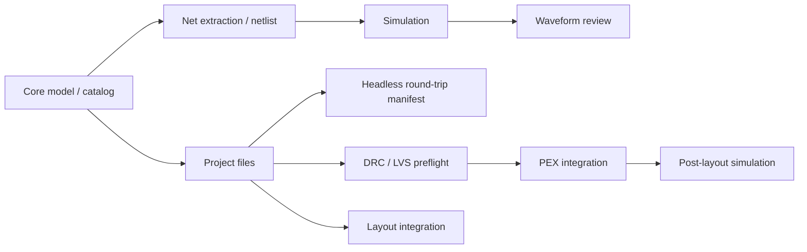

# CircuitStudio Feature Maturity

Last evaluated: 2026-05-08

この評価は、`circuit-studio` を Agent API としてではなく、人間が操作する統合 cockpit として見た個別機能の完成度を記録する。

## 評価基準

| Score | Meaning |
|---:|---|
| 0 | 未実装 |
| 1 | 型や骨格のみ |
| 2 | 基本動作あり、検証不足 |
| 3 | 代表ケースがテスト済み |
| 4 | 統合フローが動き、失敗系も検証済み |
| 5 | 実運用相当、互換性・例外・回帰が十分 |

## Verification Summary

| Target | Command | Result |
|---|---|---|
| CircuitStudio build | `perl -e 'alarm 120; exec @ARGV' swift build` | Pass |
| CircuitStudio core tests | `perl -e 'alarm 120; exec @ARGV' swift test --filter CircuitStudioCoreTests` | 172 pass, 4 skipped |
| Standalone voltage-divider round trip | `perl -e 'alarm 120; exec @ARGV' swift run circuit-studio-flow-runner --fixture voltage-divider --approve-signoff --output /tmp/circuit-studio-cli-roundtrip-vd --run-id vd-cli` | Pass |
| Standalone CMOS inverter round trip | `perl -e 'alarm 120; exec @ARGV' swift run circuit-studio-flow-runner --fixture cmos-inverter --approve-signoff --output /tmp/circuit-studio-cli-roundtrip-cmos --run-id cmos-cli` | Pass |
| Dogfood CMOS inverter design project | `perl -e 'alarm 120; exec @ARGV' swift run circuit-studio-flow-runner --fixture cmos-inverter --approve-signoff --output /tmp/circuit-studio-dogfood-cmos --run-id dogfood-cmos-inverter --max-abs-delta 0.05 --max-rel-delta 2.0` | Pass |
| Standalone resistor-divider round trip | `perl -e 'alarm 120; exec @ARGV' swift run circuit-studio-flow-runner --fixture resistor-divider --approve-signoff --output /tmp/circuit-studio-cli-roundtrip-resistor-divider --run-id resistor-divider-cli` | Pass |
| Standalone resistor-divider round trip through command API | `perl -e 'alarm 120; exec @ARGV' swift run circuit-studio-flow-runner --fixture resistor-divider --approve-signoff --output /tmp/circuit-studio-cli-command-api --run-id command-api-cli` | Pass; prints `run_id=command-api-cli` |
| Standalone fixture listing through command API | `perl -e 'alarm 120; exec @ARGV' swift run circuit-studio-flow-runner --list-fixtures` | Pass |
| Standalone netlist generation through command API | `perl -e 'alarm 120; exec @ARGV' swift run circuit-studio-flow-runner --generate-netlist --fixture resistor-divider` | Pass |
| Standalone schematic simulation through command API | `perl -e 'alarm 120; exec @ARGV' swift run circuit-studio-flow-runner --simulate --fixture resistor-divider` | Pass |
| Standalone bottleneck summary through command API | `perl -e 'alarm 120; exec @ARGV' swift run circuit-studio-flow-runner --summarize-bottlenecks --output /tmp/circuit-studio-cli-command-api` | Pass |
| Standalone bottleneck summary default path | `perl -e 'alarm 120; exec @ARGV' swift run circuit-studio-flow-runner --summarize-bottlenecks --fixture resistor-divider` after a default-path round trip | Pass |
| Standalone structured design-spec round trip | `perl -e 'alarm 120; exec @ARGV' swift run circuit-studio-flow-runner --design-spec /tmp/circuit-studio-agent-resistor-divider.json --run-id dogfood-design-spec-default --approve-signoff --max-abs-delta 1e-3 --max-rel-delta 2.0` | Pass; source spec captured under `input-artifacts/design/` |
| Standalone structured design-spec bottleneck summary | `perl -e 'alarm 120; exec @ARGV' swift run circuit-studio-flow-runner --summarize-bottlenecks --design-spec /tmp/circuit-studio-agent-resistor-divider.json` | Pass |
| Standalone invalid run ID guard | `perl -e 'alarm 120; exec @ARGV' swift run circuit-studio-flow-runner --fixture voltage-divider --approve-signoff --output /tmp/circuit-studio-cli-invalid-run-id --run-id ../bad-run` | Expected fail before output directory creation |
| Standalone voltage-divider round trip with golden PEX artifact | `perl -e 'alarm 120; exec @ARGV' swift run circuit-studio-flow-runner --fixture voltage-divider --approve-signoff --pex-manifest Tests/CircuitStudioCoreTests/Fixtures/pex/golden-voltage-divider/manifest.json --pex-corner tt_25c_1v0 --output /tmp/circuit-studio-cli-roundtrip-vd-golden-pex --run-id vd-golden-pex-cli` | Pass |
| Standalone voltage-divider round trip with golden signoff and PEX artifacts | `perl -e 'alarm 120; exec @ARGV' swift run circuit-studio-flow-runner --fixture voltage-divider --approve-signoff --signoff-drc-log Tests/CircuitStudioCoreTests/Fixtures/signoff/golden-calibre-drc-clean.log --signoff-lvs-log Tests/CircuitStudioCoreTests/Fixtures/signoff/golden-calibre-lvs-clean.log --pex-manifest Tests/CircuitStudioCoreTests/Fixtures/pex/golden-voltage-divider/manifest.json --pex-corner tt_25c_1v0 --output /tmp/circuit-studio-cli-roundtrip-vd-golden-signoff-pex --run-id vd-golden-signoff-pex-cli` | Pass |
| Standalone voltage-divider round trip with post-layout comparison | `perl -e 'alarm 120; exec @ARGV' swift run circuit-studio-flow-runner --fixture voltage-divider --approve-signoff --signoff-drc-log Tests/CircuitStudioCoreTests/Fixtures/signoff/golden-calibre-drc-clean.log --signoff-lvs-log Tests/CircuitStudioCoreTests/Fixtures/signoff/golden-calibre-lvs-clean.log --pex-manifest Tests/CircuitStudioCoreTests/Fixtures/pex/golden-voltage-divider/manifest.json --pex-corner tt_25c_1v0 --output /tmp/circuit-studio-cli-roundtrip-vd-comparison --run-id vd-comparison-cli` | Pass |
| Standalone voltage-divider round trip with relaxed comparison limits | `perl -e 'alarm 120; exec @ARGV' swift run circuit-studio-flow-runner --fixture voltage-divider --approve-signoff --signoff-drc-log Tests/CircuitStudioCoreTests/Fixtures/signoff/golden-calibre-drc-clean.log --signoff-lvs-log Tests/CircuitStudioCoreTests/Fixtures/signoff/golden-calibre-lvs-clean.log --pex-manifest Tests/CircuitStudioCoreTests/Fixtures/pex/golden-voltage-divider/manifest.json --pex-corner tt_25c_1v0 --max-abs-delta 1e-3 --max-rel-delta 1e-3 --output /tmp/circuit-studio-cli-roundtrip-vd-comparison-limits --run-id vd-comparison-limits-cli` | Pass |
| Standalone voltage-divider round trip with strict comparison limit | `perl -e 'alarm 120; exec @ARGV' swift run circuit-studio-flow-runner --fixture voltage-divider --approve-signoff --signoff-drc-log Tests/CircuitStudioCoreTests/Fixtures/signoff/golden-calibre-drc-clean.log --signoff-lvs-log Tests/CircuitStudioCoreTests/Fixtures/signoff/golden-calibre-lvs-clean.log --pex-manifest Tests/CircuitStudioCoreTests/Fixtures/pex/golden-voltage-divider/manifest.json --pex-corner tt_25c_1v0 --max-abs-delta 0 --output /tmp/circuit-studio-cli-roundtrip-vd-comparison-limit-fail --run-id vd-comparison-limit-fail-cli` | Expected fail at `post-layout-comparison`; failure manifest preserved |
| Golden layout corpus contract | `perl -e 'alarm 120; exec @ARGV' swift test --filter GoldenLayoutCorpusServiceTests` | 1 pass |
| Golden PEX multi-corner gates | `perl -e 'alarm 120; exec @ARGV' swift test --filter PEXArtifactServiceTests` | 6 pass |
| Simulation failure/cancellation | `perl -e 'alarm 120; exec @ARGV' swift test --filter SimulationServiceTests` | Pass |
| Unified design-flow API | `perl -e 'alarm 120; exec @ARGV' swift test --filter DesignFlowServiceTests` | 11 pass |
| CoreSpice IR | `perl -e 'alarm 120; exec @ARGV' swift test --filter CoreSpiceIRTests` | 29 pass |
| semiconductor-layout IO | `perl -e 'alarm 120; exec @ARGV' swift test --filter LayoutIOTests` | 65 pass |
| swift-mask-data detector | `perl -e 'alarm 120; exec @ARGV' swift test --filter FormatDetectorTests` | 28 pass |
| PEXEngine runtime | `perl -e 'alarm 120; exec @ARGV' swift test --filter PEXRuntimeTests` | 16 pass |

Skipped CircuitStudio tests are explicit known limitations:

| Test | Reason |
|---|---|
| `J3: BJT with .model card` | NR solver lacks damping for nonlinear BJT convergence |
| `J4: MOSFET with .model card` | NR solver lacks damping for nonlinear MOSFET convergence |
| `J6: SIN voltage source transient` | Transient solver timestep control collapses with SIN waveforms |
| `J9: Parameter expression evaluation` | SPICE parser does not yet support `.param` expression evaluation |

## Feature Maturity Matrix

| Feature | Score | Implemented | Confirmed by tests | Weak / unverified | Next tests |
|---|---:|---|---|---|---|
| Schematic model/editor operations | 3 | `SchematicDocument`, component placement model, wires, labels, junctions, selection, undo/redo, mirror, copy/paste, T-junction wire splitting | `SchematicViewModelTests`, `UndoStackTests`, `MirrorTests`, `SelectionTests`, `CopyPasteTests` | Interactive canvas gestures, NoConnect/power-symbol style workflows, ERC-level checks | Add gesture-level editor tests and ERC-oriented connectivity diagnostics |
| Device catalog / symbol metadata | 4 | Standard device catalog, categories, ports, parameter schemas, semiconductor model classification | `DeviceCatalogTests` | Symbol rendering fidelity and full SPICE model coverage are not exhaustively checked | Add snapshot/geometry tests for symbols and model preset coverage tests |
| Net extraction | 4 | Union-Find based net extraction, pin/wire connectivity, ground net handling, label naming/merging, endpoint-to-segment T-junctions, overlapping collinear wires | `NetExtractorTests` | Larger schematics, conflicting labels, floating nets, non-axis-aligned imported wires | Add conflicting-label diagnostics and larger multi-branch imported-schematic cases |
| Netlist generation | 4 | SPICE generation for passive, controlled source, diode, BJT, MOSFET, tran/ac directives, process headers | `NetlistGeneratorTests`, parts of `EndToEndTests` | Advanced SPICE syntax, `.param` expressions, subcircuits, include ordering edge cases | Add parser/generator round-trip tests and expression/subckt coverage |
| Process configuration / Virtual PDK | 4 | Process libraries, includes, corner overrides, global parameters, temperature, fixture-backed virtual PDK | `ProcessConfigurationTests`, `VirtualPDKTests` | Multiple PDK layouts, missing libraries, conflicting corner sections, relative path portability | Add missing-file diagnostics and multi-corner include resolution tests |
| SimulationService | 4 | In-process CoreSpice execution, explicit analysis command execution, OP/AC/tran paths, event stream surface, typed failure surfacing, active-job cleanup, and cancellation event emission | `SimulationServiceTests`, `EndToEndTests` | Nonlinear convergence limitations, SIN transient limitation, `.param` expression limitation, and deeper cancellation of long-running analyses remain weak | Add convergence failure classification details and long-running cancellation interruption tests |
| WaveformViewer | 3 | Waveform document, traces, chart view, toolbar, trace visibility, streaming updates, zoom/pan/cursor, terminal filtering, complex magnitude display | `WaveformViewModelTests` | Chart rendering, AppKit scroll capture, export panel, large waveform decimation performance | Add chart interaction tests, export error tests, and large dataset decimation tests |
| ProjectService / standard file handling | 3 | Project creation, `.xcircuite` files, workspace/placement/simulation JSON, SPICE save paths, PEX config paths and TOML rendering | `ProjectServiceTests` | Layout export, overwrite policy, invalid JSON/load errors, absolute path normalization | Add temp-directory tests for layout export, invalid project files, and absolute path handling |
| Unified design-flow API | 4 | `DesignFlowService` exposes a shared API for SPICE simulation, schematic simulation, netlist generation, auto-layout, pre-PEX verification, post-layout simulation/comparison, full headless round trip, PEX artifact loading, external signoff-log import, active simulation cancellation, bottleneck history aggregation, structured design-spec loading, and Codable `DesignFlowCommand` execution; `DesignFlowDesignSpec` lets Agent/CLI callers provide schema-versioned components, nets, analyses, and optional PEX IR without adding a built-in fixture, validates unsafe names plus duplicate terminal ownership before artifact creation, and captures the source spec under each run directory; `DesignFlowFixtureLibrary` exposes the shared small-circuit fixture catalog; CLI fixture listing, fixture/design-spec netlist generation, fixture/design-spec simulation, fixture/design-spec round-trip, bottleneck summary, UI simulation, and UI layout generation now use shared app-layer APIs instead of constructing lower-level flows independently | `DesignFlowServiceTests`; `CircuitStudioFlowRunner` exposes `--list-fixtures`, `--generate-netlist`, `--simulate`, default round-trip, `--summarize-bottlenecks`, and `--design-spec` through `DesignFlowService.execute`; `docs/design-spec.md` documents the current schema contract; `AppState` simulation/cancel actions use `DesignFlowService`; `DesignProject` layout generation uses `DesignFlowService`; `ServiceContainer` no longer exposes `SimulationService` directly | Explicit UI pre-PEX verification buttons, PEX review UI, custom catalog injection, and future Agent design-edit commands are not yet all routed through the facade | Move every new UI/CLI/Agent operation to `DesignFlowService.execute` or lower-level `DesignFlowService` methods first; add API tests before adding buttons or command flags; add custom catalog/PDK injection before broader external use |
| Layout integration | 3 | `CircuitStudioApp` depends on `LayoutEditor`, `LayoutAutoGen`, `LayoutCore`, `LayoutTech`, `LayoutIO`, `LayoutVerify`; auto layout now preserves one-terminal physical nets as top-level boundary pins and avoids simple horizontal M1 shorts in passive round trips | `swift build`, `HeadlessRoundTripServiceTests`; lower-level `LayoutIOTests` pass | Full interactive layout editing workflow and cross-probe behavior are still lightly covered | Add app/service integration tests around loading layout, displaying violations, and cross-probe state |
| Headless round-trip harness | 4 | `HeadlessRoundTripService` runs schematic net extraction, SPICE generation, pre-layout simulation, auto layout, external signoff command execution or imported signoff review loading, persisted signoff approval, strict pre-PEX verification, PEX IR injection, post-layout simulation, pre/post waveform comparison, optional absolute/symmetric-relative comparison limits, and writes a machine-readable manifest with artifacts, captured input artifact paths, original source paths, comparison report path, gate status, per-stage `durationSeconds`, and `bottleneckSummary`; failed gates persist manifests with failed/skipped stage state before throwing; comparison artifacts persist observed deltas, applied limits, gate status, and gate violations; invalid limits and invalid run IDs are rejected before flow artifacts are written; mutable signoff review JSON and structured design specs are captured into the run directory for audit/replay; input artifact capture uses standardized path-boundary and symlink-resolved containment so similarly prefixed run directories and symlinked external files are treated as external inputs; command/API results expose the concrete run ID; historical run summaries aggregate repeated manifests; `circuit-studio-flow-runner` exposes CMOS inverter, voltage-divider, resistor-divider, and structured JSON design-spec pass paths as standalone command-line entrypoints and can load saved signoff logs plus a saved PEX manifest/IR with explicit `--approve-signoff` and `--max-abs-delta` / `--max-rel-delta` comparison gates | `HeadlessRoundTripServiceTests` covers CMOS inverter transient, voltage divider OP, resistor-divider OP, imported signoff review, captured artifact paths, immutable captured review artifacts, invalid run ID rejection, run-directory prefix-safe artifact capture, symlinked external artifact capture, comparison artifact, comparison write failure, comparison-limit not-comparable failure, numeric comparison-limit failure, comparison-limit passing policy persistence, invalid comparison-limit rejection, stage timing, root-failure bottleneck summaries, historical bottleneck aggregation, pre-PEX failure, empty PEX IR failure, and post-layout simulation failure; `DesignFlowServiceTests` covers command result run IDs, structured design-spec netlist/simulation/round-trip, schema rejection, and source spec capture; `PostLayoutComparisonServiceTests` covers sweep mismatch rejection, sweep interpolation, limit diagnostics, invalid limit validation, symmetric relative delta, and applied gate policy; CLI approved pass, unapproved failure, relaxed comparison-limit pass, strict comparison-limit failure, resistor-divider pass, CMOS dogfood pass with post-layout limits, structured design-spec dogfood pass, command API run ID output, and bottleneck manifest output are verified | Real PEX backend and real signoff decks are still mock-backed; failure manifests are covered for headless harness gates but not real-tool corpus failures; RC low-pass currently exposes auto-layout/LVS gaps and is not yet a pass fixture; design spec schema is documented but still narrow and flat | Add real PEX backend smoke tests, real signoff deck smoke tests, RC/non-resistive circuit fixtures, custom catalog/PDK injection, variable-specific comparison limits, and aggregate multi-corner reports |
| Full LVS / DRC preflight | 4 | `PhysicalVerificationService`, DRC violation summaries, schematic-to-layout DesignUnit checks, stale-layout detection, actual layout instance validation, physically realized net validation, hierarchy topology error reporting, hierarchical connectivity extraction through shapes/vias/cut-shapes/pins/labels/instance pins, physical short/open detection, terminal mismatch reporting, explicit Full LVS skip diagnostics, missing/misnamed external port detection, invalid imported terminal reporting, duplicate imported terminal reporting, metadata-backed polygon terminal recognition, raw MOS `ACTIVE ∩ POLY` extraction, source/drain/gate/bulk terminal inference for current sample-process fixtures, numeric GDS layer alias normalization, shared-diffusion two-device extraction, raw resistor extraction, MOS W/L/kind/`nf` comparison, resistor value comparison, external signoff command execution, log artifact capture, existing signoff log import, golden layout corpus contract loading, report normalization, imported review injection into the headless pre-PEX gate, approval persistence, explicit CLI approval, and explicit human approval gating before PEX | `PhysicalVerificationServiceTests`, `ExternalSignoffCommandServiceTests`, `ExternalSignoffArtifactServiceTests`, `GoldenLayoutCorpusServiceTests`, `HeadlessRoundTripServiceTests`, `CMOSInverterFlowTests`; lower-level `LayoutIOTests` pass | Real foundry PDK extraction rules, real golden GDS/OASIS binary corpora, real signoff deck fixtures, and UI review workflows are not implemented | Add foundry-style extraction deck fixtures, real golden GDS/OASIS corpus tests, real signoff deck smoke tests, and review UI approval tests |
| PEX command / artifact integration | 4 | `PEXCommandService`, `PEXProjectConfig`, PEX config paths, explicit executable invocation, extract argument building, stderr/non-zero mapping, manifest and IR artifact loading, unit normalization, dropped-element diagnostics, mock PEXEngine artifact handoff, and golden multi-corner PEX manifest/IR/raw/log fixture loading | `PEXCommandServiceTests`, `PEXArtifactServiceTests`; lower-level `PEXRuntimeTests` pass | UI review flow, real-backend extractor flow, and PATH/`PEXENGINE_BIN` discovery isolation are not covered | Add UI review integration, real backend smoke tests, and environment discovery tests |
| Post-layout simulation | 4 | `PostLayoutSimulationService` merges base SPICE and unit-normalized PEX parasitic IR, renders extracted R/C/Ccoupling elements, runs CoreSpice analysis, and `PostLayoutComparisonService` records pre/post common-variable deltas for matching sweep grids or compatible post-layout sweep grids interpolated onto the pre-layout sweep points; optional max absolute/symmetric-relative delta limits can fail the post-layout comparison stage, invalid limits are rejected, applied gate policy is persisted, and saved multi-corner PEX fixtures can be compared one corner at a time | `PostLayoutSimulationServiceTests`, `PostLayoutComparisonServiceTests`, `HeadlessRoundTripServiceTests`, `PEXArtifactServiceTests`, `CMOSInverterFlowTests`; CLI relaxed/strict comparison-limit runs; CMOS dogfood project with post-layout limits | Model/subckt-aware parasitic insertion, variable-specific limits, large PEX deck performance, and aggregate multi-corner report artifacts are not covered | Add variable-specific comparison limits and aggregate multi-corner post-layout comparison reports |

## Current Read

The strongest `circuit-studio` areas are model/catalog, netlist generation, process configuration, representative simulation flows, and the current headless artifact spine. The DRC/LVS/PEX/post-layout path now has a strict headless round-trip harness that carries CMOS inverter, voltage divider, resistor-divider fixtures, and a structured JSON design-spec resistor divider through artifact-producing stages without forced continuation. Failed gates leave manifests for agent/human review; externally produced signoff logs can be imported into the same approval gate only with explicit approval; golden layout corpus metadata can be loaded without bypassing approval; the pass-path corpus and first structured design spec can be run from the standalone `circuit-studio-flow-runner` CLI; and the voltage-divider CLI path can consume saved golden signoff logs plus saved multi-corner PEX manifest/IR artifacts while capturing those input artifacts and pre/post waveform deltas in the manifest. `DesignFlowService` is now the shared operation API for current CLI round trips and UI simulation actions, and `DesignFlowCommand` gives CLI, future UI actions, and Agent callers a Codable command/result contract for fixture/design-spec list/netlist/simulation/round-trip/bottleneck operations. Post-layout comparison can now be informational or a hard absolute/symmetric-relative delta gate, compatible adaptive transient sweep grids are compared through interpolation, the applied gate policy is persisted for later audit/replay, per-run bottlenecks are recorded, mutable signoff review state and source design specs are captured into each run, run IDs are path-isolated and returned through command/CLI results, input artifact capture uses path-boundary and symlink-resolved checks, and repeated manifests can be aggregated into historical bottleneck summaries. Real foundry decks, real extractor backends, non-resistive small-circuit pass fixtures, full UI verification controls, custom catalog/PDK injection, variable-specific limits, aggregate multi-corner post-layout reports, and broader design-edit commands are still future work.

## Recommended Next Work

| Priority | Work |
|---:|---|
| 1 | Add real foundry signoff deck fixtures and real golden GDS/OASIS regression corpora |
| 2 | Add real PEX backend smoke tests beyond saved/mock fixtures |
| 3 | Turn RC low-pass into a strict pass fixture by fixing the auto-layout/LVS gaps it exposed |
| 4 | Expand `DesignFlowCommand` from fixture/design-spec operations into explicit design-edit, layout verification, PEX review, and approval commands before adding UI controls or CLI flags |
| 5 | Add variable-specific post-layout comparison limits |
| 6 | Add aggregate multi-corner post-layout comparison reports |
| 7 | Add ProjectService follow-up tests for layout export, invalid project files, and absolute path handling |
| 8 | Track CoreSpice nonlinear convergence and `.param` expression limitations as upstream blockers |
