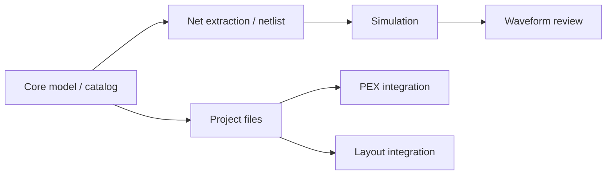

# CircuitStudio Feature Maturity

Last evaluated: 2026-05-07

この評価は、`circuit-studio` を Agent API としてではなく、人間が操作する統合 cockpit として見た個別機能の完成度を記録する。

## 評価基準

| Score | Meaning |
|---:|---|
| 0 | 未実装 |
| 1 | 型や骨格のみ |
| 2 | 基本動作あり、検証不足 |
| 3 | 代表ケースがテスト済み |
| 4 | 統合フローが動き、失敗系も検証済み |
| 5 | 実運用相当、互換性・例外・回帰が十分 |

## Verification Summary

| Target | Command | Result |
|---|---|---|
| CircuitStudio build | `perl -e 'alarm 120; exec @ARGV' swift build` | Pass |
| CircuitStudio core tests | `perl -e 'alarm 120; exec @ARGV' swift test --filter CircuitStudioCoreTests` | 83 pass, 4 skipped |
| CoreSpice IR | `perl -e 'alarm 120; exec @ARGV' swift test --filter CoreSpiceIRTests` | 29 pass |
| semiconductor-layout IO | `perl -e 'alarm 120; exec @ARGV' swift test --filter LayoutIOTests` | 65 pass |
| swift-mask-data detector | `perl -e 'alarm 120; exec @ARGV' swift test --filter FormatDetectorTests` | 28 pass |
| PEXEngine runtime | `perl -e 'alarm 120; exec @ARGV' swift test --filter PEXRuntimeTests` | 16 pass |

Skipped CircuitStudio tests are explicit known limitations:

| Test | Reason |
|---|---|
| `J3: BJT with .model card` | NR solver lacks damping for nonlinear BJT convergence |
| `J4: MOSFET with .model card` | NR solver lacks damping for nonlinear MOSFET convergence |
| `J6: SIN voltage source transient` | Transient solver timestep control collapses with SIN waveforms |
| `J9: Parameter expression evaluation` | SPICE parser does not yet support `.param` expression evaluation |

## Feature Maturity Matrix

| Feature | Score | Implemented | Confirmed by tests | Weak / unverified | Next tests |
|---|---:|---|---|---|---|
| Schematic model/editor operations | 3 | `SchematicDocument`, component placement model, wires, labels, junctions, selection, undo/redo, mirror, copy/paste | `SchematicViewModelTests`, `UndoStackTests`, `MirrorTests`, `SelectionTests`, `CopyPasteTests` | Interactive canvas gestures, wire splitting edge cases, NoConnect/power-symbol style workflows, ERC-level checks | Add gesture-level editor tests and T-junction/wire-split regression tests |
| Device catalog / symbol metadata | 4 | Standard device catalog, categories, ports, parameter schemas, semiconductor model classification | `DeviceCatalogTests` | Symbol rendering fidelity and full SPICE model coverage are not exhaustively checked | Add snapshot/geometry tests for symbols and model preset coverage tests |
| Net extraction | 3 | Union-Find based net extraction, pin/wire connectivity, ground net handling | `NetExtractorTests` | Larger schematics, labels merging nets, T-junctions, overlapping wires, floating nets | Add multi-branch net, label merge, and floating-net cases |
| Netlist generation | 4 | SPICE generation for passive, controlled source, diode, BJT, MOSFET, tran/ac directives, process headers | `NetlistGeneratorTests`, parts of `EndToEndTests` | Advanced SPICE syntax, `.param` expressions, subcircuits, include ordering edge cases | Add parser/generator round-trip tests and expression/subckt coverage |
| Process configuration / Virtual PDK | 4 | Process libraries, includes, corner overrides, global parameters, temperature, fixture-backed virtual PDK | `ProcessConfigurationTests`, `VirtualPDKTests` | Multiple PDK layouts, missing libraries, conflicting corner sections, relative path portability | Add missing-file diagnostics and multi-corner include resolution tests |
| SimulationService | 3 | In-process CoreSpice execution, explicit analysis command execution, OP/AC/tran paths, event stream surface | `SimulationServiceTests`, `EndToEndTests` | Nonlinear convergence limitations, SIN transient limitation, `.param` expression limitation, cancellation not covered here | Add convergence failure classification, cancellation, and structured diagnostic tests |
| WaveformViewer | 3 | Waveform document, traces, chart view, toolbar, trace visibility, streaming updates, zoom/pan/cursor, terminal filtering, complex magnitude display | `WaveformViewModelTests` | Chart rendering, AppKit scroll capture, export panel, large waveform decimation performance | Add chart interaction tests, export error tests, and large dataset decimation tests |
| ProjectService / standard file handling | 3 | Project creation, `.xcircuite` files, workspace/placement/simulation JSON, SPICE save paths, PEX config paths and TOML rendering | `ProjectServiceTests` | Layout export, overwrite policy, invalid JSON/load errors, absolute path normalization | Add temp-directory tests for layout export, invalid project files, and absolute path handling |
| Layout integration | 2 | `CircuitStudioApp` depends on `LayoutEditor`, `LayoutAutoGen`, `LayoutCore`, `LayoutTech`, `LayoutIO`, `LayoutVerify` | `swift build`; lower-level `LayoutIOTests` pass | CircuitStudio-level layout workflow and cross-probe behavior are not covered | Add app/service integration tests around loading layout, displaying violations, and cross-probe state |
| PEX command integration | 3 | `PEXCommandService`, `PEXProjectConfig`, PEX dependency, project PEX config paths, explicit executable invocation, extract argument building, stderr/non-zero mapping | `PEXCommandServiceTests`; lower-level `PEXRuntimeTests` pass | Artifact loading and UI review flow are not covered; PATH/`PEXENGINE_BIN` discovery is not isolated in tests | Add artifact loading tests and UI review integration tests |

## Current Read

The strongest `circuit-studio` areas are model/catalog, netlist generation, process configuration, and representative simulation flows. The weakest areas are not necessarily missing code; they are missing focused tests around UI-adjacent workflows: waveform review, project lifecycle, layout integration, and PEX integration.

## Recommended Next Work

| Priority | Work |
|---:|---|
| 1 | Add schematic connectivity regressions for labels, T-junctions, and overlapping wires |
| 2 | Add SimulationService failure/cancellation tests with structured diagnostic expectations |
| 3 | Add PEX follow-up tests for artifact loading and UI review integration |
| 4 | Add WaveformViewer follow-up tests for chart interaction, export errors, and large dataset decimation |
| 5 | Add ProjectService follow-up tests for layout export, invalid project files, and absolute path handling |
| 6 | Track CoreSpice nonlinear convergence and `.param` expression limitations as upstream blockers |
