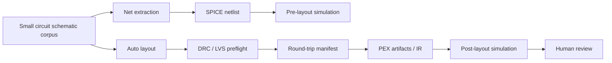

# Flow Verification Log

Last run: 2026-05-08

This log tracks end-to-end verification of the current semiconductor design flow using existing functionality. The strict round-trip corpus now contains a CMOS inverter and a voltage divider. Together they exercise schematic connectivity, MOS/passive device metadata, SPICE generation, OP/transient simulation, auto layout, DRC/LVS preflight, PEX parasitic injection, and post-layout simulation without requiring a large design.

## Commands Run

| Scope | Command | Result |
|---|---|---|
| CircuitStudio SwiftPM build | `perl -e 'alarm 120; exec @ARGV' swift build` | Pass |
| CircuitStudio SwiftPM tests | `perl -e 'alarm 120; exec @ARGV' swift test --filter CircuitStudioCoreTests` | 173 pass, 4 skipped |
| Headless round-trip corpus | `perl -e 'alarm 120; exec @ARGV' swift test --filter HeadlessRoundTripServiceTests` | 17 pass; CMOS inverter, voltage divider, and resistor-divider strict pre-PEX gates pass; imported signoff review, captured input artifacts, immutable captured review artifacts, invalid run ID rejection, run-directory prefix-safe artifact capture, symlinked external artifact capture, comparison mismatch artifact, comparison-limit pass/fail policy persistence, invalid comparison-limit rejection, stage timing, root-failure bottleneck summaries, historical bottleneck aggregation, and pre-PEX/PEX/post-layout/comparison-write failure manifests are covered |
| Standalone voltage-divider round trip | `perl -e 'alarm 120; exec @ARGV' swift run circuit-studio-flow-runner --fixture voltage-divider --approve-signoff --output /tmp/circuit-studio-cli-roundtrip-vd --run-id vd-cli` | Pass; emitted a manifest with all stages passed |
| Standalone CMOS inverter round trip | `perl -e 'alarm 120; exec @ARGV' swift run circuit-studio-flow-runner --fixture cmos-inverter --approve-signoff --output /tmp/circuit-studio-cli-roundtrip-cmos --run-id cmos-cli` | Pass; emitted a manifest with all stages passed |
| Dogfood CMOS inverter design project | `perl -e 'alarm 120; exec @ARGV' swift run circuit-studio-flow-runner --fixture cmos-inverter --approve-signoff --output /tmp/circuit-studio-dogfood-cmos --run-id dogfood-cmos-inverter --max-abs-delta 0.05 --max-rel-delta 2.0` | Pass; independent project completed pre-layout simulation, auto-layout, DRC/LVS gate, PEX injection, post-layout simulation, interpolated waveform comparison, and manifest generation |
| Standalone resistor-divider round trip | `perl -e 'alarm 120; exec @ARGV' swift run circuit-studio-flow-runner --fixture resistor-divider --approve-signoff --output /tmp/circuit-studio-cli-roundtrip-resistor-divider --run-id resistor-divider-cli` | Pass; emitted a manifest with all stages passed |
| Standalone resistor-divider round trip through command API | `perl -e 'alarm 120; exec @ARGV' swift run circuit-studio-flow-runner --fixture resistor-divider --approve-signoff --output /tmp/circuit-studio-cli-command-api --run-id command-api-cli` | Pass; CLI now delegates the orchestration to `DesignFlowService.execute(.runFixtureRoundTrip)` and prints `run_id=command-api-cli` |
| Standalone fixture listing through command API | `perl -e 'alarm 120; exec @ARGV' swift run circuit-studio-flow-runner --list-fixtures` | Pass; prints `cmos-inverter`, `voltage-divider`, and `resistor-divider` from `DesignFlowCommand.listFixtures` |
| Standalone netlist generation through command API | `perl -e 'alarm 120; exec @ARGV' swift run circuit-studio-flow-runner --generate-netlist --fixture resistor-divider` | Pass; prints the resistor-divider SPICE netlist from `DesignFlowCommand.generateFixtureNetlist` |
| Standalone schematic simulation through command API | `perl -e 'alarm 120; exec @ARGV' swift run circuit-studio-flow-runner --simulate --fixture resistor-divider` | Pass; prints `simulation=completed` from `DesignFlowCommand.runFixtureSimulation` |
| Standalone bottleneck summary through command API | `perl -e 'alarm 120; exec @ARGV' swift run circuit-studio-flow-runner --summarize-bottlenecks --output /tmp/circuit-studio-cli-command-api` | Pass; prints run/stage bottleneck summary from `DesignFlowCommand.summarizeBottlenecks` |
| Standalone bottleneck summary default path | `perl -e 'alarm 120; exec @ARGV' swift run circuit-studio-flow-runner --summarize-bottlenecks --fixture resistor-divider` after a default-path round trip | Pass; uses `./round-trip-runs/resistor-divider` when `--output` is omitted |
| Standalone structured design-spec round trip | `perl -e 'alarm 120; exec @ARGV' swift run circuit-studio-flow-runner --design-spec /tmp/circuit-studio-agent-resistor-divider.json --run-id dogfood-design-spec-default --approve-signoff --max-abs-delta 1e-3 --max-rel-delta 2.0` | Pass; generated a resistor-divider schematic from JSON spec, ran netlist/simulation/layout/signoff/PEX/post-layout comparison, captured the source design spec under `input-artifacts/design/`, and wrote a manifest under `round-trip-runs/circuit-studio-agent-resistor-divider` |
| Standalone structured design-spec bottleneck summary | `perl -e 'alarm 120; exec @ARGV' swift run circuit-studio-flow-runner --summarize-bottlenecks --design-spec /tmp/circuit-studio-agent-resistor-divider.json` | Pass; reads the same default design-spec output directory as the round-trip command |
| Standalone invalid run ID guard | `perl -e 'alarm 120; exec @ARGV' swift run circuit-studio-flow-runner --fixture voltage-divider --approve-signoff --output /tmp/circuit-studio-cli-invalid-run-id --run-id ../bad-run` | Expected fail before `/tmp/circuit-studio-cli-invalid-run-id` is created |
| Standalone voltage-divider round trip with golden PEX artifact | `perl -e 'alarm 120; exec @ARGV' swift run circuit-studio-flow-runner --fixture voltage-divider --approve-signoff --pex-manifest Tests/CircuitStudioCoreTests/Fixtures/pex/golden-voltage-divider/manifest.json --pex-corner tt_25c_1v0 --output /tmp/circuit-studio-cli-roundtrip-vd-golden-pex --run-id vd-golden-pex-cli` | Pass; loaded saved PEX manifest/IR and emitted a manifest with all stages passed |
| Standalone voltage-divider round trip with golden signoff and PEX artifacts | `perl -e 'alarm 120; exec @ARGV' swift run circuit-studio-flow-runner --fixture voltage-divider --approve-signoff --signoff-drc-log Tests/CircuitStudioCoreTests/Fixtures/signoff/golden-calibre-drc-clean.log --signoff-lvs-log Tests/CircuitStudioCoreTests/Fixtures/signoff/golden-calibre-lvs-clean.log --pex-manifest Tests/CircuitStudioCoreTests/Fixtures/pex/golden-voltage-divider/manifest.json --pex-corner tt_25c_1v0 --output /tmp/circuit-studio-cli-roundtrip-vd-golden-signoff-pex --run-id vd-golden-signoff-pex-cli` | Pass; loaded imported DRC/LVS logs and saved PEX artifacts, captured both input artifact sets under the run directory, and recorded original `sourcePath` values |
| Standalone voltage-divider round trip with post-layout comparison | `perl -e 'alarm 120; exec @ARGV' swift run circuit-studio-flow-runner --fixture voltage-divider --approve-signoff --signoff-drc-log Tests/CircuitStudioCoreTests/Fixtures/signoff/golden-calibre-drc-clean.log --signoff-lvs-log Tests/CircuitStudioCoreTests/Fixtures/signoff/golden-calibre-lvs-clean.log --pex-manifest Tests/CircuitStudioCoreTests/Fixtures/pex/golden-voltage-divider/manifest.json --pex-corner tt_25c_1v0 --output /tmp/circuit-studio-cli-roundtrip-vd-comparison --run-id vd-comparison-cli` | Pass; emitted `post-layout-comparison.json` with common-variable pre/post deltas |
| Standalone voltage-divider round trip with relaxed comparison limits | `perl -e 'alarm 120; exec @ARGV' swift run circuit-studio-flow-runner --fixture voltage-divider --approve-signoff --signoff-drc-log Tests/CircuitStudioCoreTests/Fixtures/signoff/golden-calibre-drc-clean.log --signoff-lvs-log Tests/CircuitStudioCoreTests/Fixtures/signoff/golden-calibre-lvs-clean.log --pex-manifest Tests/CircuitStudioCoreTests/Fixtures/pex/golden-voltage-divider/manifest.json --pex-corner tt_25c_1v0 --max-abs-delta 1e-3 --max-rel-delta 1e-3 --output /tmp/circuit-studio-cli-roundtrip-vd-comparison-limits --run-id vd-comparison-limits-cli` | Pass; comparison limits were configured and the `post-layout-comparison` stage passed |
| Standalone voltage-divider round trip with strict comparison limit | `perl -e 'alarm 120; exec @ARGV' swift run circuit-studio-flow-runner --fixture voltage-divider --approve-signoff --signoff-drc-log Tests/CircuitStudioCoreTests/Fixtures/signoff/golden-calibre-drc-clean.log --signoff-lvs-log Tests/CircuitStudioCoreTests/Fixtures/signoff/golden-calibre-lvs-clean.log --pex-manifest Tests/CircuitStudioCoreTests/Fixtures/pex/golden-voltage-divider/manifest.json --pex-corner tt_25c_1v0 --max-abs-delta 0 --output /tmp/circuit-studio-cli-roundtrip-vd-comparison-limit-fail --run-id vd-comparison-limit-fail-cli` | Expected fail at `post-layout-comparison`; manifest preserved the failed stage and `post-layout-comparison.json` showed max absolute delta `1.2499980264202293e-06` |
| Standalone voltage-divider round trip with bottleneck summary | `perl -e 'alarm 120; exec @ARGV' swift run circuit-studio-flow-runner --fixture voltage-divider --approve-signoff --signoff-drc-log Tests/CircuitStudioCoreTests/Fixtures/signoff/golden-calibre-drc-clean.log --signoff-lvs-log Tests/CircuitStudioCoreTests/Fixtures/signoff/golden-calibre-lvs-clean.log --pex-manifest Tests/CircuitStudioCoreTests/Fixtures/pex/golden-voltage-divider/manifest.json --pex-corner tt_25c_1v0 --max-abs-delta 1e-3 --max-rel-delta 1e-3 --output /tmp/circuit-studio-cli-roundtrip-vd-bottleneck --run-id vd-bottleneck-cli` | Pass; manifest recorded per-stage `durationSeconds` and `bottleneckSummary` |
| Standalone voltage-divider failed comparison with bottleneck summary | `perl -e 'alarm 120; exec @ARGV' swift run circuit-studio-flow-runner --fixture voltage-divider --approve-signoff --signoff-drc-log Tests/CircuitStudioCoreTests/Fixtures/signoff/golden-calibre-drc-clean.log --signoff-lvs-log Tests/CircuitStudioCoreTests/Fixtures/signoff/golden-calibre-lvs-clean.log --pex-manifest Tests/CircuitStudioCoreTests/Fixtures/pex/golden-voltage-divider/manifest.json --pex-corner tt_25c_1v0 --max-abs-delta 0 --output /tmp/circuit-studio-cli-roundtrip-vd-bottleneck-fail --run-id vd-bottleneck-fail-cli` | Expected fail; manifest recorded `failedStageName` as `post-layout-comparison` and preserved longest-stage recommendations |
| Standalone imported signoff without approval | `perl -e 'alarm 120; exec @ARGV' swift run circuit-studio-flow-runner --fixture voltage-divider --signoff-drc-log Tests/CircuitStudioCoreTests/Fixtures/signoff/golden-calibre-drc-clean.log --signoff-lvs-log Tests/CircuitStudioCoreTests/Fixtures/signoff/golden-calibre-lvs-clean.log --pex-manifest Tests/CircuitStudioCoreTests/Fixtures/pex/golden-voltage-divider/manifest.json --pex-corner tt_25c_1v0 --output /tmp/circuit-studio-cli-roundtrip-unapproved --run-id unapproved-cli` | Expected fail at pre-PEX gate because `--approve-signoff` is required |
| Golden layout corpus contract | `perl -e 'alarm 120; exec @ARGV' swift test --filter GoldenLayoutCorpusServiceTests` | 1 pass; validates manifest, layout artifact presence, and DRC/LVS log loading without implying human approval |
| Golden PEX multi-corner gates | `perl -e 'alarm 120; exec @ARGV' swift test --filter PEXArtifactServiceTests` | 6 pass; `tt_25c_1v0` and `ss_125c_0v9` golden PEX corners load and run post-layout comparison gates |
| Simulation failure/cancellation | `perl -e 'alarm 120; exec @ARGV' swift test --filter SimulationServiceTests` | Pass; invalid SPICE failures clear active job state and registered cancellation emits a cancellation event |
| Unified design-flow API | `perl -e 'alarm 120; exec @ARGV' swift test --filter DesignFlowServiceTests` | 12 pass; fixture selection, structured design-spec netlist/simulation/round-trip commands, structured spec input validation, SPICE prefix/required parameter/range/model compatibility rejection paths, inline PEX unit normalization and rejection paths, command API list/netlist/simulation/round-trip/bottleneck commands, schematic simulation, layout generation, pre-PEX verification, post-layout simulation/comparison, headless round trip, PEX artifact loading, invalid command rejection, Codable command artifacts, and bottleneck summary are callable through the shared API |
| CMOS inverter flow | `perl -e 'alarm 120; exec @ARGV' swift test --filter CMOSInverterFlowTests` | 1 pass |
| CoreSpice full tests | `perl -e 'alarm 180; exec @ARGV' swift test` in `/Users/1amageek/Desktop/LSI/CoreSpice` | 542 pass |
| semiconductor-layout full tests | `perl -e 'alarm 180; exec @ARGV' swift test` in `/Users/1amageek/Desktop/LSI/semiconductor-layout` | 91 pass |
| swift-mask-data full tests | `perl -e 'alarm 180; exec @ARGV' swift test` in `/Users/1amageek/Desktop/LSI/swift-mask-data` | 589 pass |
| PEXEngine full tests | `perl -e 'alarm 180; exec @ARGV' swift test` in `/Users/1amageek/Desktop/LSI/PEXEngine` | 96 pass |
| Xcode workspace schemes | `perl -e 'alarm 60; exec @ARGV' xcodebuild -list -workspace Xcircuite.xcworkspace` | Pass |
| Xcode app build | `perl -e 'alarm 180; exec @ARGV' xcodebuild -workspace Xcircuite.xcworkspace -scheme Xcircuite -destination 'platform=macOS' build` | Pass |
| Xcode app tests | `perl -e 'alarm 240; exec @ARGV' xcodebuild test -workspace Xcircuite.xcworkspace -scheme Xcircuite -destination 'platform=macOS'` | 5 pass |
| Multi-package flow script | `scripts/verify-flow.sh` | Added; starts by running package-local tests and Xcode checks sequentially |

## Verified Flow Coverage

| Flow stage | Current evidence | Status |
|---|---|---|
| Schematic model | CMOS inverter and voltage divider preview documents load and contain MOS/passive devices and labeled nets | Verified |
| Net extraction | CMOS nets include `vdd`, `in`, `out`, and `0`; voltage divider nets include the labeled `out` plus source/ground boundary nets | Verified |
| Netlist generation | Generated SPICE contains MOS/passive elements and OP/transient analysis commands | Verified |
| Pre-layout simulation | CoreSpice OP/transient runs complete with waveform data | Verified |
| Auto layout | Layout document, component mappings, net mappings, and explicit single-terminal boundary pins are generated | Verified |
| Full LVS | `PhysicalVerificationService` extracts physical connectivity from hierarchical routing geometry, vias, imported cut-shapes, top pins/labels, generated instance pins, imported polygon terminal metadata, numeric GDS layer aliases, raw MOS `ACTIVE ∩ POLY` geometry, inferred MOS terminals, shared-diffusion MOS devices, and raw resistors; it reports stale mappings, dangling mappings, missing/extra objects, declared-only nets, hierarchy topology errors, physical shorts, physical opens, unconnected terminals, terminal/net mismatches, skipped connectivity extraction, missing/misnamed external ports, invalid imported terminals, duplicate imported terminals, duplicate raw devices, raw MOS W/L/kind/`nf` mismatches, and raw resistor value mismatches | Verified for current in-app layout model, sample-process raw-device fixtures, and first imported-layout semantics fixtures |
| PEX artifact loading | Manifest and IR loading, unit normalization, dropped-element diagnostics, golden multi-corner PEX fixture loading, post-layout comparison gates, and mock PEXEngine artifact handoff are covered | Verified |
| Post-layout simulation | Normalized parasitics are merged into SPICE, CoreSpice analysis completes, and a pre/post waveform comparison JSON records common-variable deltas by aligning matching sweep grids or linearly interpolating post-layout values onto the pre-layout sweep grid; incompatible sweep variables or non-overlapping/non-monotonic sweeps are reported as `not-comparable`; optional absolute/symmetric-relative delta limits can turn the comparison into a hard gate, invalid limits are rejected before flow execution, and applied gate policy is persisted in the comparison artifact | Verified |
| External signoff execution/import | External DRC/LVS commands can be launched, stdout/stderr logs are captured as artifacts, diagnostics are parsed, non-zero exits become failing reports, existing signoff logs can be imported as review reports, imported reviews can feed the headless pre-PEX gate only after explicit approval, and approval decisions persist under `.xcircuite/signoff/` | Verified with mock signoff tools, golden deck-like log fixtures, headless imported-review round trip, and CLI unapproved-gate failure |
| Headless round trip | CMOS inverter, voltage divider, resistor-divider, and JSON design-spec flows write pre/post SPICE netlists, captured external signoff logs, immutable captured external signoff review JSON, captured PEX input artifacts with source paths, post-layout comparison JSON, and a `round-trip-manifest.json`; strict pre-PEX verification passes without forced continuation; invalid run IDs are rejected before run artifacts are created; failed pre-PEX, PEX, post-layout, comparison-write, and comparison-limit gates persist manifests with failed/skipped stages; comparison artifacts preserve observed deltas, applied limits, gate status, and gate violations; manifests include per-stage timing and a bottleneck summary with root failed stage/longest stage recommendations; historical summaries aggregate repeated run manifests; the same pass-path fixtures and structured design specs can be executed through `circuit-studio-flow-runner` without the app UI, and the voltage-divider CLI path can consume saved signoff logs plus saved PEX manifest/IR instead of built-in mock/synthetic artifacts | Verified strict for three pass fixtures plus structured design-spec dogfood flow, failure manifests, standalone CLI entry, explicit signoff approval, golden signoff artifact entry, immutable captured review artifact, run ID isolation guard, golden layout corpus contract, golden multi-corner PEX artifact entry, pre/post comparison artifact, comparison tolerance gates, invalid-limit rejection, policy persistence, and bottleneck summaries |
| Unified operation API | `DesignFlowService` provides the shared entrypoint for UI, CLI, and Agent callers: SPICE simulation, schematic simulation, netlist generation, auto-layout, pre-PEX verification, post-layout simulation/comparison, full headless round trip, PEX artifact loading, signoff-log import, bottleneck history aggregation, structured design-spec loading, and Codable `DesignFlowCommand` execution. `DesignFlowFixtureLibrary` provides the shared fixture catalog used by CLI and future UI/Agent fixture selection | CLI now calls `DesignFlowService.execute(.runFixtureRoundTrip)` / `.runDesignRoundTrip` and `DesignFlowFixtureLibrary`; AppState simulation actions and DesignProject layout generation now call `DesignFlowService`; `DesignFlowServiceTests` cover the shared service and command surfaces |
| Human review cockpit | Xcode app launches and UI smoke tests pass | Smoke-tested |

## Issue Queue

| ID | Priority | Status | Area | Problem | Action |
|---|---:|---|---|---|---|
| FV-001 | P2 | Resolved | CoreSpice SwiftPM packaging | CircuitStudio build/test emitted unhandled README resource warnings from CoreSpice dependency targets. | Added explicit README excludes in CoreSpice `Package.swift`; reran CircuitStudio build and CoreSpice IR tests. |
| FV-002 | P2 | Resolved for current gate | LVS | Declared `LayoutNet` entries could be treated as present even without physical geometry. | LVS now only treats nets referenced by physical `shape/via/pin/label` geometry as realized; added a declared-only net rejection test. |
| FV-003 | P2 | Resolved for mock backend | PEX to post-layout | CircuitStudio flow test used synthetic `PEXParasiticIR`; it did not prove PEXEngine artifacts could be consumed. | Added a mock PEXEngine run that writes artifacts, loads the manifest/IR through CircuitStudio, and builds a post-layout netlist. |
| FV-004 | P2 | Open | Human review | Xcode UI tests only prove launch and smoke behavior, not DRC/LVS/PEX artifact review or approval flow. | Add review-state UI tests around verification reports, diagnostics, and accept/reject decisions. |
| FV-005 | P3 | Resolved | Test ergonomics | Running dependency test filters from `circuit-studio` can report zero tests; dependency packages must be tested from their own directories. | Added `scripts/verify-flow.sh` to run package-local tests and Xcode checks in sequence. |
| FV-006 | P3 | Open | Xcode test environment | Xcode UI tests pass but emit `DebuggerLLDB.DebuggerVersionStore.StoreError` / `no debugger version` warnings while launching the app. | Investigate Xcode toolchain/debugger metadata only if it becomes flaky or starts failing CI. |
| FV-007 | P3 | Open | CoreSpice limitations surfaced in CircuitStudio | Four CircuitStudio tests remain intentionally skipped for nonlinear convergence, SIN transient timestep handling, and `.param` expression support. | Track as CoreSpice capability work before treating CircuitStudio simulation as production-grade. |
| FV-008 | P1 | Resolved for generated, first imported-layout, and sample-process raw-device LVS | Full LVS | The current gate needed polygon-derived connectivity through instance pins, layers, vias, and device terminals. | Added hierarchical connectivity extraction, schematic-vs-physical short/open checks, imported polygon terminal recognition, raw MOS recognition, inferred raw MOS terminals, raw resistor recognition, explicit Full LVS skip diagnostics, missing/misnamed external port reporting, invalid terminal reporting, duplicate terminal reporting, and raw W/L/kind/`nf`/resistance mismatch reporting. |
| FV-009 | P2 | Open | Real PEX backend | The PEX artifact handoff is verified with the mock backend, not with a signoff-grade extractor or real layout file semantics. | Add a real-backend or golden-SPEF fixture path once the layout export and tech mapping contract are stable. |
| FV-010 | P1 | Resolved for in-process LVS | Imported-layout LVS semantics | LVS-M11 needed hierarchy-cycle rejection, GDS numeric layer alias normalization, imported cut-shape connectivity, and shared-diffusion MOS extraction. | Added topology diagnostics, tech-backed layer alias normalization, cut-shape via/contact bridging, shared-diffusion two-device extraction, and focused tests. |
| FV-011 | P1 | Resolved for imported reports | External signoff review gate | PEX readiness needed to account for signoff DRC/LVS results that were produced outside the in-process LVS checker. | Added normalized external DRC/LVS report models, diagnostic parsing, pass/fail aggregation, and an explicit human approval gate before PEX. |
| FV-012 | P1 | Resolved for mock signoff tools | External signoff execution | External signoff reports can now be imported and gated, but CircuitStudio needed to run signoff DRC/LVS commands and persist review approvals. | Added command-runner integration, captured log artifact paths, non-zero-exit report generation, persisted approval records, and focused tests. |
| FV-013 | P1 | Resolved for golden log artifact import | Real signoff decks | External command execution was verified with mock tools, not imported signoff artifact corpora. | Added import support for existing DRC/LVS logs and golden deck-like clean/mismatch fixtures. |
| FV-018 | P1 | Open | Real foundry decks and layout corpus | Golden signoff log import is covered, but the workspace still lacks real foundry DRC/LVS decks, golden GDS/OASIS layout files, and tool-specific adapters beyond the generic log parser. | Add real-deck smoke fixtures, golden GDS/OASIS expected reports, and deck-specific parser adapters if generic log parsing is insufficient. |
| FV-025 | P1 | Resolved for corpus contract | Golden layout corpus | There was no manifest-level contract tying a layout artifact to DRC/LVS signoff logs. | Added `GoldenLayoutCorpusService`, a golden layout corpus fixture, resource packaging, and tests that validate layout/log existence and load clean signoff reports without bypassing explicit approval. |
| FV-026 | P1 | Resolved for golden fixture | Multi-corner PEX gates | Saved PEX fixture coverage had only one corner. | Added `ss_125c_0v9` IR/raw/log artifacts and a regression that loads both corners, runs post-layout simulation, and applies pre/post comparison gates. |
| FV-027 | P2 | Resolved for CLI fixture set | Small-circuit fixture breadth | The standalone runner exposed only CMOS inverter and voltage divider names. | Added a resistor-divider fixture path to the CLI and a strict headless regression. An attempted RC low-pass transient surfaced current auto-layout/LVS coverage gaps and remains a future fixture target. |
| FV-028 | P1 | Resolved for manifest history | Historical bottleneck aggregation | Per-run bottleneck summaries did not show repeated failure or runtime trends across runs. | Added `RoundTripBottleneckHistoryService` and tests that aggregate failed-run counts, per-stage timing, most frequent failed stage, most expensive stage, and recommendations. |
| FV-029 | P2 | Resolved for service regression | Simulation failure/cancellation | Simulation failures and cancellation events were not directly covered at the service boundary. | Added regressions for typed failure surfacing, active-job cleanup, and cancellation event emission. |
| FV-030 | P1 | Resolved for current UI/CLI entries | Unified operation API | UI simulation/layout actions, CLI round-trip actions, and fixture selection could call lower-level services or private definitions through different paths. | Added `DesignFlowService`, `DesignFlowCommand`, `DesignFlowCommandResult`, and `DesignFlowFixtureLibrary`; moved CLI round-trip/PEX/signoff loading and fixture selection through `DesignFlowService.execute(.runFixtureRoundTrip)`; moved AppState simulation/cancellation and DesignProject layout generation through `DesignFlowService`; removed direct `SimulationService` exposure from `ServiceContainer`; and added shared API regressions for fixture selection, command list/netlist/simulation/round-trip/bottleneck paths, invalid command inputs, Codable command artifacts, simulation, layout, pre-PEX, post-layout, PEX load, bottleneck history, and round-trip. |
| FV-031 | P1 | Resolved | Run artifact isolation | `runID` could contain path separators and escape `.xcircuite/flow-runs`. | Added shared run ID validation before artifact creation in both headless and command API paths, and regressions that reject invalid IDs before flow-run directories are created. |
| FV-032 | P1 | Resolved | Signoff review immutability | Round-trip manifests pointed to the mutable project-global signoff review JSON. | Captured the review JSON into the run directory with `sourcePath` recorded, so completed manifests remain self-contained for audit/replay. |
| FV-033 | P2 | Resolved | Bottleneck attribution | Per-run bottleneck summary reported the last failed stage instead of the root failed stage. | Changed failed-stage attribution to the first failed stage and updated failure regressions to cover external signoff as root cause. |
| FV-034 | P2 | Resolved | Artifact capture path boundary | Input artifact capture used a plain string prefix check for run-directory containment. | Switched to standardized path-boundary containment and added a sibling-directory regression so similarly prefixed run directories are copied as external inputs instead of being treated as in-run artifacts. |
| FV-035 | P2 | Resolved | CLI exposed only full round-trip | `DesignFlowCommand` supported fixture listing, netlist generation, simulation, and bottleneck summary, but the standalone runner only called the round-trip command. | Added explicit runner modes for fixture listing, netlist generation, schematic simulation, and bottleneck summaries, all delegated through `DesignFlowService.execute`. |
| FV-036 | P2 | Resolved | Summary mode default path mismatch | `--summarize-bottlenecks` required `--output` even though the runner help documented a default output directory. | Summary mode now resolves the same `./round-trip-runs/<fixture>` default path used by the round-trip flow and has a CLI smoke check. |
| FV-037 | P1 | Resolved | Symlinked input artifact escape | A path inside the run directory could point through a symlink to mutable external content and be treated as already captured. | Input artifact capture now treats a file as in-run only when both its path and symlink-resolved target are inside the run directory; otherwise it copies the resolved target into `input-artifacts/` and records the original `sourcePath`. |
| FV-038 | P1 | Resolved | Transient post-layout comparison over-rejected dogfood design | Dogfooding a CMOS inverter independent project showed post-layout transient simulation produced a different adaptive timestep count, so the comparison gate failed as `not-comparable`. | `PostLayoutComparisonService` now aligns by sweep value and linearly interpolates post-layout values onto the pre-layout sweep grid when sweeps are compatible. |
| FV-039 | P2 | Resolved | Relative delta exploded near zero | The comparison report used only the pre-layout value as the relative-delta denominator, producing unusable values around zero crossings. | Relative delta now uses a symmetric denominator: `max(abs(pre), abs(post), floor)`, making near-zero comparisons auditable while preserving hard absolute-delta gates. |
| FV-040 | P1 | Resolved for first structured spec | Fixture-only Agent entrypoint | Non-UI flow execution still required selecting one of the built-in fixtures, so Agent dogfooding could not submit a small custom circuit as structured data. | Added `DesignFlowDesignSpec`, design-spec command kinds, CLI `--design-spec`, schema-version validation, spec-level parasitic IR decoding and unit normalization, design/component/SPICE-prefix/known-required-ranged-parameter/model-compatibility/net/terminal/analysis/PEX validation, source spec capture under each run directory, default output path alignment, `docs/design-spec.md`, and regressions plus CLI dogfood run for a JSON resistor-divider design. |
| FV-014 | P1 | Resolved for first circuit | Headless flow orchestration | Individual services existed, but there was no non-UI runner that produced a complete artifact manifest for the full design loop. | Added `HeadlessRoundTripService` and a CMOS inverter test that records artifacts, stages, signoff review state, and strict gate status. |
| FV-015 | P1 | Resolved for first circuit | Strict DRC gate | The CMOS inverter could round-trip only with explicit continuation after the in-process DRC gate failed. | Fixed DRC false positives for cross-layer overlap, grid-rounded spacing, and via landing enclosure; Pre-PEX DRC now treats connectivity opens as LVS responsibility and the headless round trip no longer forces continuation. |
| FV-016 | P1 | Resolved for two-fixture corpus | Golden flow breadth | Only one small circuit had a strict headless round-trip fixture. | Added a voltage divider OP round-trip fixture and fixed the passive-layout boundary/routing blockers it exposed. |
| FV-017 | P1 | Resolved for headless harness gates | Failure manifest coverage | Passing strict round trips were covered, but failed gates were mostly observed through thrown errors rather than persisted failure manifests. | Added failure manifest persistence and regressions for pre-PEX signoff failure, empty PEX IR failure, and post-layout simulation failure. |
| FV-019 | P1 | Resolved for fixture corpus | Standalone round-trip entrypoint | Strict round trips existed in tests, but there was no command-line entrypoint that an agent or script could call directly. | Added `circuit-studio-flow-runner` with CMOS inverter and voltage divider fixtures that execute the existing headless service and print the emitted manifest path. |
| FV-020 | P1 | Resolved for saved PEX fixture | Golden PEX artifact entrypoint | The standalone round-trip runner still defaulted to built-in synthetic PEX IR, so it did not prove an artifact directory produced by an extractor could drive post-layout simulation. | Added a golden voltage-divider PEX manifest/IR/raw/log fixture, a regression that runs post-layout simulation from it, and `--pex-manifest` / `--pex-corner` CLI options. |
| FV-021 | P1 | Resolved for imported signoff fixture | Golden signoff artifact entrypoint | The standalone runner could import saved PEX artifacts, but still had to run mock signoff commands and did not record PEX input artifacts in the round-trip manifest. | Added imported signoff review support to the headless service, `--signoff-drc-log` / `--signoff-lvs-log` CLI options, explicit `--approve-signoff`, captured signoff/PEX input artifacts under the run directory, and source-path recording in the flow manifest. |
| FV-022 | P1 | Resolved for first fixture | Pre/post simulation comparison | A completed round trip proved both simulations ran, but did not leave a machine-readable summary of post-layout impact. | Added `PostLayoutComparisonService`, sweep-value comparability checks, persisted `post-layout-comparison.json`, and a comparison-write failure manifest regression. |
| FV-023 | P1 | Resolved for CLI and service gates | Post-layout comparison gate | Pre/post comparison was recorded but could not stop an Agent flow when post-layout deltas exceeded design-specific limits. | Added `PostLayoutComparisonLimits`, aggregate max delta fields, limit validation, persisted applied gate policy, limit diagnostics, headless pass/fail manifest coverage, invalid-limit rejection, and `--max-abs-delta` / `--max-rel-delta` CLI gates. |
| FV-024 | P1 | Resolved for headless manifest | Round-trip bottleneck visibility | Round-trip artifacts showed pass/fail but did not identify the time-critical or failed bottleneck stage for Agent triage. | Added per-stage `durationSeconds`, `bottleneckSummary`, failed-stage selection, longest-stage reporting, and stage-specific recommendations to the headless manifest. |

## Full LVS Milestones

| Milestone | Status | Scope | Evidence |
|---|---|---|---|
| LVS-M1: Instance and net freshness gate | Done | Schematic hash, component-to-instance mapping, net-to-layout mapping, missing/extra/dangling object checks | `PhysicalVerificationServiceTests` |
| LVS-M2: Physical net realization gate | Done | A net must be referenced by physical geometry (`shape/via/pin/label`), not only declared in `LayoutNet` | `lvsRejectsDeclaredNetWithoutPhysicalGeometry()` |
| LVS-M3: Top-cell connectivity extraction | Done | Extracts connectivity from shapes, vias, top pins/labels, and transformed instance pins without shorting device internals | `LayoutConnectivityExtractor` inside `PhysicalVerificationService` |
| LVS-M4: Short detection | Done | Reports one physical cluster containing terminals from multiple schematic nets | `fullLVSReportsPhysicalShorts()` |
| LVS-M5: Open detection | Done | Reports one schematic net split across multiple physical clusters | `fullLVSReportsPhysicalOpens()` |
| LVS-M6: Flow integration | Done | `runPrePEXVerification` now runs Full LVS when technology is provided; CMOS inverter flow still passes | `CMOSInverterFlowTests` |
| LVS-M7: Hierarchical / imported-layout LVS | Done for first fixture | Flattens wrapper hierarchy, recursively realizes net geometry, validates nested mapped instances, and avoids flagging hierarchy wrappers as extra devices | `hierarchicalLVSFlattensWrapperCells()` |
| LVS-M8: Device recognition from polygons | Done for metadata-backed polygons | Recognizes imported polygon terminals using `lvs.component` / `lvs.pin` shape properties and compares them to schematic terminals without generated-cell instances | `fullLVSRecognizesImportedPolygonTerminals()` |
| LVS-M9: Raw MOS device extraction | Done for first fixture | Infers MOS devices from `ACTIVE ∩ POLY`, classifies NMOS/PMOS from implant/well layers, matches by layout label, and compares raw W/L/kind against schematic parameters | `rawMOSLVSRecognizesDeviceAndParametersWithoutMetadata()`, `rawMOSLVSRejectsParameterMismatch()`, `rawMOSLVSRejectsDeviceKindMismatch()` |
| LVS-M10: Sample-process raw device/terminal extraction | Done for current fixtures | Infers MOS source/drain/gate/bulk terminals from local M1 contact shapes, checks extracted drain connectivity for opens, recognizes raw resistors from `RESI ∩ POLY`, compares resistor value, and treats multi-finger MOS as one device with `nf` | `rawMOSLVSConnectsExtractedDrainTerminals()`, `rawMOSLVSReportsOpenExtractedDrainTerminals()`, `rawResistorLVSRecognizesResistanceWithoutMetadata()`, `rawResistorLVSRejectsResistanceMismatch()`, `rawMOSLVSRecognizesMultiFingerParameters()` |
| LVS-M11: Imported-layout semantics hardening | Done for in-process LVS fixtures | Rejects hierarchy cycles before extraction, normalizes numeric GDS fallback layers through the active technology, treats imported cut-shapes as via/contact bridges, and extracts simple shared-diffusion MOS series devices | `fullLVSRejectsHierarchyCyclesBeforeExtraction()`, `importedNumericLayerRawMOSLVSUsesTechnologyLayerAliases()`, `importedCutShapeConnectsTerminalsAcrossProcessLayers()`, `sharedDiffusionRawMOSLVSRecognizesSeriesDevices()` |
| LVS-M12: External signoff correlation | Done for imported reports | Import external signoff DRC/LVS reports, normalize diagnostics, correlate rule/component/net metadata when present, and require explicit human approval before PEX | `prePEXVerificationRequiresExternalSignoffApproval()`, `prePEXVerificationAcceptsApprovedExternalSignoff()`, `externalSignoffErrorsBlockPEXEvenWhenApproved()` |
| LVS-M13: External signoff execution and approval persistence | Done for service layer and mock tools | Run configured signoff DRC/LVS tools, capture stdout/stderr artifacts, convert non-zero exits into failing reports, persist review decisions, and reload approval state | `runCapturesLogArtifactAndParsesDiagnostics()`, `nonZeroExitCreatesFailingReportWithoutDroppingArtifacts()`, `runCommandsBuildsUnapprovedReview()`, `reviewStorePersistsApproval()` |
| LVS-M14: Headless round-trip harness | Done for first circuit | Run the CMOS inverter through non-UI net extraction, netlist, pre-layout sim, auto layout, signoff command artifacts, persisted approval, pre-PEX gate, PEX IR injection, post-layout sim, and manifest writing | `cmosInverterCompletesHeadlessRoundTripWithArtifacts()` |
| LVS-M15: Strict-clean round trip | Done for first circuit | Make the same CMOS inverter round trip pass strict pre-PEX verification without forced continuation | `cmosInverterCompletesHeadlessRoundTripWithArtifacts()` |
| LVS-M16: Multi-fixture round-trip corpus | Done for pass path | Add another small circuit so the harness is not overfit to the CMOS inverter | `cmosInverterCompletesHeadlessRoundTripWithArtifacts()`, `voltageDividerCompletesHeadlessRoundTripWithArtifacts()` |
| LVS-M17: Failure-manifest regressions | Done for headless harness gates | Persist machine-readable manifests for known failed gates so agent/human review can proceed from artifacts instead of only thrown errors | `prePEXGateFailureWritesManifest()`, `emptyPEXIRFailureWritesManifest()`, `postLayoutSimulationFailureWritesManifest()` |
| LVS-M18: Golden signoff artifact import | Done for log corpus | Import externally produced DRC/LVS logs without re-running tools, normalize them into `ExternalSignoffReview`, and keep clean/mismatch golden fixtures under test resources | `loadGoldenSignoffLogsBuildsReview()`, `loadGoldenMismatchLogBlocksReview()`, `loadRejectsMissingLog()` |
| LVS-M19: Standalone fixture round-trip runner | Done for fixture corpus | Run the same strict voltage-divider and CMOS-inverter pass paths from a SwiftPM executable so non-UI agents can create artifact directories and manifests on demand | `swift run circuit-studio-flow-runner --fixture voltage-divider`, `swift run circuit-studio-flow-runner --fixture cmos-inverter` |
| LVS-M20: Saved PEX artifact round trip | Done for first fixture | Load a saved PEXEngine-style manifest/IR/raw/log corpus into the standalone voltage-divider round trip instead of using built-in synthetic parasitics | `loadGoldenPEXFixtureAndRunPostLayoutAnalysis()`, `swift run circuit-studio-flow-runner --fixture voltage-divider --approve-signoff --pex-manifest Tests/CircuitStudioCoreTests/Fixtures/pex/golden-voltage-divider/manifest.json --pex-corner tt_25c_1v0` |
| LVS-M21: Saved signoff and PEX artifact round trip | Done for first fixture | Run the standalone voltage-divider path from imported DRC/LVS logs and saved PEX artifacts, require explicit CLI approval, capture all input artifacts into the flow run directory, and persist source/captured paths into the generated round-trip manifest | `voltageDividerCompletesRoundTripWithImportedSignoffReview()`, `swift run circuit-studio-flow-runner --fixture voltage-divider --approve-signoff --signoff-drc-log Tests/CircuitStudioCoreTests/Fixtures/signoff/golden-calibre-drc-clean.log --signoff-lvs-log Tests/CircuitStudioCoreTests/Fixtures/signoff/golden-calibre-lvs-clean.log --pex-manifest Tests/CircuitStudioCoreTests/Fixtures/pex/golden-voltage-divider/manifest.json --pex-corner tt_25c_1v0` |
| LVS-M22: Pre/post waveform comparison artifact | Done for current fixture corpus | Persist a machine-readable pre-layout vs post-layout comparison report, align by sweep value, interpolate compatible post-layout sweep grids, reject incompatible sweeps as not comparable, and keep a failure manifest if comparison artifact writing fails | `PostLayoutComparisonServiceTests`, `voltageDividerCompletesHeadlessRoundTripWithArtifacts()`, `cmosInverterCompletesHeadlessRoundTripWithArtifacts()`, `postLayoutComparisonMismatchWritesNotComparableArtifact()`, `postLayoutComparisonWriteFailureWritesManifest()` |
| LVS-M23: Post-layout comparison tolerance gate | Done for first fixture and CLI | Configure absolute/relative max-delta limits, validate limits before execution, fail the round-trip at `post-layout-comparison` when the report is not comparable or exceeds limits, preserve the applied policy in `post-layout-comparison.json`, and keep the failure manifest | `PostLayoutComparisonServiceTests`, `postLayoutComparisonLimitsRejectNotComparableReportAndWriteManifest()`, `postLayoutComparisonLimitsRejectNumericDeltaAndWriteManifest()`, `postLayoutComparisonLimitsPersistPassingGatePolicy()`, `invalidPostLayoutComparisonLimitsFailBeforeRunArtifacts()`, `swift run circuit-studio-flow-runner --max-abs-delta 0`, `swift run circuit-studio-flow-runner --max-abs-delta 1e-3 --max-rel-delta 1e-3` |
| LVS-M24: Round-trip bottleneck summary | Done for headless manifests | Record per-stage durations, summarize total measured runtime, identify the failed stopping stage, identify the longest measured stage, and emit action-oriented recommendations for Agent/human triage | `HeadlessRoundTripServiceTests`, `swift run circuit-studio-flow-runner --fixture voltage-divider --max-abs-delta 1e-3 --max-rel-delta 1e-3`, `swift run circuit-studio-flow-runner --fixture voltage-divider --max-abs-delta 0` |
| LVS-M25: Golden layout corpus contract | Done for fixture contract | Load a manifest that binds layout artifacts to DRC/LVS logs and keep approval separate from log cleanliness | `GoldenLayoutCorpusServiceTests` |
| LVS-M26: Multi-corner golden PEX gate | Done for saved PEX fixtures | Load multiple saved PEX corners and run post-layout comparison gates for each corner | `goldenPEXFixtureRunsMultiCornerPostLayoutGates()` |
| LVS-M27: Additional standalone pass fixture | Done for CLI pass path | Add another strict CLI fixture name to prove agents can select from a small pass corpus | `resistorDividerCompletesHeadlessRoundTripWithArtifacts()`, `swift run circuit-studio-flow-runner --fixture resistor-divider --approve-signoff` |
| LVS-M28: Historical bottleneck aggregation | Done for manifest history | Aggregate repeated manifests into failure-frequency and runtime bottleneck summaries | `bottleneckHistoryAggregatesRoundTripManifests()` |
| LVS-M29: Simulation failure/cancellation guard | Done for service boundary | Verify invalid SPICE failure cleanup and cancellation event emission | `simulationFailureClearsActiveJobAndSurfacesTypedError()`, `cancellingRegisteredJobEmitsCancellationEvent()` |
| LVS-M30: Unified UI/CLI operation API | Done for current entries | Route CLI round-trip, fixture selection, and UI simulation/layout actions through shared app-layer APIs so future Agent/UI/CLI operations share one command surface | `DesignFlowServiceTests`, `DesignFlowFixtureLibrary`, `ContentView`, `DesignProject`, `CircuitStudioFlowRunner` |
| LVS-M31: Structured command API | Done for current fixture/round-trip operations | Add a Codable command/result layer for fixture listing, fixture netlist generation, fixture simulation, fixture round-trip execution, and bottleneck summary so CLI, future UI buttons, and Agent calls can share the same operation contract | `commandAPIListsFixturesGeneratesNetlistAndRunsSimulation()`, `commandAPIRunsFixtureRoundTripAndSummarizesBottlenecks()`, `commandAPIRejectsIncompleteSignoffPairAndInvalidLimits()`, `swift run circuit-studio-flow-runner --fixture resistor-divider --approve-signoff --output /tmp/circuit-studio-cli-command-api --run-id command-api-cli` |
| LVS-M32: Run artifact isolation and immutable review capture | Done for current round-trip harness | Reject path-escaping run IDs before artifact creation, capture mutable signoff review JSON under each run directory, use path-boundary and symlink-resolved checks for input artifact capture, expose run IDs in command/CLI results, and report the root failed stage in bottleneck summaries | `invalidRunIDFailsBeforeRunArtifacts()`, `capturedSiblingArtifactDoesNotUseRunDirectoryPrefixMatch()`, `symlinkedInRunArtifactTargetingExternalFileIsCaptured()`, `commandAPIRejectsIncompleteSignoffPairAndInvalidLimits()`, `voltageDividerCompletesRoundTripWithImportedSignoffReview()`, `prePEXGateFailureWritesManifest()` |
| LVS-M33: Multi-mode command runner | Done for current command API | Expose fixture listing, fixture netlist generation, fixture simulation, full round-trip, and bottleneck summary from the same `DesignFlowCommand` facade used by UI/API code | `DesignFlowServiceTests`, CLI smoke runs for `--list-fixtures`, `--generate-netlist`, `--simulate`, and `--summarize-bottlenecks` |
| LVS-M34: Structured design-spec runner | Done for first custom circuit | Let Agent/CLI callers provide a schema-versioned JSON design spec with components, nets, analyses, and optional PEX IR, then run netlist generation, schematic simulation, full round trip, and bottleneck summary without adding a built-in fixture; reject unsafe names, SPICE prefix mismatches, invalid/missing/out-of-range parameters, incompatible model presets, and duplicate terminal ownership before producing artifacts; capture the source spec as an immutable run input artifact; document the schema contract | `commandAPIRunsDesignSpecNetlistSimulationAndRoundTrip()`, `commandAPIRejectsUnsafeDesignSpecNamesAndDuplicateTerminals()`, `docs/design-spec.md`, `swift run circuit-studio-flow-runner --design-spec /tmp/circuit-studio-agent-resistor-divider.json --run-id dogfood-design-spec-default --approve-signoff --max-abs-delta 1e-3 --max-rel-delta 2.0`, `swift run circuit-studio-flow-runner --summarize-bottlenecks --design-spec /tmp/circuit-studio-agent-resistor-divider.json` |

## Next Execution Order

| Order | Issue | Reason |
|---:|---|---|
| 1 | FV-018 | Real foundry deck and real golden GDS/OASIS coverage is still needed before treating the external signoff bridge as production-like. |
| 2 | FV-009 | Multi-corner saved fixtures are covered, but a real extractor backend is still needed before calling the PEX path signoff-like. |
| 3 | FV-027 follow-up | RC low-pass exposed auto-layout/LVS fixture coverage gaps; turn that failed attempt into the next non-resistive small-circuit pass fixture. |
| 4 | FV-004 | Human-in-the-loop review can stay file-based for now; UI coverage is lower priority than strict headless correctness. |
| 5 | FV-007 | Solver and parser limitations affect broader circuit classes after the flow spine is stable. |
