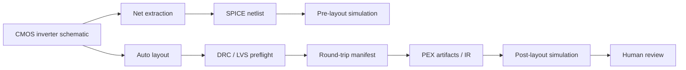

# Flow Verification Log

Last run: 2026-05-07

This log tracks end-to-end verification of the current semiconductor design flow using existing functionality. The representative circuit is a CMOS inverter because it exercises schematic connectivity, MOS device metadata, SPICE generation, transient simulation, auto layout, DRC/LVS preflight, PEX parasitic injection, and post-layout simulation without requiring a large design.

## Commands Run

| Scope | Command | Result |
|---|---|---|
| CircuitStudio SwiftPM build | `perl -e 'alarm 120; exec @ARGV' swift build` | Pass |
| CircuitStudio SwiftPM tests | `perl -e 'alarm 120; exec @ARGV' swift test --filter CircuitStudioCoreTests` | 133 pass, 4 skipped |
| Headless CMOS inverter round trip | `perl -e 'alarm 120; exec @ARGV' swift test --filter HeadlessRoundTripServiceTests` | 1 pass; strict pre-PEX gate passes |
| CMOS inverter flow | `perl -e 'alarm 120; exec @ARGV' swift test --filter CMOSInverterFlowTests` | 1 pass |
| CoreSpice full tests | `perl -e 'alarm 180; exec @ARGV' swift test` in `/Users/1amageek/Desktop/LSI/CoreSpice` | 542 pass |
| semiconductor-layout full tests | `perl -e 'alarm 180; exec @ARGV' swift test` in `/Users/1amageek/Desktop/LSI/semiconductor-layout` | 91 pass |
| swift-mask-data full tests | `perl -e 'alarm 180; exec @ARGV' swift test` in `/Users/1amageek/Desktop/LSI/swift-mask-data` | 589 pass |
| PEXEngine full tests | `perl -e 'alarm 180; exec @ARGV' swift test` in `/Users/1amageek/Desktop/LSI/PEXEngine` | 96 pass |
| Xcode workspace schemes | `perl -e 'alarm 60; exec @ARGV' xcodebuild -list -workspace Xcircuite.xcworkspace` | Pass |
| Xcode app build | `perl -e 'alarm 180; exec @ARGV' xcodebuild -workspace Xcircuite.xcworkspace -scheme Xcircuite -destination 'platform=macOS' build` | Pass |
| Xcode app tests | `perl -e 'alarm 240; exec @ARGV' xcodebuild test -workspace Xcircuite.xcworkspace -scheme Xcircuite -destination 'platform=macOS'` | 5 pass |
| Multi-package flow script | `scripts/verify-flow.sh` | Added; starts by running package-local tests and Xcode checks sequentially |

## Verified Flow Coverage

| Flow stage | Current evidence | Status |
|---|---|---|
| Schematic model | CMOS inverter preview document loads and contains MOS devices and labeled nets | Verified |
| Net extraction | Nets include `vdd`, `in`, `out`, and `0` | Verified |
| Netlist generation | Generated SPICE contains `MP1`, `MN1`, and transient analysis command | Verified |
| Pre-layout simulation | CoreSpice transient run completes with waveform data | Verified |
| Auto layout | Layout document, component mappings, and net mappings are generated | Verified |
| Full LVS | `PhysicalVerificationService` extracts physical connectivity from hierarchical routing geometry, vias, imported cut-shapes, top pins/labels, generated instance pins, imported polygon terminal metadata, numeric GDS layer aliases, raw MOS `ACTIVE ∩ POLY` geometry, inferred MOS terminals, shared-diffusion MOS devices, and raw resistors; it reports stale mappings, dangling mappings, missing/extra objects, declared-only nets, hierarchy topology errors, physical shorts, physical opens, unconnected terminals, terminal/net mismatches, skipped connectivity extraction, missing/misnamed external ports, invalid imported terminals, duplicate imported terminals, duplicate raw devices, raw MOS W/L/kind/`nf` mismatches, and raw resistor value mismatches | Verified for current in-app layout model, sample-process raw-device fixtures, and first imported-layout semantics fixtures |
| PEX artifact loading | Manifest and IR loading, unit normalization, dropped-element diagnostics, and mock PEXEngine artifact handoff are covered | Verified |
| Post-layout simulation | Normalized parasitics are merged into SPICE and CoreSpice analysis completes | Verified |
| External signoff execution | External DRC/LVS commands can be launched, stdout/stderr logs are captured as artifacts, diagnostics are parsed, non-zero exits become failing reports, and approval decisions persist under `.xcircuite/signoff/` | Verified with mock signoff tools |
| Headless round trip | CMOS inverter flow writes pre/post SPICE netlists, external signoff logs, persisted review JSON, and a `round-trip-manifest.json`; strict pre-PEX verification passes without forced continuation | Verified strict for first circuit |
| Human review cockpit | Xcode app launches and UI smoke tests pass | Smoke-tested |

## Issue Queue

| ID | Priority | Status | Area | Problem | Action |
|---|---:|---|---|---|---|
| FV-001 | P2 | Resolved | CoreSpice SwiftPM packaging | CircuitStudio build/test emitted unhandled README resource warnings from CoreSpice dependency targets. | Added explicit README excludes in CoreSpice `Package.swift`; reran CircuitStudio build and CoreSpice IR tests. |
| FV-002 | P2 | Resolved for current gate | LVS | Declared `LayoutNet` entries could be treated as present even without physical geometry. | LVS now only treats nets referenced by physical `shape/via/pin/label` geometry as realized; added a declared-only net rejection test. |
| FV-003 | P2 | Resolved for mock backend | PEX to post-layout | CircuitStudio flow test used synthetic `PEXParasiticIR`; it did not prove PEXEngine artifacts could be consumed. | Added a mock PEXEngine run that writes artifacts, loads the manifest/IR through CircuitStudio, and builds a post-layout netlist. |
| FV-004 | P2 | Open | Human review | Xcode UI tests only prove launch and smoke behavior, not DRC/LVS/PEX artifact review or approval flow. | Add review-state UI tests around verification reports, diagnostics, and accept/reject decisions. |
| FV-005 | P3 | Resolved | Test ergonomics | Running dependency test filters from `circuit-studio` can report zero tests; dependency packages must be tested from their own directories. | Added `scripts/verify-flow.sh` to run package-local tests and Xcode checks in sequence. |
| FV-006 | P3 | Open | Xcode test environment | Xcode UI tests pass but emit `DebuggerLLDB.DebuggerVersionStore.StoreError` / `no debugger version` warnings while launching the app. | Investigate Xcode toolchain/debugger metadata only if it becomes flaky or starts failing CI. |
| FV-007 | P3 | Open | CoreSpice limitations surfaced in CircuitStudio | Four CircuitStudio tests remain intentionally skipped for nonlinear convergence, SIN transient timestep handling, and `.param` expression support. | Track as CoreSpice capability work before treating CircuitStudio simulation as production-grade. |
| FV-008 | P1 | Resolved for generated, first imported-layout, and sample-process raw-device LVS | Full LVS | The current gate needed polygon-derived connectivity through instance pins, layers, vias, and device terminals. | Added hierarchical connectivity extraction, schematic-vs-physical short/open checks, imported polygon terminal recognition, raw MOS recognition, inferred raw MOS terminals, raw resistor recognition, explicit Full LVS skip diagnostics, missing/misnamed external port reporting, invalid terminal reporting, duplicate terminal reporting, and raw W/L/kind/`nf`/resistance mismatch reporting. |
| FV-009 | P2 | Open | Real PEX backend | The PEX artifact handoff is verified with the mock backend, not with a signoff-grade extractor or real layout file semantics. | Add a real-backend or golden-SPEF fixture path once the layout export and tech mapping contract are stable. |
| FV-010 | P1 | Resolved for in-process LVS | Imported-layout LVS semantics | LVS-M11 needed hierarchy-cycle rejection, GDS numeric layer alias normalization, imported cut-shape connectivity, and shared-diffusion MOS extraction. | Added topology diagnostics, tech-backed layer alias normalization, cut-shape via/contact bridging, shared-diffusion two-device extraction, and focused tests. |
| FV-011 | P1 | Resolved for imported reports | External signoff review gate | PEX readiness needed to account for signoff DRC/LVS results that were produced outside the in-process LVS checker. | Added normalized external DRC/LVS report models, diagnostic parsing, pass/fail aggregation, and an explicit human approval gate before PEX. |
| FV-012 | P1 | Resolved for mock signoff tools | External signoff execution | External signoff reports can now be imported and gated, but CircuitStudio needed to run signoff DRC/LVS commands and persist review approvals. | Added command-runner integration, captured log artifact paths, non-zero-exit report generation, persisted approval records, and focused tests. |
| FV-013 | P1 | Open | Real signoff decks | External command execution is verified with mock tools, not real foundry DRC/LVS decks or golden imported layout corpora. | Add real-deck smoke fixtures, golden GDS/OASIS expected reports, and deck-specific parser adapters if generic log parsing is insufficient. |
| FV-014 | P1 | Resolved for first circuit | Headless flow orchestration | Individual services existed, but there was no non-UI runner that produced a complete artifact manifest for the full design loop. | Added `HeadlessRoundTripService` and a CMOS inverter test that records artifacts, stages, signoff review state, and strict gate status. |
| FV-015 | P1 | Resolved for first circuit | Strict DRC gate | The CMOS inverter could round-trip only with explicit continuation after the in-process DRC gate failed. | Fixed DRC false positives for cross-layer overlap, grid-rounded spacing, and via landing enclosure; Pre-PEX DRC now treats connectivity opens as LVS responsibility and the headless round trip no longer forces continuation. |
| FV-016 | P1 | Open | Golden flow breadth | Only one small circuit has a strict headless round-trip fixture. | Add at least one more small circuit and failure-manifest regressions before increasing device/layout complexity. |

## Full LVS Milestones

| Milestone | Status | Scope | Evidence |
|---|---|---|---|
| LVS-M1: Instance and net freshness gate | Done | Schematic hash, component-to-instance mapping, net-to-layout mapping, missing/extra/dangling object checks | `PhysicalVerificationServiceTests` |
| LVS-M2: Physical net realization gate | Done | A net must be referenced by physical geometry (`shape/via/pin/label`), not only declared in `LayoutNet` | `lvsRejectsDeclaredNetWithoutPhysicalGeometry()` |
| LVS-M3: Top-cell connectivity extraction | Done | Extracts connectivity from shapes, vias, top pins/labels, and transformed instance pins without shorting device internals | `LayoutConnectivityExtractor` inside `PhysicalVerificationService` |
| LVS-M4: Short detection | Done | Reports one physical cluster containing terminals from multiple schematic nets | `fullLVSReportsPhysicalShorts()` |
| LVS-M5: Open detection | Done | Reports one schematic net split across multiple physical clusters | `fullLVSReportsPhysicalOpens()` |
| LVS-M6: Flow integration | Done | `runPrePEXVerification` now runs Full LVS when technology is provided; CMOS inverter flow still passes | `CMOSInverterFlowTests` |
| LVS-M7: Hierarchical / imported-layout LVS | Done for first fixture | Flattens wrapper hierarchy, recursively realizes net geometry, validates nested mapped instances, and avoids flagging hierarchy wrappers as extra devices | `hierarchicalLVSFlattensWrapperCells()` |
| LVS-M8: Device recognition from polygons | Done for metadata-backed polygons | Recognizes imported polygon terminals using `lvs.component` / `lvs.pin` shape properties and compares them to schematic terminals without generated-cell instances | `fullLVSRecognizesImportedPolygonTerminals()` |
| LVS-M9: Raw MOS device extraction | Done for first fixture | Infers MOS devices from `ACTIVE ∩ POLY`, classifies NMOS/PMOS from implant/well layers, matches by layout label, and compares raw W/L/kind against schematic parameters | `rawMOSLVSRecognizesDeviceAndParametersWithoutMetadata()`, `rawMOSLVSRejectsParameterMismatch()`, `rawMOSLVSRejectsDeviceKindMismatch()` |
| LVS-M10: Sample-process raw device/terminal extraction | Done for current fixtures | Infers MOS source/drain/gate/bulk terminals from local M1 contact shapes, checks extracted drain connectivity for opens, recognizes raw resistors from `RESI ∩ POLY`, compares resistor value, and treats multi-finger MOS as one device with `nf` | `rawMOSLVSConnectsExtractedDrainTerminals()`, `rawMOSLVSReportsOpenExtractedDrainTerminals()`, `rawResistorLVSRecognizesResistanceWithoutMetadata()`, `rawResistorLVSRejectsResistanceMismatch()`, `rawMOSLVSRecognizesMultiFingerParameters()` |
| LVS-M11: Imported-layout semantics hardening | Done for in-process LVS fixtures | Rejects hierarchy cycles before extraction, normalizes numeric GDS fallback layers through the active technology, treats imported cut-shapes as via/contact bridges, and extracts simple shared-diffusion MOS series devices | `fullLVSRejectsHierarchyCyclesBeforeExtraction()`, `importedNumericLayerRawMOSLVSUsesTechnologyLayerAliases()`, `importedCutShapeConnectsTerminalsAcrossProcessLayers()`, `sharedDiffusionRawMOSLVSRecognizesSeriesDevices()` |
| LVS-M12: External signoff correlation | Done for imported reports | Import external signoff DRC/LVS reports, normalize diagnostics, correlate rule/component/net metadata when present, and require explicit human approval before PEX | `prePEXVerificationRequiresExternalSignoffApproval()`, `prePEXVerificationAcceptsApprovedExternalSignoff()`, `externalSignoffErrorsBlockPEXEvenWhenApproved()` |
| LVS-M13: External signoff execution and approval persistence | Done for service layer and mock tools | Run configured signoff DRC/LVS tools, capture stdout/stderr artifacts, convert non-zero exits into failing reports, persist review decisions, and reload approval state | `runCapturesLogArtifactAndParsesDiagnostics()`, `nonZeroExitCreatesFailingReportWithoutDroppingArtifacts()`, `runCommandsBuildsUnapprovedReview()`, `reviewStorePersistsApproval()` |
| LVS-M14: Headless round-trip harness | Done for first circuit | Run the CMOS inverter through non-UI net extraction, netlist, pre-layout sim, auto layout, signoff command artifacts, persisted approval, pre-PEX gate, PEX IR injection, post-layout sim, and manifest writing | `cmosInverterCompletesHeadlessRoundTripWithArtifacts()` |
| LVS-M15: Strict-clean round trip | Done for first circuit | Make the same CMOS inverter round trip pass strict pre-PEX verification without forced continuation | `cmosInverterCompletesHeadlessRoundTripWithArtifacts()` |
| LVS-M16: Multi-fixture round-trip corpus | Pending | Add another small circuit and negative/failure manifests so the harness proves both pass and fail paths | Future corpus work |

## Next Execution Order

| Order | Issue | Reason |
|---:|---|---|
| 1 | LVS-M16 / FV-016 | The first strict round trip passes; the next risk is overfitting to one CMOS inverter fixture. |
| 2 | FV-013 | Real signoff deck coverage is needed before treating the external signoff bridge as production-like. |
| 3 | FV-009 | Real PEX backend coverage is needed before calling the post-layout flow signoff-like. |
| 4 | FV-004 | Human-in-the-loop review can stay file-based for now; UI coverage is lower priority than strict headless correctness. |
| 5 | FV-007 | Solver and parser limitations affect broader circuit classes after the flow spine is stable. |
| 6 | FV-006 | Current warning does not block build or tests. |
