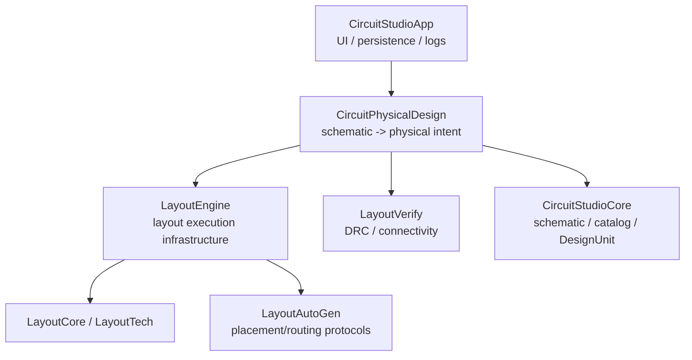
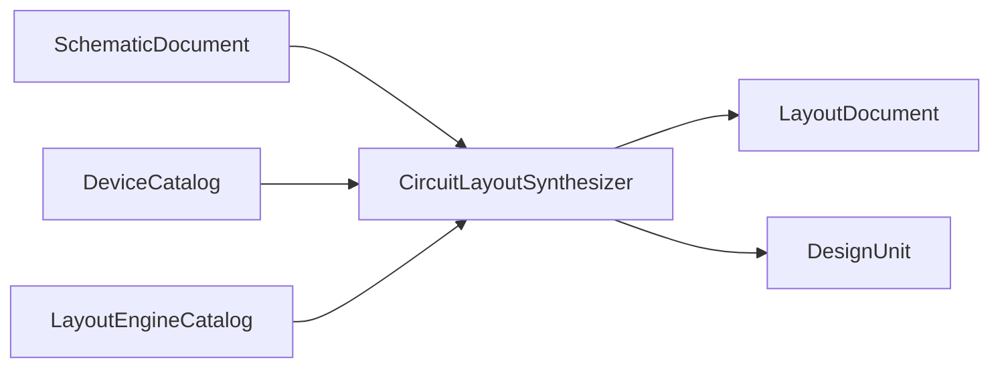

# Layout Engine Boundary

Status: Implemented baseline
Date: 2026-06-13
Scope: physical layout design, generation, repair, verification handoff, and
CircuitStudio integration.

## Goal

Physical layout work is split into two layers:

| Layer | Responsibility |
|---|---|
| `LayoutEngine` | Physical-layout execution infrastructure: engine catalog, placement/routing/device-cell backend selection, route repair contracts, and layout-stage descriptors. It knows layout documents and technology data, not CircuitStudio schematic models. |
| `CircuitPhysicalDesign` | Circuit-to-physical bridge: schematic net extraction, device catalog mapping, primitive layout synthesis, floorplanning, inter-block routing, connectivity/device extraction, topology validation, physical DRC/LVS report composition, design-unit mapping, preflight availability, and physical layout trust evaluation. |

`CircuitStudioApp` must remain a UI, persistence, command, and diagnostics presentation
layer. It may choose and pass a catalog, but it must not own placement, routing,
device-cell generation, DRC repair, or schematic-to-layout synthesis logic.

## Dependency Rule

| Source | May depend on | Must not depend on |
|---|---|---|
| `LayoutEngine` | `LayoutCore`, `LayoutTech`, `LayoutAutoGen` | `CircuitStudioCore`, `CircuitStudioApp`, project files, UI state |
| `CircuitPhysicalDesign` | `CircuitStudioCore`, `LayoutEngine`, `LayoutAutoGen`, `LayoutVerify` | SwiftUI views, app state, project persistence, menu/log presentation, run artifact publishing |
| `CircuitStudioApp` | `CircuitPhysicalDesign`, UI/editor/persistence services | Floorplanning, routing, connectivity extraction, topology validation, physical verification algorithms |

This keeps algorithm and engine research usable from a package boundary while preserving
CircuitStudio-specific meaning in a bridge layer.

## Ownership

| Type group | Owner |
|---|---|
| `LayoutEngineCatalog`, `LayoutEngineDescriptor`, engine registrations, placement/routing/device/verifier provider protocols, placement/routing selections | `LayoutEngine` |
| `CircuitLayoutSynthesizer`, `PhysicalDeviceMapper`, semantic `CircuitLayoutAvailability`, `DRCPostRouteVerifier` | `CircuitPhysicalDesign` |
| `LayoutOwnershipPolicy`, `LayoutOwnershipResolver`, `NetAwareLayoutEvaluator`, `LayoutTrustEvaluationService`, `LayoutTrustReport` | `CircuitPhysicalDesign` |
| `GridFloorplanner`, `InterBlockRouter`, `LayoutConnectivityExtractor`, `RawLayoutDeviceExtractor`, `LayoutTopologyValidator`, `PhysicalVerificationService`, and their typed reports/profiles | `CircuitPhysicalDesign` |
| Bundled JSON loading for physical profiles, default profile/catalog selection, preflight source snapshots, source/file materialization availability reasons, diagnostic log formatting, project file paths, UI command state, and layout trust artifact publishing | `CircuitStudioApp` |

## Runtime Flow

The bridge extracts circuit intent and maps it into physical layout work. The engine
catalog supplies stage implementations. The application receives canonical layout,
design-unit bindings, DRC results, skipped components, unrouted nets, and quality
metrics for review and persistence.

## Failure Policy

| Situation | Required behavior |
|---|---|
| Unknown placement or routing engine ID | Throw before producing geometry and report available IDs. |
| Physical device without a registered cell engine | Report unavailable in preflight and throw before partial layout generation. |
| Router cannot complete a net | Preserve `unroutedNets` in the synthesis output. |
| DRC repair cannot attribute a violation to a route | Stop repair and carry remaining violations in the result. |
| UI sees a disabled layout command | `CircuitPhysicalDesign` reports schematic/device availability; App diagnostics add source/project/cell/file materialization context. |

## Test Surface

| Test layer | Purpose |
|---|---|
| `LayoutEngine` public-contract tests | External code can register and select engines using public APIs. |
| `LayoutAutoGen` public-contract tests | External engines can conform to placement/routing/device/verifier protocols without `@testable`. |
| `CircuitPhysicalDesign` tests | Schematic-to-layout synthesis uses the selected engine catalog and preflight matches synthesis behavior. |
| `CircuitStudioApp` tests | UI and persistence call the bridge and do not bypass project/logging paths. |
