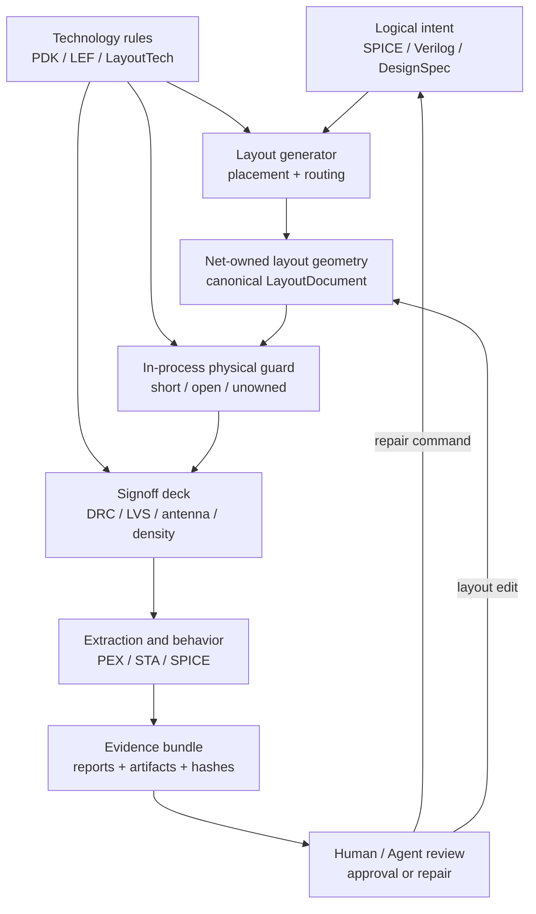
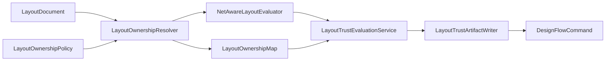

# Layout Trust Mechanism Goals and Roadmap

Status: Implemented baseline
Date: 2026-06-01
Scope: generated and imported physical layouts used by CircuitStudio, its CLI/API flows,
and agent-driven layout repair loops.

## Goal

A layout claim is trusted only when the claim is backed by evidence at the correct
physical layer. A generated layout is not considered trusted because the generator
returned geometry. It becomes trusted when the system can prove, preserve, and review:

| Trust axis | Required property |
|---|---|
| Intent traceability | Every physical object can be traced to logical intent, an explicit generated purpose, or a documented exemption. |
| Connectivity correctness | The layout has no unintended physical shorts, no split physical realization of one logical net, and no unowned conductive geometry. |
| Rule correctness | The geometry passes the active technology DRC, including the rule classes that affect manufacturability. |
| Electrical equivalence | The extracted physical topology matches the schematic or gate-level netlist through LVS. |
| Reliability closure | Antenna, density, IR, EM, timing, and post-layout behavior are checked by the appropriate verifier. |
| Reproducibility | Inputs, tool versions, commands, reports, and decisions are stored as immutable run artifacts. |
| Human review | A reviewer can inspect what changed, what was checked, what failed, what passed, and which claim is being approved. |

The goal is not to replace signoff tools with a local heuristic. The goal is to build
a layered trust system where fast in-process checks catch generator and router mistakes
early, while signoff-grade tools remain the final physical authority.

The cross-cutting artifact publication and verified-reader design is defined in
`docs/trusted-artifact-completion-design.md`. Layout trust, antenna protection, timing
artifacts, review summaries, and approval records should converge on that shared
artifact spine instead of adding feature-local integrity checks.

## Trust Boundary



The boundary is explicit:

| Layer | Owns | Must not claim |
|---|---|---|
| Generator | Produces geometry from logical intent and technology rules. | It must not claim the layout is correct only because it emitted shapes. |
| Router | Produces route geometry for named nets and fails closed when it cannot prove route ownership. | It must not call ordering retries real rip-up-reroute unless it implements true rip-up. |
| In-process guard | Builds physical connectivity from geometry and detects shorts, opens, and unowned conductive shapes. | It must not claim foundry DRC, antenna, density, or LVS closure. |
| Signoff deck | Runs independent physical verification and produces rule-level diagnostics. | It must not silently convert missing tools or truncated logs into a clean pass. |
| Artifact writer | Persists inputs, outputs, diagnostics, hashes, and stage verdicts. | It must not overwrite an approved artifact in place or drop failure evidence. |
| Review layer | Projects evidence into a reviewable decision surface. | It must not reinterpret raw logs in a way that changes the recorded verdict. |

## Verification Ladder

Trust is earned one level at a time. Higher levels depend on lower levels, but do not
erase them.

| Level | Name | Question answered | Primary evidence | Completion rule |
|---:|---|---|---|---|
| 0 | Data contract | Is every generated shape owned or explicitly exempt? | Canonical layout plus ownership metadata | No blank owner, duplicate ambiguous owner, or unclassified conductive geometry. |
| 1 | Topology guard | Do the owned shapes form the intended physical nets? | In-process connectivity report | No physical shorts, opens, or unowned conductive shapes. |
| 2 | Geometry DRC | Is the geometry legal under the active technology? | DRC report and raw logs | Active deck completes and reports zero blocking violations. |
| 3 | Electrical LVS | Does the layout match the logical design? | LVS report and extracted topology | Active deck completes and reports schematic/layout equivalence. |
| 4 | Reliability | Is the layout robust enough to fabricate and operate? | Antenna, density, IR, EM, timing reports | Each configured reliability axis has a pass verdict or an explicit non-applicability record. |
| 5 | Post-layout behavior | Does extracted behavior still meet specs? | PEX artifacts, STA, SPICE comparison | Configured timing and waveform gates pass with recorded limits. |
| 6 | Audit and approval | Can a human or agent replay the decision? | Run manifest, artifact hashes, approval records | Review summary is complete and approvals target immutable artifact hashes. |

## Detailed Design

The implementation is split by responsibility. Each layer owns one decision and passes
structured data to the next layer.



| Type | Responsibility | Does not own |
|---|---|---|
| `LayoutOwnershipPolicy` | Defines which layers require net ownership and which explicit purposes are exempt. | Physical connectivity or artifact writing. |
| `LayoutOwnershipResolver` | Resolves each top-cell shape into owned, unowned, ignored, or exempt records. | Short/open detection or DRC/LVS. |
| `NetAwareLayoutEvaluator` | Builds physical connectivity from owned shapes and technology cut-layer bridges. | Ownership normalization, DRC, LVS, antenna, or artifact layout. |
| `LayoutTrustEvaluationService` | Combines ownership resolution and net-aware topology into one trust report. | File I/O and human approval. |
| `LayoutTrustArtifactWriter` | Writes canonical layout, ownership map, net-aware report, and trust report. | Changing verdicts or filtering diagnostics. |
| `DesignFlowCommand.runLayoutTrust` | Provides CLI/API access to the layout trust stage. | DRC/LVS replacement. |
| `DesignFlowCommand.runVerification` | Runs layout trust before DRC/LVS and includes the report in verification artifacts. | Mutating layout or approving failures. |

The service boundaries are protocol-backed (`LayoutOwnershipResolving`,
`NetAwareLayoutEvaluating`, `LayoutTrustEvaluating`, and `LayoutTrustArtifactWriting`)
so tests and future engines can replace one layer without changing the others.

The generated artifact set is:

| Artifact | Producer | Consumer |
|---|---|---|
| `canonical-layout.json` | `LayoutTrustArtifactWriter` | Re-run and review tools. |
| `ownership-map.json` | `LayoutTrustArtifactWriter` | Human review, agent repair, debug UI. |
| `net-aware-report.json` | `LayoutTrustArtifactWriter` | Topology failure analysis. |
| `layout-trust-report.json` | `LayoutTrustArtifactWriter` | CLI/API/UI gate summaries. |

## Artifact Contract

Every trusted layout run must be reconstructable from its run directory.

```text
.xcircuite/
  runs/
    <run-id>/
      intent.json
      plan.json
      actions.jsonl
      design-diff.json
      layout/
        canonical-layout.json
        ownership-map.json
        net-aware-report.json
        exported.gds
        exported.oas
      signoff/
        drc-report.json
        lvs-report.json
        antenna-report.json
        density-report.json
        raw-logs/
      pex/
        manifest.json
        spef/
        parasitic-ir.json
      reports/
        timing.json
        post-layout-comparison.json
        review-summary.json
```

The implemented command paths are fixed as follows:

| Command | Artifact root | Layout trust artifacts | Verification report |
|---|---|---|---|
| `runLayoutTrust` | `<project-root>/.xcircuite/runs/<run-id>/` | `layout/canonical-layout.json`, `layout/ownership-map.json`, `layout/net-aware-report.json`, `layout/layout-trust-report.json` | Not produced. |
| `runVerification` | `<project-root>/.xcircuite/runs/<run-id>/` | `layout/canonical-layout.json`, `layout/ownership-map.json`, `layout/net-aware-report.json`, `layout/layout-trust-report.json` | `reports/physical-verification.json` |

Existing headless round-trip bundles still use `.xcircuite/flow-runs/<run-id>/`.
The layout trust file names and JSON schemas are shared between both command-level
runs and future run-bundle consumers.

Failure policy:

| Situation | Required behavior |
|---|---|
| Invalid input before artifact creation | Fail before creating a run directory when no meaningful evidence exists. |
| Failure after a stage starts | Write a failed-stage manifest and the diagnostics collected so far. |
| Mutating layout operation | Write to a staged artifact first, then publish by manifest reference. |
| Missing tool or truncated report | Record an explicit skipped/error axis, never a clean pass. |
| Human approval | Store approval as a separate immutable record referencing artifact hashes. |

## Roadmap

### LT-0: Trust Contract

Define the common contract for layout ownership, exemptions, verdicts, and artifact
paths.

Acceptance criteria:

| Check | Required |
|---|---|
| Ownership model | Conductive generated geometry has one net owner or an explicit non-net purpose. |
| Error model | Shorts, opens, unowned geometry, missing tools, truncated logs, and unsupported topology have typed diagnostics. |
| Artifact schema | Reports are Codable and can be loaded by CLI/API/UI without parsing console text. |
| Tests | Positive and negative fixtures prove the contract fails closed. |

### LT-1: In-process Net-aware Evaluation

Build physical connectivity from layout geometry and technology bridge layers. This is
the fast guard used before expensive signoff.

Acceptance criteria:

| Check | Required |
|---|---|
| Same-layer conductors | Touching or overlapping same-layer shapes connect. |
| Cut layers | Vias and contacts bridge only their declared adjacent conductor layers. |
| Layer crossings | Orthogonal crossings on different routing layers do not connect without a cut shape. |
| Opens | One logical net split into multiple physical components fails. |
| Shorts | One physical component containing multiple logical nets fails. |
| Ownership | Blank or missing net ownership fails. |

Current implementation status: implemented for owned generated route geometry and
CLI/API layout trust runs through `LayoutTrustEvaluationService`,
`LayoutTrustArtifactWriter`, `DesignFlowCommand.runLayoutTrust`, and `MazeRouter`
route validation.

### LT-2: Generator Compliance

Make every generator route through the same ownership contract instead of relying on
implicit labels or generator-local assumptions.

Acceptance criteria:

| Check | Required |
|---|---|
| Standard-cell routes | Internal routing shapes are owned or explicitly exempt. |
| Hierarchical routes | Block port pads, vias, and global routes carry net ownership. |
| Imports | Imported GDS/OAS/OASIS-derived topology can be normalized into ownership or reported as unowned. |
| Regression | Each generator has at least one clean case and one intentionally broken case. |

### LT-3: Router Correctness

Keep routing claims aligned with implemented behavior.

Acceptance criteria:

| Check | Required |
|---|---|
| Determinism | Given the same inputs and seed/order policy, emitted routes are stable. |
| Fail-closed behavior | Unroutable, invalid-grid, invalid-net, and invalid-route cases throw typed errors. |
| Route validation | The router runs the net-aware guard before returning shapes. |
| Algorithm naming | Retry ordering, rip-up-reroute, maze expansion, and antenna-aware routing are named only when actually implemented. |

### LT-4: Signoff Correlation

Correlate in-process guard results with independent DRC/LVS/antenna signoff.

Acceptance criteria:

| Check | Required |
|---|---|
| DRC | Generated layout exports to GDS/OAS and passes the active DRC deck for clean fixtures. |
| LVS | The exported layout matches the reference schematic/netlist for clean fixtures. |
| Negative fixtures | Known shorts, opens, spacing violations, antenna violations, and wrong schematics fail the expected axis. |
| Correlation | When both in-process and signoff checks can see a topology issue, their diagnostics name compatible nets or geometry regions. |

### LT-5: Evidence Bundle

Make layout evaluation auditable by default.

Acceptance criteria:

| Check | Required |
|---|---|
| Manifest | Every run records inputs, commands, tool versions, stage verdicts, duration, and artifact hashes. |
| Review projection | CLI/API/UI read one review summary rather than reinterpreting raw artifacts differently. |
| Approval | Approval records target immutable artifact hashes and are separate from the reports being approved. |
| Re-run | A run can be reproduced from captured inputs or clearly reports which external dependency is missing. |

### LT-6: Corpus Hardening

Prevent overfitting to generated pass paths by adding broad clean and failing corpora.

Acceptance criteria:

| Corpus | Required coverage |
|---|---|
| Generated clean | Inverter, NAND/NOR, DFF, ACC-4, hierarchical blocks, and scale fixtures. |
| Generated failing | Physical short, physical open, spacing violation, antenna violation, LVS mismatch. |
| Imported clean | Real or golden GDS/OAS/OASIS layouts with expected DRC/LVS results. |
| Imported failing | Imported layouts with raw topology errors and rule violations. |
| Cross-format | GDS/OAS/OASIS round trips preserve enough topology for verification. |

### LT-7: Antenna-aware Physical Implementation

Move from detecting antenna debt to actively reducing it through P&R.

Implemented baseline for generated Sky130 gate-level rows:

| Component | Responsibility |
|---|---|
| `AntennaProtectionPlanProvider` | Protocol boundary for choosing protection sites from route-derived candidates. |
| `GateLevelAntennaProtectionPlanner` | Derives per-instance/per-gate protection sites from gate-load topology and route budget data. |
| `AntennaProtectionRuleSet` | Encodes whether local gate contacts, unanchored gate nets, and span-budget violations need protection. |
| `Sky130AntennaTieGenerator` | Emits DRC/LVS-clean local diffusion ties on the same met1 riser stage as the protected gate contact, tagging each shape with the materialized protection site ID. |
| `SpecToSiliconFlow` | Writes `*.antenna-protection.json` as supporting antenna evidence, then exports GDS and runs the physical deck. Magic antennacheck remains the antenna signoff claim. |

`AntennaProtectionPlan` and `LayoutTrustReport` are strict JSON artifacts. Both carry `schemaVersion` and `kind`; readers reject unsupported envelopes. Protection plans also validate site identity, topology fields, finite geometry, duplicate IDs, and rule-set values before decode/write/use. Layout trust reports validate that stored top-cell identity, status, and shape counts are derivable from `ownershipMap` and `netAwareReport`.

Acceptance criteria:

| Step | Required |
|---|---|
| Net budgeting | Each generated route has an antenna budget derived from gate area and process limits; local met1 gate-contact risers are treated as same-stage antenna risks. |
| Partitioning | Block partitioning minimizes long gate-connected cross-block nets. |
| Router | True rip-up-reroute and congestion cost are implemented before claiming high-scale routability. |
| Repair | Diode insertion or jumper strategy is net-aware, DRC-clean, LVS-clean, and does not short neighboring nets. |
| Signoff | ACC-4 antenna violations are reduced or eliminated with evidence from the antenna deck. |
| Evidence separation | Protection plans and route diagnostics are recorded as supporting evidence; they do not satisfy the `.antenna` axis without a passing antenna signoff claim. Evidence manifests use schema v2 and must encode the claim kind explicitly; older schemas are rejected without conversion. |

### LT-8: Incremental and Scalable Verification

Make the trusted loop fast enough for human and agent iteration.

Acceptance criteria:

| Check | Required |
|---|---|
| Incremental guard | Topology guard can re-evaluate changed regions without reprocessing the full layout when safe. |
| Cached signoff inputs | Identical generated cells and timing/signoff artifacts are reused by content hash. |
| Bounded runtime | Large generated fixtures have recorded runtime budgets and bottleneck summaries. |
| Parallel safety | Heavy shared resources use one concurrency gate across all relevant tests and flows. |

## Done Definition

A layout feature is not done until it satisfies the level it claims.

| Claim made by feature | Minimum done definition |
|---|---|
| "Generated route is connected" | LT-1 and LT-3 pass for the route, with negative tests. |
| "Generated cell/block is DRC/LVS clean" | LT-4 DRC and LVS pass through exported mask data. |
| "Antenna clean" | LT-7 signoff evidence passes the antenna axis, not only heuristic span reduction. |
| "Agent can repair layout" | LT-5 artifacts plus a rerunnable edit/verify command loop exist. |
| "Tapeout evidence is trusted" | Levels 0 through 6 pass, with explicit records for any non-applicable axis. |

## Current Reading

The current work is moving from signoff-only detection toward a layered trust system:

| Area | Current state | Remaining gap |
|---|---|---|
| Net-aware guard | Implemented for generated maze-router routes and standalone layout trust command runs. | Extend ownership normalization to all generated/imported layout paths. |
| DRC/LVS generated fixtures | Strong regression coverage for Sky130 generated cells and blocks. | Continue adding negative fixtures and imported binary corpora. |
| Antenna | Generated Sky130 gate-level rows now plan local diffusion ties per gate contact, emit an antenna-protection artifact that names the instance/gate/site coordinates as supporting evidence, and pass real Magic antenna on ACC-4 while preserving DRC/LVS. | Extend the same protection model to hierarchical cross-block routing and imported layouts. |
| Artifacts | Dedicated layout trust reports, ownership maps, canonical layout snapshots, and net-aware reports are written by the layout trust stage. | Add UI panels and broader corpus entries that consume the new artifacts. |

This roadmap intentionally separates "detecting a problem truthfully" from "repairing
the problem automatically." A trustworthy harness must first fail for the right reason,
then add repair engines whose outputs pass the same independent gates.
