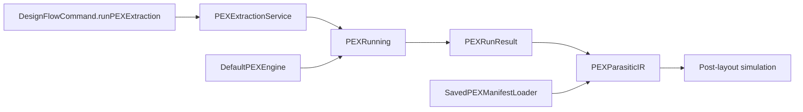

# PEX Execution

`circuit-studio` calls the public `PEXRunning` protocol from `PEXEngine` directly.
It does not maintain a second backend protocol or launch the package CLI as an
internal bridge.

## API

| Type | Responsibility |
|---|---|
| `PEXExtractionRequest` | Selects a `PEXProjectConfig`, corner, optional project/workspace roots, and executable override. |
| `PEXExtractionService` | Maps the project config to `PEXRunRequest` and calls the injected `PEXRunning` implementation. |
| `DefaultPEXEngine` | Production implementation supplied by `PEXEngine`. |
| `PEXExtractionResult` | Carries the canonical `PEXRunResult`, manifest, and studio post-layout IR projection. |
| `SavedPEXManifestLoader` | Loads an immutable prior manifest when no new extraction is requested. |

`SavedPEXManifestLoader` is a persistence reader, not an execution backend. The
production extraction path and tests both inject an implementation of the upstream
`PEXRunning` protocol.

## Verification

| Check | Evidence |
|---|---|
| Saved artifact loading | `PEXExtractionServiceTests.savedManifestLoaderLoadsIR()` |
| Direct protocol execution | `PEXExtractionServiceTests.extractionUsesInjectedPEXRunner()` |
| Disabled configuration gate | `PEXExtractionServiceTests.disabledConfigurationIsRejectedBeforeExecution()` |
| Unified command API | `DesignFlowUnifiedAPICommandTests.commandAPIRunsPEXExtractionThroughEngineProtocol()` |
