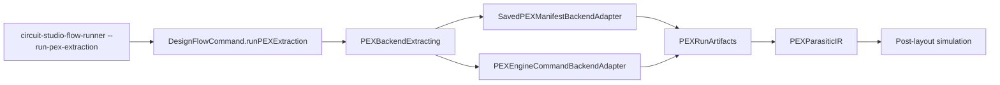

# PEX Backend Adapters

`circuit-studio` treats PEX extraction as an adapter-backed artifact source. The post-layout simulation path consumes the same `PEXRunArtifacts` and `PEXParasiticIR` whether the data came from a saved manifest, a golden replay fixture, or a `pexengine` command run.

## Contract

| Type | Responsibility |
|---|---|
| `PEXBackendExtractionRequest` | Provides the config or manifest URL, optional working directory, corner ID, optional executable override, and extra backend arguments. Config JSON may carry `inputs.technologyByCorner` and `processProfile.cornerDeckPaths` for explicit per-corner process extraction. |
| `PEXBackendExtractionResult` | Returns loaded `PEXRunArtifacts`, loaded corner-specific `PEXParasiticIR`, and the command result when a process was executed. |
| `SavedPEXManifestBackendAdapter` | Loads an existing PEX manifest and IR without launching a backend. |
| `PEXEngineCommandBackendAdapter` | Runs `pexengine extract --config <path> --json`, reads `artifacts.manifestURL` from JSON stdout, then loads the emitted manifest and IR. |
| `DesignFlowCommand.runPEXExtraction` | Exposes PEX extraction through the same Codable command/result surface used by CLI and future Agent/UI operations. |

## Current Limits

| Limit | Status |
|---|---|
| Real installed `pexengine` smoke | Adapter contract exists; current regression uses a mock executable that emits the same JSON handoff shape. |
| Full round-trip inline `PEXEngine run` | Not wired into `HeadlessRoundTripService` yet; the command API can extract artifacts, and saved manifests can already feed the round trip. |
| Per-corner process technology in project config | Supported by `PEXProjectConfig.processProfile` and `inputs.technologyByCorner`; relative paths are resolved by `pexengine` against the config file and captured into immutable run inputs. |
| Tool-specific diagnostics | Non-zero process exits and missing manifest URLs are typed failures; detailed extractor warnings still come from the emitted PEX manifest/IR. |
| UI review | Deferred; UI should read the same command result and artifacts instead of inventing a separate PEX path. |

## Verification

| Check | Evidence |
|---|---|
| Saved manifest adapter | `PEXBackendExtractingTests.savedManifestAdapterLoadsIR()` |
| `pexengine` JSON handoff | `PEXBackendExtractingTests.pexEngineCommandAdapterLoadsManifestFromJSONOutput()` |
| Missing manifest URL failure | `PEXBackendExtractingTests.pexEngineCommandAdapterRejectsMissingManifestURL()` |
| Unified command API | `DesignFlowServiceTests.commandAPIRunsPEXExtractionThroughBackendAdapter()` |
| CLI dogfood | `swift run circuit-studio-flow-runner --run-pex-extraction --pex-config <path> --pex-executable <mock-pexengine>` |
