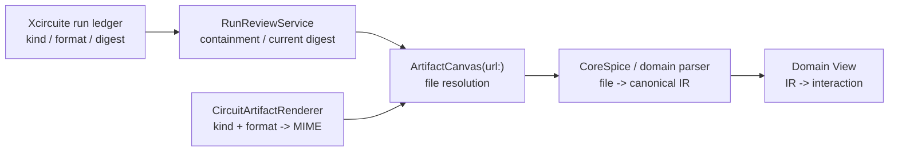

# Project Structure Specification

## 設計方針

Xcircuite は **独自ファイル形式を持たない**。
すべてのデザインデータは業界標準フォーマットで保存し、アプリ固有の状態のみを隠しディレクトリ `.xcircuite/` に格納する。

原則:

- **標準フォーマット優先**: 他の EDA ツール (KiCad, LTspice, ngspice, Magic, KLayout 等) と直接相互運用できること
- **中間表現 (IR) 経由**: すべての I/O は IR レイヤーを経由し、フォーマット間の変換を透過的に行う
- **VS Code モデル**: プロジェクトは通常のディレクトリ。`.xcircuite/` は `.vscode/` と同様の位置付け

## ディレクトリ構成

```
my-design/
├── .xcircuite/                    # アプリ固有 (隠しディレクトリ)
│   ├── workspace.json             # UI 状態
│   ├── schematic-placement.json   # 回路図エディタのビジュアル配置
│   └── simulation.json            # シミュレーション設定
│
├── top.cir                        # SPICE ネットリスト (電気的真実)
├── models/
│   ├── nmos.lib                   # デバイスモデル
│   └── passives.lib
├── process.lef                    # プロセス技術定義
└── top.oas                        # 物理レイアウト (OASIS)
```

## デフォルトファイル形式

各ドメインで「最新かつ広く使われている」フォーマットをデフォルトとする。
Import/Export では IR 経由で他形式にも対応する。

| ドメイン | デフォルト形式 | 拡張子 | 選定理由 |
|---------|--------------|--------|---------|
| レイアウト / マスクデータ | OASIS | `.oas` | GDSII の後継。5-20x 小さく、主要ファウンドリ・EDA ツールが対応済み |
| SPICE ネットリスト | SPICE テキスト | `.cir` | 最も広く認識される拡張子。LTspice, ngspice, HSPICE 等すべてで読める |
| テクノロジー定義 | LEF | `.lef` | IC 物理設計の業界標準。レイヤー定義、デザインルール、ビア定義を含む |
| デバイスモデル | SPICE ライブラリ | `.lib` | `.model` / `.subckt` 定義を含む標準テキスト形式 |

### Import/Export 対応マトリクス

| ドメイン | Import 対応 | Export 対応 |
|---------|------------|------------|
| レイアウト | OASIS, GDSII, CIF, DXF, LEF, DEF | OASIS, GDSII, CIF, DXF |
| SPICE | `.cir`, `.sp`, `.spice`, `.net` | `.cir` |
| テクノロジー | LEF, JSON | LEF, JSON |
| デバイスモデル | `.lib`, `.mod`, `.inc` | `.lib` |

## `.xcircuite/` ディレクトリ詳細

### workspace.json

エディタの UI 状態。再現性が不要で、`.gitignore` に追加してよい。

```json
{
  "version": 2,
  "editorDestination": "schematic.visual",
  "panels": {
    "inspector": true,
    "console": false,
    "simulationResults": false
  }
}
```

`editorDestination` が中央エディタ表示の SSOT であり、`schematic.visual`、
`schematic.netlist`、`layout`、`integration`、`review` のいずれかを保存する。
プロジェクトファイルや波形の一時表示中は、復帰先となる直前の workspace destination を保存する。

### schematic-placement.json

回路図エディタのビジュアル配置情報。電気的接続は SPICE ネットリストが真実であり、このファイルはコンポーネントの位置とワイヤーの経路のみを保持する。

```json
{
  "version": 1,
  "sourceNetlist": "top.cir",
  "components": {
    "R1": { "position": [200, 300], "rotation": 0 },
    "C1": { "position": [400, 300], "rotation": 90 }
  },
  "wires": [
    { "net": "net1", "path": [[200, 300], [400, 300]] }
  ],
  "labels": [
    { "net": "VDD", "position": [100, 100] }
  ]
}
```

### simulation.json

シミュレーション設定。チームで共有する設定はコミット対象。

```json
{
  "version": 1,
  "analyses": [
    { "type": "tran", "stopTime": 1e-3, "stepTime": 10e-6 }
  ],
  "process": {
    "technologyFile": "process.lef",
    "corner": "tt",
    "temperature": 27.0
  }
}
```

## プロジェクトのライフサイクル

### 新規プロジェクト

「New Project」はディレクトリを作成し、最小限のファイルを配置する:

```
my-design/
├── .xcircuite/
│   └── workspace.json
└── top.cir                  # 空のネットリストテンプレート
```

`.xcircuite/` は最初の保存操作またはプロジェクト作成時に自動生成する。

### 既存ディレクトリを開く

「Open Folder...」で任意のディレクトリを開ける。`.xcircuite/` が存在しなければ初回保存時に生成する。これにより、他ツールで作成したプロジェクトもそのまま開ける。

### ファイル変更の検知

ディレクトリ内のファイルは外部ツールで編集される可能性がある。`FSEvents` を監視し、変更があれば IR 経由でリロードする。

## .gitignore 推奨設定

```gitignore
# Xcircuite UI 状態 (個人設定)
.xcircuite/workspace.json

# シミュレーション結果のキャッシュ (再生成可能)
.xcircuite/cache/
```

`simulation.json` と `schematic-placement.json` はチーム共有のためコミット対象とする。

## IR アーキテクチャとの関係

```
ファイル (標準形式)
    ↕  Import / Export
中間表現 (IR)
    ↕  ブリッジ
エディタモデル (ViewModel)
    ↕  描画
SwiftUI View
```

| レイヤー | 実装 |
|---------|------|
| レイアウト IR | `LayoutIR` (swift-mask-data) → `IRLayoutBridge` → `LayoutDocument` |
| SPICE IR | CoreSpice パーサ → `NetlistGenerator` → `SchematicDocument` |
| テクノロジー IR | `TechFormatConverter` → `LayoutTechDatabase` |

独自形式が不要な理由: すべてのデータフローが IR を経由するため、ファイル形式はプラガブルであり、アプリケーションロジックはフォーマットに依存しない。

## Artifact rendering の責務境界

artifact 表示でも、ファイル形式・検証・描画を単一の View に集約しない。
`XcircuiteFileKind` と `XcircuiteFileFormat` を run ledger 上の分類 SSOT とし、表示用 MIME は利用側の adapter が決定する。



| Owner | Responsibility |
|-------|----------------|
| `Xcircuite workspace` | `kind` / `format` / path / SHA-256 / byte count を永続化する。SwiftUI と MIME を知らない |
| `swift-artifact` | URL 解決、一般 MIME 検出、renderer registry、汎用形式の Renderer を提供する。EDA 固有形式を持たない |
| `CircuitArtifactRenderer` | Xcircuite 分類を利用側 MIME に変換し、EDA ファイルを canonical IR に復元して描画する |
| `RunReviewService` | ledger 上の同一 artifact を再解決し、project containment と現在の SHA-256 / byte count を検証する |
| `CircuitStudioApp` | composition root で Renderer を一度だけ登録し、検証済み URL の選択・loading・failure state を管理する |

波形 CSV と ngspice RAW は、それぞれ `application/vnd.xcircuite.waveform+csv` と
`application/vnd.xcircuite.waveform-raw` に解決する。CSV は CoreSpice の `CSVWaveformReader`、
RAW は ngspice RAW parser を通して `WaveformData` に復元し、`WaveformViewer` が同じ IR を表示する。

HTML / React など実行可能な Web artifact は、digest が一致するだけでは安全な実行コンテンツとは判断できない。
CircuitStudio で登録する場合は、Renderer 追加とは別に navigation、network、script、file access の policy を定義する。

## PEX 連携ファイル

PEXEngine の導入時、CircuitStudio は以下のファイルをプロジェクト内に揃える。

```
my-design/
├── .xcircuite/
│   ├── pex.json            # CircuitStudio 側の PEX 設定
│   └── pex/
│       └── runs/           # pexengine 実行成果物
├── pex.toml                # pexengine 用標準設定
└── tech.json               # 技術情報テンプレート (未存在時のみ生成)
```

`.xcircuite/pex.json` の `inputs.technologyByCorner` にはcorner別の技術JSONを、
`processProfile.cornerDeckPaths` にはMagicなどのcorner別抽出deckを指定できる。
相対パスは設定ファイル基準で解決され、PEXEngineのrun artifactへimmutable inputとして保存される。
`pex.toml` は外部の `pexengine` CLI から直接利用可能な形式とし、CircuitStudio 内の設定 (`.xcircuite/pex.json`) と同期される。
