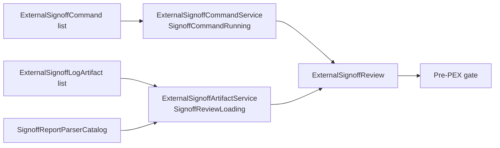

# Signoff Review Sources

Signoff execution and persisted-review loading are separate responsibilities.
The concrete services directly conform to their domain protocols; there is no
factory, shared request envelope, or internal adapter layer.

## API

| Type | Responsibility |
|---|---|
| `SignoffCommandRunning` | Executes typed external signoff commands and produces a review. |
| `ExternalSignoffCommandService` | Direct implementation of `SignoffCommandRunning`. |
| `SignoffReviewLoading` | Loads an existing review from typed log artifacts. |
| `ExternalSignoffArtifactService` | Direct implementation of `SignoffReviewLoading`. |
| `SignoffReportParserCatalog` | Resolves a declared report dialect to a parser. |
| `TechnologyPackageManifest.SignoffReference.reportStyleID` | Declares the report dialect for imported package evidence. |

Command execution remains an external-tool boundary, but it is expressed through
the domain protocol already owned by CircuitStudio. Stored evidence is loaded by a
separate protocol so implementations never receive irrelevant command or replay fields.
