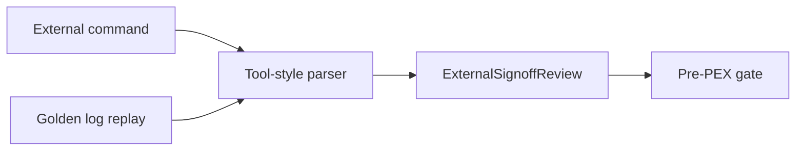

# Signoff Adapter Contract

`SignoffReviewRunning` is the shared boundary for DRC/LVS execution and replay. It normalizes command output, imported logs, and tool-specific log dialects into `ExternalSignoffReview`, so the PEX gate does not depend on how signoff evidence was produced.

## Adapters

| Adapter ID | Input | Current behavior |
|---|---|---|
| `generic-command` | `ExternalSignoffCommand` | Runs local commands, captures stdout/stderr logs, parses diagnostics, and returns an unapproved review. |
| `golden-log-replay` | Existing DRC/LVS logs | Loads golden/replay logs without launching tools. |
| `calibre-like` | Command or replay logs | Uses Calibre-oriented diagnostics, including incorrect/mismatch summaries. |
| `magic-netgen-like` | Command or replay logs | Uses Magic/Netgen-style LVS mismatch and property mismatch diagnostics. |
| `klayout-like` | Command or replay logs | Uses KLayout-style `severity: rule: detail` diagnostics. |

## API Surface

| Type | Purpose |
|---|---|
| `SignoffReviewRunning` | Protocol for all signoff backends. |
| `SignoffAdapterRequest` | Shared request containing commands, replay logs, and artifact directory. |
| `ExternalCommandSignoffAdapter` | Generic local command adapter. |
| `GoldenLogReplaySignoffAdapter` | Existing artifact replay adapter. |
| `SignoffAdapterFactory` | Resolves adapter IDs and parser styles. |
| `ExternalSignoffReportParser.Style` | Selects generic, Calibre-like, Magic/Netgen-like, or KLayout-like normalization. |

## Current Limit

This layer normalizes evidence and adapter selection, but it does not bundle real foundry decks or invoke installed commercial/open-source signoff tools yet. Real tool fixture execution and deck-specific corpus coverage remain follow-up work.
