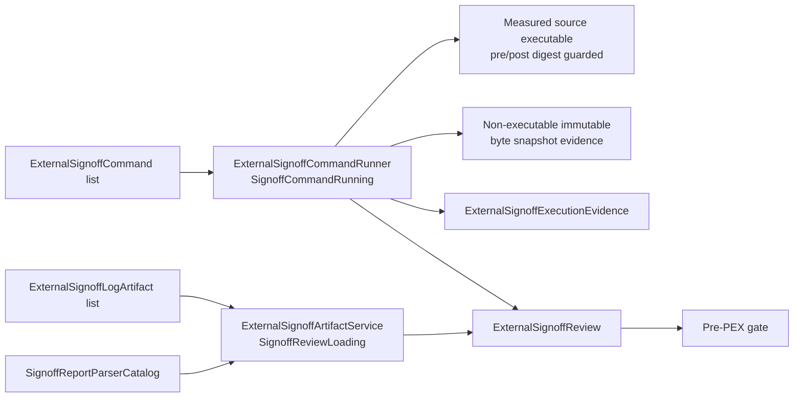
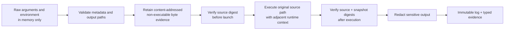

# Signoff Review Sources

Signoff execution and persisted-review loading are separate responsibilities.
The concrete services directly conform to their domain protocols; there is no
factory, shared request envelope, or internal adapter layer.

## API

| Type | Responsibility |
|---|---|
| `SignoffCommandRunning` | Executes a command batch and returns review, per-command results, and retained evidence. |
| `ExternalSignoffCommandRunner` | Direct implementation that executes the measured source path under pre/post digest guards and retains a non-executable immutable byte snapshot plus immutable logs. |
| `ExternalSignoffCommand` | In-memory launch configuration. It is intentionally not `Codable` because arguments and environment values can contain credentials. |
| `ExternalSignoffExecutionEvidence` | Schema-versioned, sanitized child provenance for successful and partial batch execution. |
| `ExternalSignoffBatchError` | Preserves completed results, the failed command index, measured failed-tool identity, and partial evidence. |
| `SignoffReviewLoading` | Loads an existing review from typed log artifacts. |
| `ExternalSignoffArtifactService` | Direct implementation of `SignoffReviewLoading`. |
| `SignoffReportParserCatalog` | Resolves a declared report dialect to a parser. |
| `TechnologyPackageManifest.SignoffReference.reportStyleID` | Declares the report dialect for imported package evidence. |

Command execution remains an external-tool boundary, but it is expressed through
the domain protocol already owned by CircuitStudio. Stored evidence is loaded by a
separate protocol so implementations never receive irrelevant command or replay fields.

## Execution and secret-handling contract

- Callers identify secret-bearing environment entries with `sensitiveEnvironmentKeys`.
  Those values are removed from captured output and diagnostics. Non-secret values stay
  observable because report parsers may depend on layer, corner, or cell identifiers.
- Raw environment values are never persisted as execution metadata; provenance retains
  only a digest of the complete effective environment inherited by the launched process.
  The fingerprint therefore remains non-empty even when the command supplies no overrides.
- Raw launch configuration is also retained only as an opaque `configurationDigest`.
  It distinguishes executions whose sensitive arguments differ without persisting those
  values or collapsing their immutable logs onto one identity.
- `sensitiveArgumentIndexes` redacts matching arguments from descriptions,
  provenance, logs, results, timeout/cancellation failures, and batch evidence.
- Raw commands cannot be encoded. Only sanitized command results and execution
  evidence conform to `Codable`.
- The runner validates tool metadata, argument metadata, sensitive indexes, and log
  containment before launching a process.
- The runner executes the canonical source path so Mach-O `@executable_path`, adjacent
  dynamic libraries, resources, and bundle-relative lookup keep their original runtime
  semantics. The source digest is verified immediately before launch and after completion.
- Measured executable bytes are separately retained as a content-addressed, non-executable
  immutable snapshot. Provenance records the sanitized source invocation while the snapshot
  provides byte-for-byte evidence; any source mutation retained through the post-run check
  fails with `sourceExecutableDigestMismatch`.
- Logs are retained under a content-addressed execution identity derived from the
  sanitized log, measured executable, effective-environment fingerprint, and opaque
  launch-configuration digest. Repeating
  a tool in the same artifact directory cannot overwrite or conflict with a prior
  attempt; identical evidence is idempotent and differing evidence is append-only.
- Batch evidence is also content-addressed, so repeated batches preserve every distinct
  sanitized result instead of replacing a fixed evidence file.
- Batch failure never discards completed results or a failed tool identity measured
  before launch. The partial evidence artifact is suitable for run finalization.
