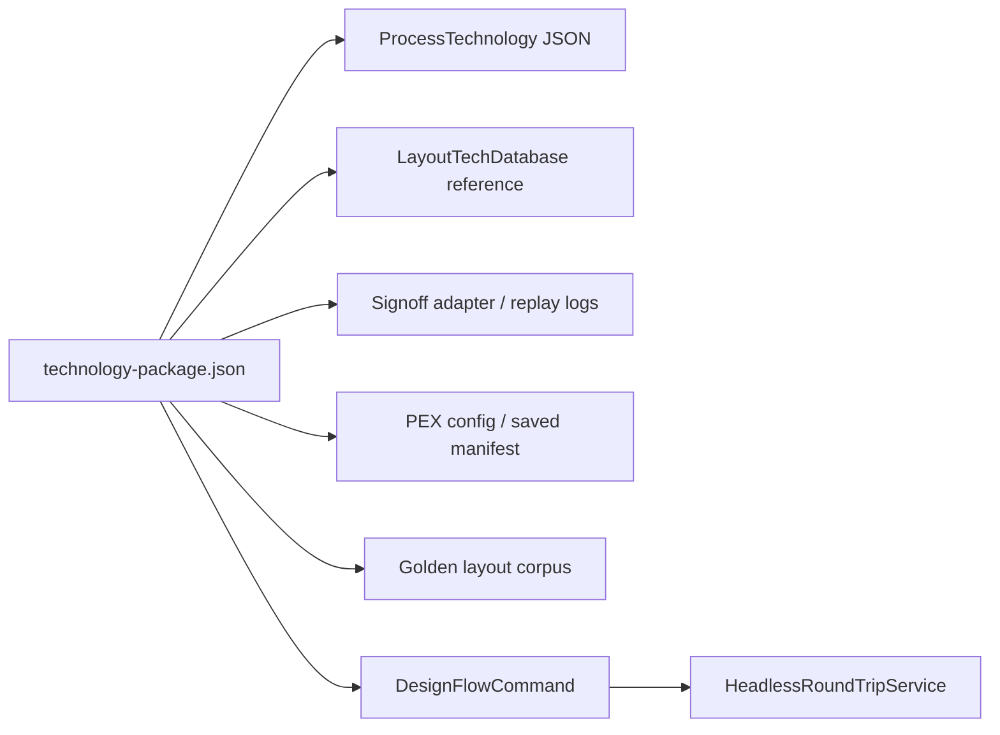

# Technology Package Contract

`TechnologyPackageManifest` is the shared contract for injecting process, layout, signoff, PEX, corner, and corpus references into the non-UI design flow. It keeps fixture and tool configuration out of individual runner branches so CLI, API, Agent, and future UI operations can use the same inputs.

## Contract

| Field | Purpose |
|---|---|
| `version` | Schema version. Current supported value is `1`. |
| `packageID` | Stable machine-readable package identifier. |
| `name` | Human-readable package name. |
| `processTechnologyPath` | Relative or absolute path to `ProcessTechnology` JSON used by netlist generation and simulation include resolution. |
| `spiceModelSearchPaths` | Relative or absolute include search paths for SPICE model resolution. |
| `layoutTechnology` | Builtin or JSON `LayoutTechDatabase` reference used by auto layout and DRC/LVS. |
| `signoff` | Report style ID plus DRC/LVS tool or replay-log references. |
| `pex` | PEX backend/config/saved-manifest references and default PEX corner. |
| `corpus` | Optional golden corpus manifest references. |
| `corners` | Cross-domain corner mapping between process corner IDs and PEX corner IDs. |

## Current Builtin Layout Technology IDs

| ID | Resolution |
|---|---|
| `sampleProcess` | `LayoutTechDatabase.sampleProcess()` |
| `standard` | `LayoutTechDatabase.standard()` |

## API Surface

| API | Behavior |
|---|---|
| `TechnologyPackageLoader.load(manifestURL:)` | Decodes, validates, and resolves process/PEX config references. |
| `TechnologyPackageLoader.validate(manifestURL:)` | Returns a structured validation report without materializing the package. |
| `TechnologyPackageLayoutTechResolver.resolve(package:)` | Resolves builtin or JSON layout technology references. |
| `DesignFlowCommand.Kind.loadTechnologyPackage` | Loads and validates a package through the shared command API. |
| `DesignFlowCommand.technologyPackagePath` | Injects the package into fixture/design netlist generation, simulation, and round-trip paths. |

## M1 Limit

This milestone introduces the shared contract and verifies package-driven fixture round trips. It does not yet replace every project UI setting with package-backed state, and it does not run real external signoff or PEX binaries. Those remain M3 and M4 work.
