# Timing Artifact Format

Status: proposed contract for the FF timing characterization work
Date: 2026-05-31

This document defines the artifact format for timing characterization, static timing analysis, and timing validation in CircuitStudio. The goal is to make timing claims auditable: every value consumed by STA must be traceable to either a measured characterization artifact or an explicitly imported timing model.

The immediate driver is the current flip-flop timing gap. Combinational cell timing is characterized from CoreSpice and the critical combinational path is checked by STA<->SPICE validation, but flip-flop `clk->q`, setup, and hold values still need their own artifact-backed contract.

## Scope

| Area | In scope | Out of scope |
|---|---|---|
| Timing library | Machine-readable model consumed by STA | Full Liberty parser/exporter |
| Characterization | Combinational and sequential timing measurements with raw evidence | Foundry-certified `.lib` signoff |
| STA report | Setup/hold/min-period result for one design and clock target | Multi-corner/multi-mode closure |
| Validation | Comparisons between STA predictions and SPICE measurements | Proving transistor model accuracy beyond the CoreSpice trust gate |
| Evidence | Claim-to-artifact links for human and Agent review | UI presentation layout |

The JSON contracts here are the current executable artifacts. Standard formats remain the long-term source-of-truth target: imported Liberty and SDF support should be added as separate producers that create the same internal artifact contract with provenance.

## Responsibility Map

```mermaid
flowchart LR
  Deck["SPICE deck builder"] --> Sim["SimulationService"]
  Sim --> Raw["Raw deck / waveform artifacts"]
  Raw --> Measure["Waveform measurer"]
  Measure --> Char["Characterization reports"]
  Char --> Library["timing-library.json"]
  Library --> STA["StaticTimingAnalyzer"]
  STA --> STAReport["sta-report.json"]
  STAReport --> Validator["Timing validators"]
  Validator --> Validation["timing-validation.json"]
  Validation --> Evidence["evidence bundle claim"]
```



| Producer | Artifact responsibility | Must not do |
|---|---|---|
| Characterizer | Generate timing models and measurement evidence | Decide final tapeout claims |
| STA | Consume timing library and emit timing report | Run SPICE or invent missing timing values |
| Validator | Compare an STA claim with SPICE evidence | Build or mutate the timing library |
| Flow orchestrator | Place artifacts in a run directory and link claims | Encode measurement algorithms |
| Evidence builder | State exactly which artifacts back each claim | Broaden a claim beyond its backing artifacts |

## Run Directory Layout

Timing artifacts live below the active run directory. Headless round trips and Agent-driven library runs use the shared `.xcircuite/runs/<run-id>/` ledger. Review services keep read-only compatibility for legacy `.xcircuite/flow-runs/<run-id>/` manifests during migration. The format below is relative to the run directory root.

```text
<run-dir>/
  timing/
    manifest.json
    timing-library.json
    sta-report.json
    characterization/
      combinational-cells.json
      sequential-dff.json
      measurements.jsonl
      decks/
      waveforms/
    validation/
      combinational-path-spice.json
      sequential-dff-spice.json
```

| Path | Required | Purpose |
|---|---:|---|
| `timing/manifest.json` | Yes for new timing runs | Index of timing artifacts, hashes, and status. |
| `timing/timing-library.json` | Yes | STA input model. Contains combinational and sequential timing. |
| `timing/sta-report.json` | Yes when STA runs | Design-level timing result. |
| `timing/characterization/combinational-cells.json` | Yes when cells are characterized in this run | Summary of characterized combinational cells and their source measurements. |
| `timing/characterization/sequential-dff.json` | Yes when FF timing is characterized in this run | Summary of measured `clk->q`, Q transition, setup, and hold. |
| `timing/characterization/measurements.jsonl` | Yes when raw measurements are emitted | One simulator measurement record per line. |
| `timing/characterization/decks/` | Required unless intentionally omitted | SPICE decks used to produce timing measurements. |
| `timing/characterization/waveforms/` | Required unless intentionally omitted | CSV waveforms used by measurement records. |
| `timing/validation/*.json` | Yes for each evidence claim that says SPICE validation was performed | Validation comparison reports. |

The first implementation emits the summary reports and records raw per-trial logs, decks, and waveform CSVs as `omitted` manifest records. A claim must not reference an omitted artifact; omitted raw evidence is a recorded limitation, not proof for a pass/fail claim.

## Characterization Cache

Timing characterization may reuse a local derived cache to avoid repeating identical CoreSpice sweeps. The cache is not a run evidence artifact and must not be cited by evidence claims. It is an implementation accelerator whose entries are only valid when their full characterization key matches the requested work.

Default location:

```text
~/Library/Caches/CircuitStudio/timing-characterization/v1/
  cells/<key-hash>.json
  sequential/<key-hash>.json
```

`CIRCUIT_STUDIO_TIMING_CACHE_DIR` may override the directory for CI or test isolation.

| Cache key field | Purpose |
|---|---|
| `schemaVersion` | Invalidates incompatible cache file structure. |
| `characterizerVersion` | Invalidates measurement algorithm changes. |
| `deviceModelHash` | Separates process/model changes. |
| `technologyContextHash` | Separates timing model profile provenance for sequential reports, including external profile path and SHA-256. |
| `topologyHash` | Separates transistor or gate-level topology changes. |
| Grid/search settings | Separates slew, load, setup/hold window, and resolution changes. |

Cache behavior:

| Event | Contract |
|---|---|
| Cache hit | Return the cached timing model only after the stored key matches the requested key. |
| Cache miss | Run the normal characterizer and atomically write the derived cache entry after success. |
| Characterization failure | Propagate the typed failure and do not write a cache entry. |
| Corrupt or mismatched cache file | Throw a cache read error instead of silently substituting or recomputing. |

## Headless Build

Agent-facing timing library generation is available through the flow runner:

```bash
swift run circuit-studio-flow-runner --inspect-timing-model-profiles --timing-model-profile-catalog <catalog.json> --timing-model-profile-id <profile-id>
swift run circuit-studio-flow-runner --inspect-timing-model-profiles --timing-model-profile-catalog <catalog.json> --timing-model-corner <corner-id>
swift run --quiet circuit-studio-flow-runner --inspect-timing-model-profiles --timing-model-corner <corner-id> --json
swift run circuit-studio-flow-runner --build-timing-library --output <project-root> --run-id <run-id> --timing-model-profile <profile.json>
swift run circuit-studio-flow-runner --build-timing-library --output <project-root> --run-id <run-id> --timing-model-profile-catalog <catalog.json> --timing-model-profile-id <profile-id>
swift run circuit-studio-flow-runner --build-timing-library --output <project-root> --run-id <run-id> --timing-model-profile-catalog <catalog.json> --timing-model-corner <corner-id>
```

The inspect command loads the explicit or bundled catalog, resolves every profile entry, validates that the loaded profile ID and declared corner match the catalog entry, computes profile SHA-256/model hash, and reports passed/failed entry counts without running characterization.

The build command writes `.xcircuite/runs/<run-id>/timing/manifest.json` and prints the manifest, timing library artifact, model-profile selection artifact, profile ID, profile path, catalog ID, and catalog path as key-value output. When `--timing-model-profile` is omitted, the explicit or bundled catalog selects the profile. When an external profile is supplied directly or through a catalog, `technology.modelProfile.path` and `technology.modelProfile.sha256` are persisted in the timing artifacts and in `timing/model-profile-selection.json`.

Inspect key-value output includes `timing_model_profile_catalog_status`, `timing_model_profile_catalog_id`, `timing_model_profile_selected_id`, `timing_model_corner_id`, `timing_model_profile_default_id`, `timing_model_profile_count`, `timing_model_profile_passed_count`, `timing_model_profile_failed_count`, and `timing_model_profile_ids`.

For Agent/API callers, `--json` emits the full `DesignFlowCommandResult` on success and a `flow-runner-failure` envelope on usage or runtime failure. Use `swift run --quiet` or the built executable directly when a caller needs the process stdout/stderr payload to be parseable JSON with no SwiftPM build log prefix. Failure envelopes include `nextActions[].suggestedCommands[]` using the same continuation shape as run review summaries. Runtime failures include run ID, project root, manifest path, failed stage, and recommendation when a round-trip manifest exists. `DesignFlowCommand.selectFailureSuggestedCommand` and `circuit-studio-flow-runner --select-failure-command --failure-envelope <path> --command-id <id> --reviewer <id>` record a selected failure-envelope command as a `review.selectSuggestedCommand` action in `.xcircuite/runs/<run-id>/actions.jsonl`, and `RoundTripReviewService` projects those selections back into `RoundTripReviewSummary.suggestedCommandSelections`. `DesignFlowCommand.runSelectedSuggestedCommand` and `circuit-studio-flow-runner --run-selected-suggested-command --output <project-root> --run-id <run-id> [--command-id <id>]` dispatch a previously selected ready command by resolving the ledger entry back into an allowlisted `DesignFlowCommand` instead of executing an arbitrary process. The initial allowlist accepts only persisted `circuit-studio-flow-runner` review and bottleneck-summary continuations whose manifest or project root matches the requested run. For profile inspection this includes every catalog entry with source kind, declared and loaded corner IDs, profile resource/path, profile SHA-256, device model hash, status, and structured diagnostics instead of only the key-value readiness summary.

## Shared JSON Rules

All new timing JSON artifacts use these rules.

| Rule | Contract |
|---|---|
| Encoding | UTF-8 JSON. JSONL is UTF-8 with one complete JSON object per line. |
| Versioning | Top-level `schemaVersion` is required. Initial value is `1`. |
| Kind | Top-level `kind` is required and uses lower-kebab-case. |
| Dates | ISO-8601 strings in UTC. |
| Units | Numeric values use SI base units: seconds, farads, volts, celsius, hertz. Field names include the unit suffix when ambiguity is possible. |
| Numbers | All floating-point values must be finite. NaN and infinities are invalid. |
| Paths | Paths inside manifests are run-relative. Absolute paths are allowed only in explicit provenance fields for original external inputs. |
| Hashes | Available artifacts recorded in a manifest must include a 64-character hexadecimal `sha256` and `byteCount`. |
| Determinism | Arrays with no semantic order must be sorted by stable ID. JSON objects should be encoded with sorted keys. |
| Optional collections | Optional array fields decode to empty arrays when omitted. Writers should emit the fields explicitly for audit readability. |
| Unknown fields | Readers may ignore unknown fields for forward compatibility, but writers must not rely on ignored fields for correctness. |

Timing readers reject an `available` artifact record that omits `sha256` or `byteCount`, reject malformed SHA-256 digests, and reject negative `byteCount` values. In-memory planning records may exist before files are written, but persisted manifests must satisfy the available-artifact digest contract.

## Timing Artifact Manifest

`timing/manifest.json` is the timing-local artifact index. The enclosing round-trip or tapeout manifest may also capture it as a higher-level artifact.

| Field | Required | Meaning |
|---|---:|---|
| `schemaVersion` | Yes | Manifest schema version. |
| `kind` | Yes | Must be `timing-artifact-manifest`. |
| `runID` | Yes | Run identifier from the enclosing flow. |
| `createdAt` | Yes | Manifest creation time. |
| `technology` | Yes | Technology and model reference used by timing artifacts. |
| `artifacts` | Yes | Artifact records indexed by ID. |
| `claims` | No | Timing-local claims that can be folded into `TapeoutEvidenceBundle`. |
| `warnings` | No | Non-fatal limitations or omitted evidence. |

`artifacts[]` fields:

| Field | Required | Meaning |
|---|---:|---|
| `id` | Yes | Stable artifact ID unique within this manifest. |
| `kind` | Yes | Artifact kind. |
| `path` | Yes | Run-relative path. |
| `status` | Yes | `available`, `omitted`, or `missing`. |
| `sha256` | Required when `available` | 64-character hexadecimal SHA-256 hash of the file content. |
| `byteCount` | Required when `available` | File size in bytes. |
| `createdAt` | Yes | Artifact creation time. |
| `provenance` | No | Original source path, generator, or note. |

Supported artifact kinds for timing:

| Kind | File format |
|---|---|
| `timing-manifest` | JSON |
| `timing-library` | JSON |
| `model-profile-selection` | JSON |
| `sta-report` | JSON |
| `characterization-report` | JSON |
| `measurement-log` | JSONL |
| `spice-deck` | SPICE text deck (`.cir`) |
| `waveform-csv` | CSV |
| `validation-report` | JSON |

## Timing Library Artifact

`timing/timing-library.json` is the only timing model artifact that `StaticTimingAnalyzer` should consume directly.

| Field | Required | Meaning |
|---|---:|---|
| `schemaVersion` | Yes | Timing library artifact schema version. |
| `kind` | Yes | Must be `timing-library`. |
| `runID` | No | Producing run ID, when generated inside a run. |
| `createdAt` | Yes | Creation time. |
| `technology` | Yes | Timing model context. |
| `library` | Yes | Codable `TimingLibrary` payload. |
| `modelSources` | Yes | References explaining where every timing model came from. |
| `warnings` | No | Non-fatal model limitations. |

`technology` fields:

| Field | Required | Meaning |
|---|---:|---|
| `processName` | Yes | Process or virtual process name. |
| `cornerID` | Yes | Timing corner ID. |
| `supplyVoltage` | Yes | Supply voltage in volts. |
| `temperatureC` | No | Temperature in celsius. |
| `deviceModelID` | Yes | Stable ID for the transistor/device model set. |
| `deviceModelHash` | No | Hash of the model cards or imported model file. |
| `modelProfile` | No | Profile provenance for the timing model data. Required for profile-backed generated timing runs; omitted for custom models when no profile artifact is supplied. |

`modelProfile` fields:

| Field | Required | Meaning |
|---|---:|---|
| `profileID` | Yes | Stable timing model profile ID. |
| `resourceName` | No | Bundled resource name when the profile came from package resources. |
| `path` | No | Original profile path when loaded from an external file. |
| `sha256` | No | Hash of the profile artifact when available. |

`modelSources[]` fields:

| Field | Required | Meaning |
|---|---:|---|
| `modelID` | Yes | Cell name or sequential model name. |
| `modelKind` | Yes | `combinational-cell` or `sequential-cell`. |
| `sourceType` | Yes | `characterized`, `imported`, or `constant-fixture`. |
| `artifactIDs` | Yes | Artifact IDs that support this model. |
| `notes` | No | Human-readable limitation. |

Production timing runs must not use `constant-fixture`. Tests may use it only when the test is explicitly about STA math rather than silicon evidence.

## Timing Model Profile Catalog

`timing-model-profile-catalog.json` is the selectable inventory for timing characterization profiles. It lets Agent and CI choose a profile by ID or declared corner without embedding process-specific model constants or resource paths in Swift call sites. The bundled compatibility catalog currently ships `tt`, `ss`, and `ff` sky130-like level-1 profiles so selection, inspection, artifact provenance, and cache separation can be exercised as a multi-corner inventory without treating these profiles as foundry signoff models.

| Field | Required | Meaning |
|---|---:|---|
| `schemaVersion` | Yes | Catalog schema version. |
| `kind` | Yes | Must be `timing-model-profile-catalog`. |
| `catalogID` | Yes | Stable catalog identifier. |
| `profiles` | Yes | Candidate profile entries. |

`profiles[]` fields:

| Field | Required | Meaning |
|---|---:|---|
| `profileID` | Yes | Expected `Level1DeviceModelProfile.profileID`. The loaded profile must match it. |
| `displayName` | No | Human-readable label. |
| `cornerID` | No | Declared timing corner for profile selection by `--timing-model-corner`. When present, the loaded profile corner must match it. |
| `profileResourceName` | One of resource/path | Bundled profile resource name without `.json`. |
| `profilePath` | One of resource/path | External profile path. Relative paths resolve from the catalog directory. |
| `defaultProfile` | No | Default profile when no `--timing-model-profile-id` or `--timing-model-corner` is supplied. |

Catalog entries must declare exactly one of `profileResourceName` or `profilePath`, profile IDs must be unique, and missing `defaultProfile` decodes as `false`.

## Timing Model Profile Selection

`timing/model-profile-selection.json` is the run-level ledger for the timing model profile selected by CLI/API. It is separate from `timing-library.json` so Agent and human reviewers can inspect the selected source without decoding every timing model.

| Field | Required | Meaning |
|---|---:|---|
| `schemaVersion` | Yes | Selection schema version. |
| `kind` | Yes | Must be `timing-model-profile-selection`. |
| `runID` | Yes | Producing run ID. |
| `selectedAt` | Yes | Selection time. |
| `sourceKind` | Yes | `bundled-resource` or `external-file`. |
| `selectionReason` | Yes | Short machine-readable reason for the selected route. |
| `catalogID` | No | Catalog identifier when selected from a catalog. |
| `catalogPath` | No | External catalog path when selected from a file-backed catalog. |
| `profileSchemaVersion` | Yes | Schema version of the selected `Level1DeviceModelProfile`. |
| `profile` | Yes | `TimingModelProfileReference` for the selected profile. |
| `technology` | Yes | `TimingTechnologyContext` used for characterization. |

The artifact record ID is `timing-model-profile-selection`, and its manifest kind is `model-profile-selection`. Timing-library build claims reference this artifact together with characterization reports so a run proves both the generated models and the profile source that drove them.

## Combinational Characterization Report

`timing/characterization/combinational-cells.json` summarizes the characterized combinational cells.

| Field | Required | Meaning |
|---|---:|---|
| `schemaVersion` | Yes | Schema version. |
| `kind` | Yes | Must be `combinational-characterization-report`. |
| `technology` | Yes | Same technology object as the timing library. |
| `inputSlews` | Yes | Characterization input slew grid in seconds. |
| `outputLoads` | Yes | Characterization output load grid in farads. |
| `cells` | Yes | One entry per characterized cell. |
| `measurementLogArtifactID` | No | Link to `measurements.jsonl`. |
| `status` | Yes | `passed` or `failed`. |
| `warnings` | No | Non-fatal limitations. |

`cells[]` fields:

| Field | Required | Meaning |
|---|---:|---|
| `cellName` | Yes | Timing cell name. |
| `topologyHash` | Yes | Hash of the canonical CMOS gate netlist. |
| `timing` | Yes | Codable `CellTiming` payload. |
| `measurementIDs` | Yes | Measurement records used by this cell. |
| `status` | Yes | `passed` or `failed`. |

## Sequential DFF Characterization Report

`timing/characterization/sequential-dff.json` is the audit artifact for flip-flop timing. It is distinct from `SequentialTiming`: the report explains how the model was measured, while `SequentialTiming` is the STA input payload.

| Field | Required | Meaning |
|---|---:|---|
| `schemaVersion` | Yes | Schema version. |
| `kind` | Yes | Must be `sequential-characterization-report`. |
| `cellName` | Yes | Sequential model name used by the timing library. |
| `topologyHash` | Yes | Hash of the canonical DFF gate netlist or imported cell identity. |
| `activeClockEdge` | Yes | `rising` or `falling`. |
| `technology` | Yes | Same technology object as the timing library. |
| `characterizationGrid` | Yes | Slew/load/search settings. |
| `timing` | Yes | Codable `SequentialTiming` payload. |
| `clkToQMeasurements` | Yes | Measurement summaries for Q rise/fall delay. |
| `qTransitionMeasurements` | Yes | Measurement summaries for Q rise/fall transition. |
| `setupMeasurements` | Yes | Setup boundary measurements. |
| `holdMeasurements` | Yes | Hold boundary measurements. |
| `measurementLogArtifactID` | No | Link to `measurements.jsonl`. |
| `status` | Yes | `passed` or `failed`. |
| `warnings` | No | Non-fatal limitations. |

`characterizationGrid` fields:

| Field | Required | Meaning |
|---|---:|---|
| `clockSlews` | Yes | Clock input slew grid in seconds. |
| `dataSlews` | Yes | Data input slew grid in seconds. |
| `outputLoads` | Yes | Q output load grid in farads. |
| `setupHoldSearchResolution` | Yes | Binary-search stop resolution in seconds. |
| `setupHoldSearchWindow` | Yes | Initial data-clock offset search window in seconds. |

Sequential measurement summary fields:

| Field | Required | Meaning |
|---|---:|---|
| `id` | Yes | Measurement ID, also present in `measurements.jsonl`. |
| `metric` | Yes | One of `clkToQRise`, `clkToQFall`, `qTransitionRise`, `qTransitionFall`, `setupTime`, `holdTime`. |
| `clockSlew` | Yes | Clock slew in seconds. |
| `dataSlew` | Required for setup/hold | Data slew in seconds. |
| `outputLoad` | Required for clk->q and Q transition | Q load in farads. |
| `valueSeconds` | Yes | Measured value in seconds. |
| `method` | Yes | `thresholdCrossing` or `binarySearch`. |
| `status` | Yes | `passed` or `failed`. |
| `deckArtifactID` | No | SPICE deck artifact. |
| `waveformArtifactID` | No | Waveform artifact. |

Setup and hold measurements must also include:

| Field | Required | Meaning |
|---|---:|---|
| `passingOffsetSeconds` | Yes | Nearest passing data-clock offset. |
| `failingOffsetSeconds` | Yes | Nearest failing data-clock offset. |
| `capturedValue` | Yes | Logical value captured at the boundary check. |
| `expectedValue` | Yes | Expected logical value. |

## Measurement Log JSONL

`timing/characterization/measurements.jsonl` preserves one measurement attempt per line. It is useful when a summary value is a boundary search result derived from several transient simulations.

Each line uses `kind: timing-measurement`.

| Field | Required | Meaning |
|---|---:|---|
| `schemaVersion` | Yes | Measurement schema version. |
| `kind` | Yes | Must be `timing-measurement`. |
| `id` | Yes | Stable measurement ID. |
| `parentReportID` | Yes | Characterization report ID. |
| `metric` | Yes | Measured timing metric. |
| `sweepPoint` | Yes | Clock slew, data slew, load, and offset values used for this run. |
| `result` | Yes | Measured value and pass/fail outcome. |
| `rawArtifacts` | Yes | Deck and waveform artifact IDs when emitted. |
| `diagnostics` | No | Structured failure diagnostics. |

Waveform artifacts are CSV with one sweep column followed by one column per probed node. The first line is the header. Values are decimal floating-point strings in SI units. The matching measurement record declares which column names were used for threshold crossing.

## STA Report

`timing/sta-report.json` wraps the in-memory `TimingReport` model. Persisted STA
artifacts must use this wrapper so schema version, artifact kind, provenance, and
status stay attached to the report payload.

| Field | Required | Meaning |
|---|---:|---|
| `schemaVersion` | Yes | Schema version. |
| `kind` | Yes | Must be `sta-report`. |
| `runID` | No | Producing run ID. |
| `createdAt` | Yes | Creation time. |
| `designName` | Yes | Design name. |
| `timingLibraryArtifactID` | Yes | Artifact ID for `timing-library.json`. |
| `report` | Yes | Codable `TimingReport` payload. |
| `status` | Yes | `passed` or `failed`. |

Bare `TimingReport` JSON is not a valid persisted artifact. Readers must reject
payloads without the wrapper instead of inferring provenance or silently
upgrading an older shape.

## Timing Validation Report

Validation reports state exactly what was checked against SPICE. They must not imply that unvalidated parts of a path were checked.

| Field | Required | Meaning |
|---|---:|---|
| `schemaVersion` | Yes | Schema version. |
| `kind` | Yes | Must be `timing-validation-report`. |
| `scope` | Yes | `combinational-path`, `sequential-cell`, or `clocked-path`. |
| `runID` | No | Producing run ID. |
| `createdAt` | Yes | Creation time. |
| `designName` | No | Design name when validating a design path. |
| `sourceArtifacts` | Yes | Artifact IDs used by this validation. |
| `comparisons` | Yes | One or more numeric comparisons. |
| `status` | Yes | `passed` or `failed`. |
| `warnings` | No | Non-fatal limitations. |

`comparisons[]` fields:

| Field | Required | Meaning |
|---|---:|---|
| `id` | Yes | Stable comparison ID. |
| `metric` | Yes | Compared metric. |
| `predictedSeconds` | Yes | STA or library value. |
| `measuredSeconds` | Yes | SPICE-measured value. |
| `absoluteErrorSeconds` | Yes | Absolute error. |
| `relativeError` | Yes | Absolute error divided by measured magnitude with a documented floor. |
| `tolerance` | Yes | Allowed relative or absolute tolerance. |
| `passed` | Yes | Comparison result. |
| `artifactIDs` | Yes | Deck, waveform, report, and library artifacts used. |

Recommended validation scopes:

| Scope | Must cover | Claim wording allowed |
|---|---|---|
| `combinational-path` | STA combinational path delay vs SPICE chain delay | `combinational STA path agrees with SPICE` |
| `sequential-cell` | FF `clk->q`, Q transition, setup, and hold measurement consistency | `flip-flop timing is SPICE-characterized` |
| `clocked-path` | Launch FF, combinational path, and capture FF setup in one SPICE experiment | `clocked path timing agrees with SPICE` |

## Evidence Bundle Claims

`TapeoutEvidenceBundle` currently has a single `timing` axis. Multiple timing claims may share that axis, but each claim must point to the artifact that backs its exact statement.

| Claim | Backing artifact |
|---|---|
| Setup/hold met at target clock | `sta-report.json` plus `timing-library.json` |
| Combinational STA path agrees with SPICE | `validation/combinational-path-spice.json` |
| Flip-flop timing is SPICE-characterized | `characterization/sequential-dff.json` |
| Full clocked path agrees with SPICE | `validation/sequential-dff-spice.json` or another `clocked-path` validation report |

Timing evidence must avoid broad statements such as `STA vs SPICE within tolerance` unless the validation report scope includes every timing component relevant to the claim.

## Failure and Omission Semantics

| State | Meaning |
|---|---|
| `passed` | The artifact producer completed and all required checks passed. |
| `failed` | The producer completed with a structured failure. The artifact should still be written when possible. |
| `available` | The file exists and its hash/size were recorded. |
| `omitted` | The file was intentionally not emitted. The reason must be recorded in provenance or warnings. |
| `missing` | The file was expected but not found. This makes the timing manifest incomplete. |

A production timing library is invalid if any timing value consumed by STA has no `modelSources` entry. A production evidence bundle is invalid if a claim references an omitted or missing backing artifact.

## Schema Change Rules

| Change type | Required action |
|---|---|
| Add optional field | Keep `schemaVersion` unchanged. |
| Add enum case tolerated by old readers | Keep `schemaVersion` unchanged only if readers can ignore it safely. |
| Rename field, change unit, change meaning, or remove required field | Increment `schemaVersion`. |
| Add new artifact kind | Add manifest kind and document consumer behavior. |

This project is still in active development, so persisted artifact readers should
prefer a strict current-schema contract over compatibility layers. Domain
types such as `TimingLibrary`, `TimingReport`, `CellTiming`, and
`SequentialTiming` remain in-memory models; wrappers provide the persisted
schema, provenance, and artifact links.

## Implementation Checklist

| Check | Required before replacing FF constants |
|---|---:|
| `SequentialTimingCharacterizationReport` type exists | Yes |
| `TimingLibraryArtifact` wrapper exists | Yes |
| `STAReportArtifact` wrapper exists | Yes |
| Timing manifest records run-relative paths and hashes | Yes |
| `SpecToSiliconFlow` writes timing artifacts through one writer/service | Yes |
| Evidence timing claim names validation scope precisely | Yes |
| Tests reject production `constant-fixture` FF timing | Yes |
| Bare `TimingReport` artifacts are rejected | Yes |
