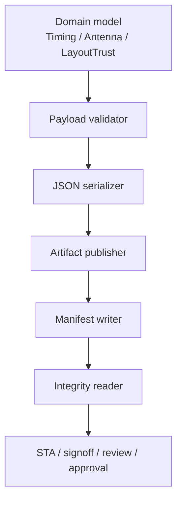
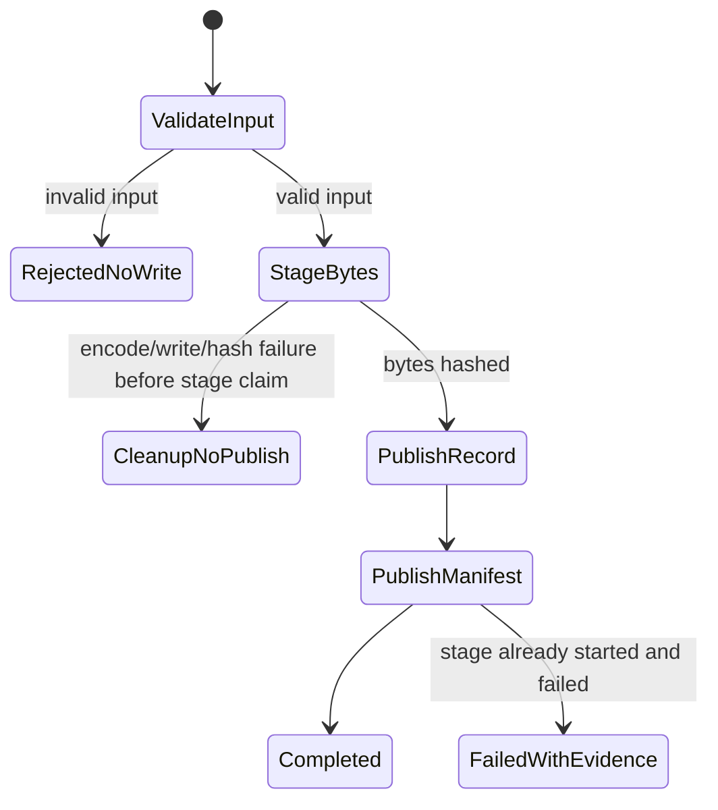
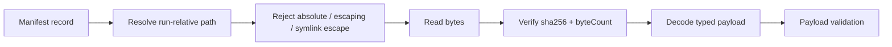

# Trusted Artifact Completion Design

Status: Proposed
Date: 2026-06-02
Scope: timing artifacts, antenna protection artifacts, layout trust artifacts, and future run evidence artifacts produced by CircuitStudio.

## Goal

Complete the artifact trust layer so persisted evidence can be safely produced, loaded, reviewed, and approved without relying on caller discipline.


Completion means the following properties hold for every persisted artifact that supports a claim:

| Property | Completion requirement |
|---|---|
| Schema identity | The payload declares the current `schemaVersion` and `kind`, and unsupported envelopes are rejected. |
| Semantic validity | The payload validates its own invariants before decode, encode, write, and use. |
| Content identity | Manifest records contain `sha256` and `byteCount`; readers recompute both before consuming payload bytes. |
| Publication safety | Invalid input creates no artifact tree; staged write failures do not publish partial success. |
| Failure evidence | Once a stage starts, failure artifacts and diagnostics are preserved instead of disappearing. |
| Review consistency | CLI/API/UI consume the same verified artifacts and do not reinterpret raw logs into new verdicts. |

## Current State

| Area | Current state | Remaining completion gap |
|---|---|---|
| Timing artifact records | `available` records require 64-character hex `sha256` and non-negative `byteCount` during encode/decode. | A shared manifest reader must verify backing file digest before payload decode. |
| Antenna protection plan | Plan schema/kind, site invariants, rule-set invariants, and route-candidate consistency are checked before use/write. | Writer publication should use the same staged atomic publisher as other artifacts. |
| Layout trust report | Strict schema/kind and derived-field consistency are enforced during encode/decode. | Layout trust artifact set should be written through one manifest-backed publisher and verified reader. |
| Round-trip manifests | Existing round-trip review verifies artifact path and digest before loading selected payloads. | The same integrity mechanism should be reusable by timing, layout trust, antenna, and future evidence writers. |

## Responsibility Boundaries



| Component | Owns | Must not own |
|---|---|---|
| Domain producer | Builds in-memory timing reports, antenna plans, layout trust reports, and evidence payloads. | File paths, manifest hashing, approval state. |
| Payload validator | Checks schema envelope and domain invariants. | File I/O, path resolution, digest recomputation. |
| Serializer | Converts a validated payload to canonical JSON bytes. | Domain decisions or manifest publication. |
| Artifact publisher | Writes bytes to a staging location, computes digest, and publishes by manifest record. | Claim semantics or payload-specific validation. |
| Integrity reader | Resolves run-relative paths, rejects escaping/absolute paths, recomputes digest, then decodes typed payloads. | Repair decisions, signoff interpretation, UI presentation policy. |
| Review layer | Projects verified artifacts into one human/agent decision surface. | Loading unverified payloads or changing recorded stage verdicts. |

## Core Interfaces

The implementation should introduce shared infrastructure instead of adding per-artifact ad hoc checks.

| Type | Shape | Responsibility |
|---|---|---|
| `ArtifactPayloadValidating` | `func validateForPersistence() throws` | Domain-level validation before encoding and writing. |
| `ArtifactEnvelopeValidating` | `static var currentSchemaVersion: Int`; `static var artifactKind: String` | Shared strict envelope convention for persisted JSON payloads. |
| `ArtifactPublicationRecord` | `id`, `kind`, `path`, `sha256`, `byteCount`, `createdAt`, `status`, `provenance` | One manifest record shape for generated evidence. |
| `ArtifactPublishing` | `publish(payload:id:kind:relativePath:) throws -> ArtifactPublicationRecord` | Stage, encode, hash, and publish artifacts. |
| `ArtifactIntegrityChecking` | `verifiedData(for record: ArtifactPublicationRecord, in runDirectory: URL) throws -> Data` | Resolve, hash-check, and return bytes only after integrity succeeds. |
| `ArtifactSetManifest` | `schemaVersion`, `kind`, `runID`, `records`, `claims`, `warnings` | Per-stage index for one artifact set. |

Swift API direction:

```swift
public protocol ArtifactPayloadValidating: Sendable {
    func validateForPersistence() throws
}

public protocol ArtifactPublishing: Sendable {
    func publish<T: Encodable & ArtifactPayloadValidating>(
        _ payload: T,
        id: String,
        kind: String,
        relativePath: String
    ) throws -> ArtifactPublicationRecord
}

public protocol ArtifactIntegrityChecking: Sendable {
    func verifiedData(
        for record: ArtifactPublicationRecord,
        in runDirectory: URL
    ) throws -> Data
}
```

## Publication Contract

Publication has two modes because "failure writes nothing" is only correct before work has started.



| Phase | Failure behavior |
|---|---|
| Before semantic validation passes | Do not create an artifact directory. |
| During staged payload write | Remove the staging file and do not emit a success manifest record. |
| During digest computation | Remove the staging file and report a typed publication error. |
| After stage execution starts | Publish a failed-stage manifest with diagnostics and any valid collected artifacts. |
| Approval | Never mutate the approved artifact; write a separate approval record that references artifact hashes. |

The publisher should write to a run-local staging directory, compute digest over staged bytes, then atomically move the file into the final run-relative path. Existing files at a final path are a typed collision unless the run is explicitly created as disposable test output.

## Reader Contract

The verified reader is the only path from manifest record to typed payload.



| Check | Failure |
|---|---|
| `status != available` for a required payload | Typed unavailable-artifact error. |
| Missing `sha256` or `byteCount` | Typed malformed-record error. |
| Digest or byte count mismatch | Typed tamper/integrity error. |
| Path escapes run directory | Typed invalid-artifact-path error. |
| Payload schema/kind mismatch | Typed payload-decode error. |
| Payload semantic validation fails | Typed invalid-payload error. |

## Feature Completion Criteria

| Feature | Done when |
|---|---|
| Timing artifacts | Timing manifest, timing library, STA report, characterization reports, and validation reports are all loaded through `ArtifactIntegrityChecking`; invalid or tampered backing files never reach `StaticTimingAnalyzer`. |
| Antenna protection artifacts | The plan is validated before route use and before persistence; writer uses staged publication; reader verifies digest before decode; materialized layout shapes reference only verified plan site IDs. |
| Layout trust artifacts | Canonical layout, ownership map, net-aware report, and layout trust report are published as one artifact set; readers verify all records before projecting `layout_trust_passed`. |
| Round-trip review | Review summary loads every referenced report through the verified reader and reports incomplete/tampered artifacts as review diagnostics. |
| Approval records | Approval targets immutable artifact records by hash and refuses targets that fail integrity verification. |

## Test Matrix

| Test class | Required cases |
|---|---|
| Unit: payload validation | Missing schema/kind, wrong kind, unsupported schema, duplicate IDs, non-finite numbers, inconsistent derived fields. |
| Unit: publisher | Invalid payload creates no directory; encode failure removes staging; duplicate final path fails; successful publish records digest and byte count. |
| Unit: integrity reader | Missing digest, malformed digest, negative byte count, tampered bytes, byte-count mismatch, absolute path, path traversal, symlink escape. |
| Integration: timing | Tampered timing library is rejected before STA; missing characterization report makes timing evidence incomplete. |
| Integration: antenna | Tampered antenna plan is rejected before synthesis/review; route plan site mismatch fails before layout emission. |
| Integration: layout trust | Tampered `layout-trust-report.json` and tampered `ownership-map.json` both make layout trust review incomplete. |
| Integration: approval | Approval cannot target an artifact whose digest no longer matches the manifest. |

## Implementation Milestones

| Milestone | Deliverable | Tests |
|---:|---|---|
| 1 | Add shared `ArtifactPublicationRecord`, `ArtifactPublisher`, and `ArtifactIntegrityChecker`. | Publisher and reader unit tests. |
| 2 | Move timing artifact loading/writing to the shared publisher/reader while preserving the current timing JSON schema. | Timing artifact contract tests plus tampered-library rejection. |
| 3 | Move antenna plan writer and reader to shared publication. | Invalid-plan no-write, tampered-plan rejection, site-ID materialization tests. |
| 4 | Move layout trust writer to publish a manifest-backed artifact set. | Layout trust artifact set integrity tests. |
| 5 | Make `RoundTripReviewService` and gate approval use the same verified reader for every artifact payload. | Review and approval tamper tests. |
| 6 | Update docs and maturity matrix with completed evidence contracts. | `swift test`, doc contract checks where applicable. |

## Open Design Decisions

| Decision | Recommended answer |
|---|---|
| Should old schemas remain readable? | No. The project is pre-release; strict current-schema readers are simpler and more trustworthy. |
| Should invalid input always write nothing? | Only before stage execution starts. After a stage starts, failure evidence should be preserved. |
| Should the publisher own domain validation? | No. It should call a payload validation protocol, but the payload owns its own semantic rules. |
| Should one global manifest replace per-stage manifests? | No. Keep per-stage manifests composable, then reference them from higher-level evidence bundles. |
| Should digest verification happen after decode? | No. Verify bytes first, then decode typed payloads. |

## Completion Definition

This work is complete when the following command-level invariant is true:

```text
No CLI/API/UI path consumes a persisted evidence payload unless:
  1. its manifest record is available,
  2. its path is run-relative and contained in the run directory,
  3. its sha256 and byteCount match the bytes on disk,
  4. its schemaVersion and kind match the current contract,
  5. its domain invariants validate, and
  6. any human approval points at the verified immutable artifact hash.
```

At that point, timing artifacts, antenna plans, layout trust reports, and approval records all share the same trust spine instead of relying on per-feature defensive checks.
